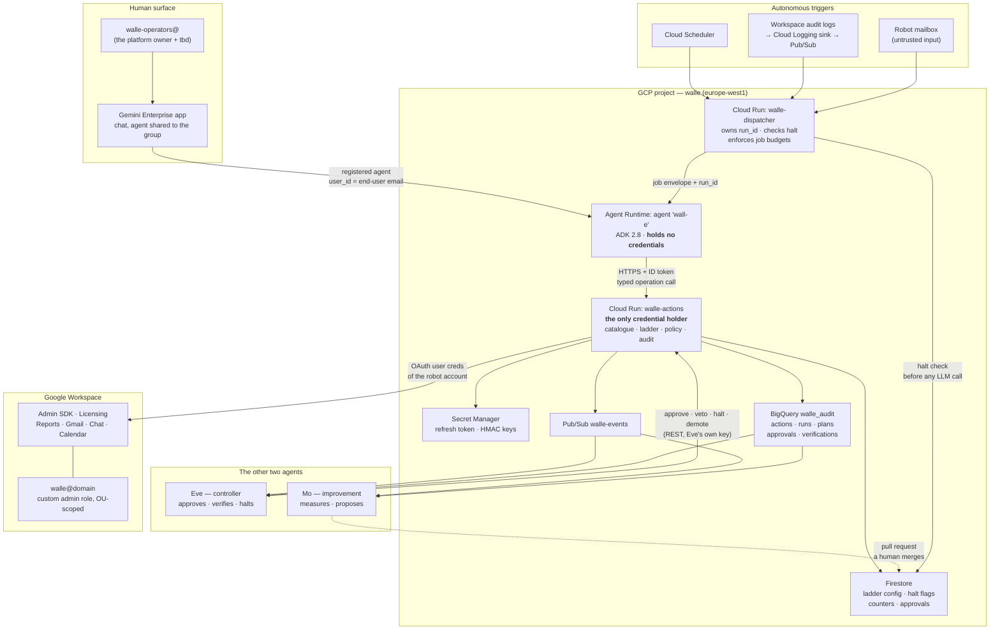

# 1. High-level design

## Status
- Owner: the platform owner
- Last reviewed: 2026-09-08

## Design intent

1. One Workspace identity (`walle@<domain>`, name tbd) holds a **narrow custom admin
   role**, and no human ever signs into it after the one-time bootstrap.
2. That identity does nothing except through the **action service**, which is the only
   process that ever holds its credential and the only place authorisation is decided.
3. The **reasoning layer never holds the credential and never decides what is allowed.**
   It can name an operation from a fixed catalogue and supply parameters. Deterministic
   Python decides the rest.
4. **Autonomy is data, not code.** Each (operation family, trigger class) pair carries a
   level in a versioned config the service reads at runtime. Promotion is a pull request
   plus a dated decision record; demotion is an API call that takes effect in seconds.
5. **No domain-wide delegation.** Not for a service account, not through a Marketplace
   app, not as an exception for one API. Where an API requires DWD, that API is out of
   scope — see the Alert Center note below.

## Component map

## The five trust boundaries

Edge AI v2 had four. Autonomy adds the fifth, and it is the one this whole design set
exists to make real.

| # | Boundary | Enforced by | What it stops |
|---|---|---|---|
| 1 | Human → Gemini Enterprise | Workspace SSO; the agent is shared only with `walle-operators@` on its User permissions tab | Non-allowlisted staff reaching Wall-E at all |
| 2 | Agent → action service | Cloud Run IAM (`run.invoker`), ID-token verification **with audience**, caller service-account allowlist | Anything but Wall-E's own identity calling the action service |
| 3 | LLM → credential | Architecture: the refresh token exists only inside the action service, never in the model's process or context | Prompt injection exfiltrating an admin credential |
| 4 | Requested action → executed action | Policy engine: catalogue allowlist, typed parameters, protected principals, scope, budgets | The model inventing a destructive call and it simply running |
| 5 | **Permitted action → autonomously executed action** | **Autonomy ladder: per-(family, trigger) level, approval tokens the service mints and a human or Eve releases, hold windows, breakers** | **An operation that is legitimate on request being taken unattended before it has earned the right** |

Boundary 5 is the new one. Boundaries 1–4 answer "may this action happen at all". Boundary
5 answers "may it happen *without a human watching*, right now, at this level of proven
reliability". They are separate questions and the design keeps them separate: risk tier is
a static property of an operation, autonomy level is a mutable property of how it is being
invoked.

## The request path, end to end

**On request (trigger class T0).** Operator types in Gemini Enterprise → Gemini Enterprise
invokes the registered agent, passing the operator's email as `user_id` → the ADK agent
picks operations from the catalogue and calls the action service with an ID token → the
action service validates, checks the operator is in the group, looks up the level for
(family, T0), executes or returns a confirmation requirement → audit row → answer.

**Unattended (T1 scheduled, T2 event, T3 inbox).** Cloud Scheduler or a Pub/Sub message
reaches the dispatcher → the dispatcher checks the halt flags and the job's daily budget
*before spending a token*, opens a `run_id`, and calls the agent with a structured job
envelope → the agent runs the named playbook, producing a **plan** of explicit targets →
the action service freezes the plan, captures pre-state, and applies the level: shadow,
proposal, human approval, Eve approval plus hold, or straight execution → execute →
**verify by re-reading** → report to the operators and to Pub/Sub.

## Why a dispatcher in front of the agent

Edge AI v2 had no autonomous path at all, so it had no dispatcher. Adding one is not
ceremony:

- **The kill switch must work before the model runs.** A halt that is only checked by the
  action service still lets every scheduled run spend tokens and produce a plan. The
  dispatcher checks it first, so halting is free and instant.
- **Run identity has to exist before the agent speaks.** `run_id`, playbook version,
  config version and budget are facts about the run, not outputs of it. The LLM must not
  be the thing that invents them.
- **A trigger must be acknowledged in a second; an agent turn takes minutes.** Cloud
  Scheduler's attempt deadline defaults to three minutes and caps at thirty, and a
  Pub/Sub push subscription's ack deadline is far shorter. A synchronous call to the
  agent blows through both, so the trigger is recorded as failed and **retried**, and
  the same run happens twice. The dispatcher acks immediately and hands the work to a
  queue, with a deterministic trigger id — the job name plus its scheduled time, or the
  Pub/Sub message id — written transactionally so a duplicate delivery is a no-op.

  (Cloud Scheduler *can* call the agent directly: it supports OAuth tokens precisely for
  `*.googleapis.com` targets. An earlier draft claimed it could not. That was wrong, and
  it was the weakest of the three reasons for having a dispatcher. The two above stand.)

## Why the action service stays separate from the agent

Unchanged from Edge AI v2, and more true under autonomy:

- The refresh token would otherwise sit in the same process as the LLM loop, so any tool
  that can read the environment becomes an exfiltration path.
- Tool arguments are generated text. Between generated text and an Admin SDK call that
  suspends a user there must be a gate the model cannot talk its way past.
- Audit, budgets, idempotency, dry-run, pre-state capture and the ladder belong in one
  place. Scattered across tool functions they would each be one refactor away from being
  bypassed.

Cost of the split: one hop, roughly 50–150 ms. For an identity that can administer the
tenant, that is not a trade worth reconsidering.

## Layer responsibilities

| Layer | Owns | Explicitly does not own |
|---|---|---|
| Gemini Enterprise | Presentation, end-user authentication, conversation history | Any credential, any policy decision |
| Dispatcher | Trigger handling, run creation, halt check, per-job budgets | Workspace access, authorisation of individual operations |
| ADK agent (Agent Runtime) | Intent → operation selection, parameter extraction, clarification, narrating results | Credentials, authorisation, the autonomy level, direct API access |
| Action service | The credential, the catalogue, the ladder, authorisation, execution, verification, audit | Natural language |
| Eve | Approving, verifying independently, halting, demoting | Executing anything, raising a level |
| Mo | Measuring, proposing | Any write path to config or Workspace |
| Workspace | The actual effect | — |

## Corrections carried in from research (2026-09-07/08)

These change things Edge AI v2 asserted. Sources are listed in
[09-open-decisions.md](09-open-decisions.md).

| Item | Edge AI v2 said | Verified now |
|---|---|---|
| Region | europe-west1 "subject to Agent Engine availability" | **Confirmed available.** Agent Runtime, Sessions and Memory Bank are GA in europe-west1 with EU at-rest residency. Decision closed. |
| Product name | "Vertex AI Agent Engine" | Now **Agent Runtime**, part of Gemini Enterprise Agent Platform. API resource is still `reasoningEngines`. |
| Deployment SDK | `vertexai.agent_engines.create()` | Deprecated since Vertex AI SDK v1.112.0. Use `vertexai.Client(project, location).agent_engines.create(...)`. |
| End-user identity | "unverified, treat `actor` as untrusted" | Gemini Enterprise passes the **user's email as `user_id`**. It is asserted by the Discovery Engine service agent, not cryptographically bound to the user, so the action service still re-checks group membership. Lock `aiplatform.reasoningEngines.query` down to three principals. |
| Chat API | "may need an app identity" | The robot's **user token is sufficient** to post messages and manage spaces it belongs to. A branded Chat app is optional UX, not a requirement. |
| Alert Center as an event source | not considered | **Requires domain-wide delegation.** Out of scope. Use Workspace audit-log sharing into Cloud Logging instead, which needs no credential at all and gives Eve an independent view. |
| Cloud Run ingress | "internal only" | Agent Runtime egresses from a Google-managed tenant project, which Cloud Run treats as **external** — internal-only ingress blocks it. The fixes are a shared VPC Service Controls perimeter, an internal load balancer in front of Cloud Run, or a Private Service Connect endpoint. A PSC **interface** alone does not help, because `run.app` traffic still bypasses the VPC without private DNS peering, and it also disables the agent's internet egress. **IAM is the enforced boundary** — [decision 9](09-open-decisions.md). |

## Non-goals

- Acting as any user other than the robot account. Impossible without DWD, and intended.
- Replacing the Admin console for bulk or emergency operations.
- Anything Wall-E cannot undo. Irreversible operations are either capped at "propose" or
  are not in the catalogue at all. See [06-security-guardrails.md](06-security-guardrails.md).
- A fully unattended agent for high-risk writes. `WRITE_HIGH` never reaches the top level
  on any trigger, at any stage. That is a permanent ceiling, not a stage we have not
  reached yet.
- Wall-E administering its own platform. GCP IAM, the ladder config, the catalogue and
  Gemini Enterprise settings are outside its reach by construction.
