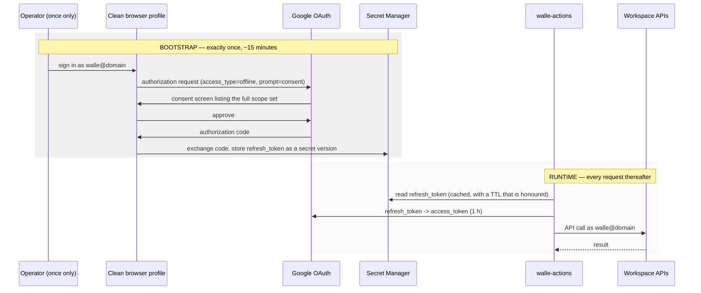

# 2. Identity & authorisation

## Status
- Owner: the platform owner
- Last reviewed: 2026-09-09

This is the core of the design. Read it before anything else.

## The problem, restated

Workspace APIs authorise against a *user*. A GCP service account is not a Workspace user.
The normal bridge is **domain-wide delegation** — the tenant grants a service account the
right to impersonate users. That is excluded, for a good reason: DWD is a tenant-wide
capability scoped only by OAuth scopes, so a compromised service account can act as
*anyone*, including a super admin.

Without DWD a service account cannot become a Workspace user. So we do not try. Wall-E
acts as exactly one identity — the robot account — and can never act as anyone else.

## Five principals, and what each may do

Autonomy means machines now approve things, so who signs matters as much as who acts.

| Principal | Type | Holds | May do |
|---|---|---|---|
| `walle@<domain>` | Workspace user | The OAuth refresh token, in Secret Manager | Everything the custom admin role allows. The only identity that touches Workspace. |
| `walle-actions@<proj>` | GCP service account | Reads the refresh token and both HMAC keys | Runs the action service. The only reader of the credential secret. |
| `walle-agent@<proj>` | GCP service account | Nothing | Runs the Wall-E agent on Agent Runtime. Can call the action service. Cannot read any secret. |
| `walle-dispatcher@<proj>` | GCP service account | Nothing | Invokes the agent. Holds `aiplatform.reasoningEngines.query` on Wall-E's engine only. Reads halt flags. |
| `eve-controller@<proj>` | GCP service account | Reads **Eve's own** approval key, and nothing of Wall-E's | Calls the control endpoints: approve, veto, halt, demote. Reads audit. Cannot execute an operation. |

`Assumption:` Mo gets a sixth, read-only principal with BigQuery access and no path to
anything else. Its design is out of scope here.

Two properties to preserve as you build:

1. **`walle-agent@` can read no secret.** Check this after every IAM change. It is
   boundary 3 in one sentence.
2. **`eve-controller@` and `walle-actions@` never share a key.** Eve signs approvals with
   a key only Eve can read; the action service verifies with the public half or a
   separate verification key. If they shared one, "Eve approved this" would mean nothing.

## How the robot account gets a credential

The robot authorises our OAuth client **once**, interactively, granting offline access.
Google returns a **refresh token**, which is the platform's permanent proof that the robot
consented. It goes into Secret Manager and mints short-lived access tokens thereafter.



### The one unavoidable human interaction

Exactly one interactive sign-in is unavoidable: the consent that produces the refresh
token. There is no way to obtain user credentials for an account without that account
consenting, and the alternatives are the thing being avoided. Practical shape:

1. Set a long random password on `walle@<domain>`, stored in the corporate vault.
2. Sign in **in a clean browser profile**, not your own session, and complete consent.
3. Lock the account down immediately afterwards, and never sign in again.

Repeat only on credential rotation.

### What makes the refresh token stop working

Verified against Google's OAuth documentation, and each one is an operational rule:

| Cause | Rule it imposes |
|---|---|
| Refresh tokens expire after 7 days | The documented rule applies to **external** user type in Testing. An Internal app is exempt either way — but set Internal **and** In production, because the cost of being wrong is a dead agent every week. |
| More than 100 live tokens for the client | The oldest is invalidated **silently, with no warning**. One client, one token; never reuse this client. |
| Not used for six months | The action service refreshes at least monthly even when idle, and alerts on failure. |
| Password change, when Gmail scopes are granted | Password rotation on the robot **invalidates the token**. Re-bootstrap is part of the rotation runbook, not a surprise. |
| Admin sets a requested service to "Restricted" in API controls | Mark the client **Trusted** in Admin console → API controls, in the same sitting as the consent. |
| GCP session-control length exceeded, for cloud-platform scopes | **Never request the `cloud-platform` scope** for the robot. It would bind the Workspace credential to your organisation's GCP session policy. |
| User revocation | This is the kill switch, K5. |

The action service must treat `invalid_grant` as a **paging incident**, not a retryable
error: it means the credential is gone and Wall-E is dead until a human re-bootstraps.

## Locking down the robot account

Once the refresh token exists, the account should be hostile to interactive use.

| Control | Where | Setting |
|---|---|---|
| Own OU | `/Automation/Service Identities` (`Assumption:` creatable) | Lets every setting below apply without touching real users |
| 2-step verification | Admin console → Security | Enforced, hardware key only, key in a safe |
| Password | `Assumption:` a corporate password vault exists | Long, random, never in the wiki. Changing it breaks the token — see above |
| Recovery options | None | Removes a social-engineering path |
| Less secure app access | Off | — |
| Session length | Short, no "remember device" | — |
| **Alert on interactive login** | Admin console → Alert center / Reports | **After bootstrap, an interactive login to this account is by definition an incident.** Highest-value control in this table. |

## Admin rights: a custom role, scoped to an OU

**Never Super Admin.** A super admin can alter security policy, grant DWD, and escalate.
The difference between a custom role and Super Admin is the difference between a
contained incident and a breach.

Create `Wall-E — Workspace Operator` under Account → Admin roles, granting only what the
enabled ladder stage actually needs. **The role grows with the ladder**: it starts
read-only at Stage 0 and gains a privilege only when the stage that needs it is entered.
That is a control, not bureaucracy — an operation cannot be executed by accident if the
role cannot perform it.

| Privilege | Stage | Note |
|---|---|---|
| Users → Read | S0 | |
| Groups → Read | S0 | |
| Organisational units → Read | S0 | |
| Reports → Audit read, Usage read | S0 | Drives every report Wall-E produces |
| Admin roles → Read | S0 | Needed to classify which groups carry an admin role |
| Groups → Update (members) | S1 | The first write privilege |
| **Users → Update** | S1 | **Indivisible.** See below |
| **License Management** | S1 | **Indivisible.** See below |
| Users → Create / Delete | **never** | Deletion is irreversible after 20 days |
| Security settings, domain settings | **never** | |
| Admin role management (assign) | **never** | Prevents self-escalation |
| Vault / eDiscovery | **never** | Would grant read access to all retained content |

**Two privileges cannot be sliced, and an earlier draft pretended otherwise.**

- There is **no standalone suspend privilege**. Suspending is a sub-action of
  *Users → Update*, alongside rename, move, password reset and aliases. So granting the
  profile-editing family at S1 unavoidably grants suspension at the Workspace layer.
  Separation between them exists **only** in `SAFE_USER_FIELDS` and the ladder levels —
  which means those two are load-bearing rather than defence in depth.
- **License Management is a single undivided privilege.** There is no read-only half. A
  first draft granted "licence read" at S0, which would have handed Wall-E assign and
  revoke during the stage whose entire premise is that it cannot write. It moves to S1.

Enumerate the real privilege names against the tenant with `privileges.list`; Google
publishes no complete catalogue, so do not trust the labels above to match the console.

### Two role assignments, not one

`roleAssignments` support `scopeType=ORG_UNIT`, so Workspace itself can refuse an
operation outside the pilot scope — a second enforcement point outside our own code, and
worth having. But a single OU-scoped assignment does not work, for two reasons an earlier
draft missed:

1. **Several privileges cannot be OU-scoped at all** — Groups, Reports, Security
   settings, Domain settings, Billing, Data Transfer and Support are customer-scoped only.
   The Stage 0 role is mostly Reports privileges.
2. **Stage 0's whole value is tenant-wide reads.** Sign-in inactivity by organisational
   unit, licences by SKU, admin-role holders against a signed list — none of that is
   answerable inside one pilot OU. Nor is `directory.admins.list`, which feeds the
   protected-principal cache that the "never touch an admin" control depends on.

So: a **customer-scoped read-only role** granted at S0, and a **separate OU-scoped write
role** granted at S1. Group-management privileges do **not** honour OU scope — this is a
fact, not the assumption an earlier draft called it — which is exactly why group
classification exists as its own control in
[06-security-guardrails.md](06-security-guardrails.md).

## OAuth client configuration

| Item | Value | Why |
|---|---|---|
| Consent screen user type | **Internal** | Critical. External apps in Testing expire refresh tokens after 7 days. |
| Publishing status | **In production** | Same reason. |
| Client type | Desktop app | Simplest loopback flow for the one-time consent |
| API controls | Mark the client ID **Trusted** in Security → API controls → App access control | Stops a future org-wide scope restriction from silently killing Wall-E |

### Scopes

**Scopes are frozen at consent time.** Adding one later means re-running the bootstrap.
So the full set for the whole ladder has to be decided before the first consent — this is
[decision 3](09-open-decisions.md) and it blocks the build.

```
https://www.googleapis.com/auth/admin.directory.user
https://www.googleapis.com/auth/admin.directory.group
https://www.googleapis.com/auth/admin.directory.orgunit.readonly
https://www.googleapis.com/auth/admin.directory.rolemanagement.readonly
https://www.googleapis.com/auth/admin.reports.audit.readonly
https://www.googleapis.com/auth/admin.reports.usage.readonly
https://www.googleapis.com/auth/apps.licensing
https://www.googleapis.com/auth/gmail.readonly
https://www.googleapis.com/auth/gmail.labels
https://www.googleapis.com/auth/gmail.send
https://www.googleapis.com/auth/chat.messages
https://www.googleapis.com/auth/calendar.events
https://www.googleapis.com/auth/userinfo.email
openid
```

Notes on this list:

- `admin.directory.rolemanagement.readonly` is **required, not optional**: without it the
  service cannot learn which groups carry an admin role, and the group-classification
  control that stops privilege escalation has nothing to read. An earlier draft omitted
  it while depending on it.
- `userinfo.email` and `openid` are needed by the bootstrap script to verify that the
  consenting account really is the robot. An earlier draft of the bootstrap script omitted
  them and would have failed on that check.
- The scopes above are **narrower than the first draft**, which asked for `gmail.modify`
  (full mailbox write), `calendar` (full) and `chat.spaces` (space management) while the
  catalogue needs none of them. Err wide on reads, narrow on writes — and these are writes.
- `drive` is **not** requested. Without DWD the robot can only see its own Drive, so the
  scope buys nothing and widens the blast radius of a token leak.
- `admin.directory.user.security` (sign-out, token revocation) is deliberately **not**
  here. It is a leaver-hygiene nice-to-have that also enables session hijack cleanup;
  decide it explicitly rather than inheriting it — [decision 3](09-open-decisions.md).
- Err wide on read scopes, narrow on write scopes. A read scope you did not need costs
  nothing; a write scope you did not need is standing risk.

Gmail scopes are "restricted" in Google's classification. For an **Internal** app this
needs no Google verification, but your tenant's own API controls may block it until the
client is marked trusted.

## How the end user's identity reaches the policy engine

Verified: Gemini Enterprise calls the agent with `user_id` set to the signed-in user's
email address, which surfaces in ADK as the session user id. The agent passes it to the
action service as `principal.id`.

**That email is asserted, not proven.** It is trustworthy exactly to the extent that only
trusted callers can invoke the agent. So:

1. Grant `aiplatform.reasoningEngines.query` on Wall-E's engine to **three principals
   only**: the Gemini Enterprise Discovery Engine service agent, `walle-dispatcher@`, and
   `eve-controller@`. Nothing else, ever.
2. The action service **re-checks** the asserted email against `walle-operators@` through
   the Directory API on every write, failing closed if it cannot check.
3. Optional hardening for the highest-risk approvals: configure a Gemini Enterprise
   Authorization with the `userinfo.email` scope so the agent receives a real user access
   token, and have the action service verify it and bind the approval to the **verified**
   email. Wall-E must never receive a user token carrying Workspace *write* scopes — that
   would break the "acts only as the robot" guarantee.

For autonomous runs there is no human, so `principal.type` is `scheduler`, `event` or
`inbox`, with `on_behalf_of` naming the playbook's owning human. A machine principal is
never a member of the operators group and is authorised only by the ladder level for its
trigger class.

## Where each secret lives

Values are never recorded here.

| Secret | Purpose | Readable by |
|---|---|---|
| `walle-oauth-client` | OAuth client id and secret | `walle-actions@`, and the bootstrap operator once |
| `walle-refresh-token` | The robot's credential | `walle-actions@` only |
| `walle-confirm-hmac` | Signs the service's own approval requests | `walle-actions@` only |
| `walle-eve-approval-key` | Eve signs approvals with it | **`eve-controller@` only** |

Create these as **regional secrets** (`projects/*/locations/europe-west1/secrets/*`, via
the regional endpoint), not global secrets with user-managed replication. Regional secrets
keep the data in the location at rest, in use and in transit; user-managed replication
pins only the payload at rest while the secret itself stays a global resource. Automatic
replication — what an earlier draft's script used — stores payloads worldwide and plainly
contradicts the residency requirement.

**Pin the version number.** The service reads `.../versions/7`, never `.../versions/latest`.
`latest` resolves to the newest *enabled* version, so disabling the newest silently falls
back to the previous, still-valid token and the credential kill switch does nothing.
Rotation is an explicit config change and a deploy.

## Rotation

| What | When | How |
|---|---|---|
| Refresh token | Yearly, and immediately on any suspicion | Re-run bootstrap, add a new secret version, disable the old. Note this also happens involuntarily whenever the robot's password changes. |
| HMAC keys | Yearly, independently of each other | Add a new version; the service accepts both for one overlap window, then the old is disabled. |
| Robot password | Yearly | **Breaks the refresh token.** Always pair with a re-bootstrap in the same maintenance window. |

## Rejected alternatives

| Alternative | Why not |
|---|---|
| Service account + domain-wide delegation | Excluded by requirement, and rightly: tenant-wide impersonation scoped only by OAuth scopes. |
| Private Workspace Marketplace app | Installs domain-wide and uses DWD underneath. Same objection. |
| Alert Center API as an event source | Google's documentation requires a service account with DWD. Dropped; Workspace audit-log sharing to Cloud Logging replaces it with no credential at all. |
| Vault API for retention or export | Reachable with the robot's user token if licensed, but that grants read access to all retained content in the tenant. Not worth it. Separate identity and separate ladder if ever needed. |
| Gemini Enterprise "Authorizations" as the acting identity | Acts as the *requesting* user, so every operator's own privileges become the ceiling and every action is attributed to them. Wrong identity for admin operations. Useful only for the identity-binding hardening above. |
| Chat app identity | Works for Chat only, no path to Admin SDK. A possible second front door later, not a substitute. |
| Agent Identity (SPIFFE) instead of `walle-agent@` | **Not rejected — deferred, and probably wrong to defer.** It went generally available on 2026-04-22, with the auth manager and its APIs GA on 2026-08-22 and VPC Service Controls integration on 2026-08-14. It is supported on Agent Runtime and Cloud Run, identities appear in IAM policies as `principal://…`, and credentials are auto-rotated 24-hour X.509 certificates over mTLS rather than a long-lived service-account identity. That is strictly better than what this design uses for boundary 2. Adopt it, at engine creation, per [12-agent-identity.md](12-agent-identity.md). The launch stage is settled; the one undocumented fact, whether the agent can present a Google-signed ID token that Cloud Run IAM accepts, is a one-day spike with `walle-agent@` as the fallback. |
