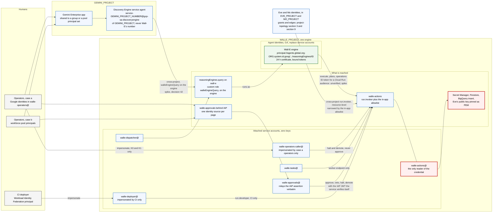

# 12. Agent identity, operator identity and workforce identity

## Status
- Owner: the platform owner
- Last reviewed: 2026-09-14
- Objective: see the platform HLD ([../agentic-platform/01-hld.md](../agentic-platform/01-hld.md)).
- Platform framing: Agent Identity (§1), operator identity (§5), keyless service accounts (§6)
  and the drift job (§10) are platform rules on
  [../agentic-platform/04-identity-and-privileged-access.md](../agentic-platform/04-identity-and-privileged-access.md)
  (§2.1, §2.3, §2.5, §2.6, §3, §6), the authority for the fleet; this chapter stays the
  authority for Wall-E's own principals, its engine and the research behind them. No identity
  decision here depends on the robot's Super Admin role (platform HLD §13.1).
- Maturity: **design. Nothing is built and nothing is enabled.**
- Placement: `WALLE_PROJECT` holds one engine; Eve's identities and key are in `EVE_PROJECT`, Mo's in `MO_PROJECT`, the Gemini Enterprise app and its service agent in `GEMINI_PROJECT`. [../project-topology.md](../project-topology.md) is the authority for placement and every cross-project grant.
- Research basis: Google Cloud, Google Workspace and Gemini Enterprise documentation, the IAM and Agent Platform release notes, and the `google-auth` and ADK source trees, read between 2026-09-03 and 2026-09-09. Every product fact below carries its launch stage. Anything the documentation does not settle is marked **unverified**, and nothing marked "likely" in the research is promoted to a fact here.
- Depends on: [02](02-identity-and-auth.md) for the credential model, [03](03-lld.md) for the endpoint allowlist, [06](06-security-guardrails.md) for the threat model, [08](08-team-eve-mo.md) for the Eve and Mo contract. [11](11-prompt-security.md) covers content screening and [13](13-agent-interconnection.md) covers Agent Gateway and the registries. This chapter names them only where an identity decision depends on them.

## What this chapter answers

Three questions the earlier documents leave open, or answer with a service account by default.

1. **What identity each agent runs as.** [02](02-identity-and-auth.md) gives Wall-E `walle-agent@` and calls Agent Identity "deferred, and probably wrong to defer". This chapter closes that. Adopt it, at creation, for every reasoning layer that runs on Agent Runtime.
2. **What identity each human operator presents**, on the two surfaces that matter: the approval page and the control endpoints. [02](02-identity-and-auth.md) assumes every operator is a Workspace user. This chapter keeps that as the pilot case and adds the case where operators exist only in an external identity provider.
3. **What identity every other machine uses**: the Cloud Run services, Cloud Tasks, the CI deployer, the Discovery Engine service agent that fronts Gemini Enterprise. The rule is keyless everywhere, and it is stated per principal rather than as a slogan.

Section 9 holds the one diagram. It is the whole chapter on one page.

## Positions

| Question | Position | Launch stage of what it relies on | Mechanism |
|---|---|---|---|
| Wall-E's runtime identity | **Agent Identity**, `identity_type=AGENT_IDENTITY`, set when the engine is created. `walle-agent@` is the fallback only if the Cloud Run hop spike in section 1.6 fails | GA since 2026-04-22 | Deploy config committed in git, a CI check on it, a post-deploy assertion on `spec.effectiveIdentity` |
| Eve's and Mo's runtime identity | The same, for any reasoning layer they run on Agent Runtime, in `EVE_PROJECT` and `MO_PROJECT`. Eve's signing key stays on a non-agent identity, `eve-controller@EVE_PROJECT` | GA | Their design records, built against section 1.8 |
| The robot's refresh token | Stays in regional Secret Manager at a pinned version, exactly as [02](02-identity-and-auth.md) says. The auth manager is not used for it | Auth manager GA per the IAM release notes entry of 2026-08-22 | `agentidentitycredentials.googleapis.com` left disabled, plus an org-policy constraint on `AuthProvider` |
| Operator identity for the pilot | `Assumption:` operators are Workspace users. Google identities on the IAP page, and the CLI break-glass path through `walle-operators-caller@` (which holds the `run.invoker` binding, no human does) for K0 and K1 only | GA | IAM bindings by Google Group, IAP JWT verified in the action service |
| Operators without a Google account | Workforce Identity Federation. The IAP page is their only handle. No CLI K0. The committed operator list holds opaque subjects, not emails | IAP with workforce identity GA since 2025-02-07. The `cloud-run` IAP resource type carries a Preview marker | Workforce pool, IAP settings, JWT `sub` check in code |
| Both operator kinds on one approval page | Not until tested. One identity source per IAP resource | unverified | Build rule, section 5.3 |
| Who may call `reasoningEngines.query` on Wall-E | Two principals ([14](14-hld-challenge.md) C10 removed `eve-controller@`), through a custom role bound on the engine resource; the first is `service-<GEMINI_PROJECT_NUMBER>@gcp-sa-discoveryengine…`, built from the **app** project's number. `WALLE_PROJECT` holds exactly one engine by topology, so the rule holds by construction | GA | Custom role, resource-level binding, `WALLE_PROJECT` holding one engine, a drift query |
| Service account keys | None are created, anywhere, ever | Key constraints GA | Two org-policy constraints set explicitly on the project |
| Impersonation | The `roles/iam.serviceAccountTokenCreator` grants are enumerated in section 6 (rule SA-5 of page 04 §2.3): two, three only on the fallback path. No workforce principal ever holds one | GA | IAM, drift query |

---

## 1. Agent Identity for the agents

### 1.1 What it is

The fleet rule, the organisation-wide trust domain and the principal forms are
[page 04 §2.1](../agentic-platform/04-identity-and-privileged-access.md#21-agent-identity-for-every-reasoning-layer-promotes-wall-e12-1);
this section keeps Wall-E's resolution of them and the facts that page does not restate.

Agent Identity gives an Agent Runtime instance a system-attested identity tied to the lifecycle of the resource that hosts it. GA since 2026-04-22 per both the IAM and the Agent Platform release notes. The identity is a principal identifier of the form

```
principal://TRUST_DOMAIN/NAMESPACE/AGENT_NAME
```

which for Wall-E resolves to

```
principal://agents.global.org-ORGANIZATION_ID.system.id.goog/resources/aiplatform/projects/PROJECT_NUMBER/locations/europe-west1/reasoningEngines/ENGINE_ID
```

Four facts about that string, all GA.

| Fact | Consequence for Wall-E |
|---|---|
| The trust domain is created at the organisation level, `agents.global.org-ORGANIZATION_ID.system.id.goog`, when the project has an organisation. Orgless projects get a project-level domain, and the documentation and the `google-auth` source disagree on its spelling (`project-` versus `proj-`) | Irrelevant here. `Assumption:` the Wall-E project sits under an organisation. Record the organisation id in [SETUP](SETUP.md) as a derived value |
| The namespace is the engine's immutable resource path and the agent name is the immutable reasoning-engine id | The principal is fully determined by four values and cannot be renamed. Never type it by hand; read it back after deploy, [SETUP](SETUP.md) Phase 12b step 5 |
| Deleting and recreating the engine produces a new id and therefore a new principal | Every resource-level binding on the old principal dies with it. Redeploy in place. A recreate is an identity change and goes through the IAM change checklist |
| The SPIFFE form `spiffe://TRUST_DOMAIN/resources/SERVICE/RESOURCE_PATH` names the same identity | Gemini Enterprise shows this form on the Agent details page, section 4 |

**Immutability, precisely.** The Semantic Governance configuration page states that `identity_type` and `agent_gateway_config` are set at creation and immutable, and that an engine without `AGENT_IDENTITY` is silently filtered out of that console. The REST reference does not mark `identityType` immutable, and the ADK deploy path sets it by an update immediately after a bare create. So "immutable" cannot mean "settable only in the create call". Treat it as fixed the moment the engine is registered anywhere, and never plan on flipping it. Whether the reverse switch, from `AGENT_IDENTITY` back to `SERVICE_ACCOUNT`, is allowed is **unverified**. The design consequence is the one that matters: **the identity decision is made before the production engine is created, not after.** Section 1.7.

### 1.2 Enabling it at deploy

Four documented ways, all setting the same field. GA for the SDK and Terraform paths. The IAM tutorial page for the agents CLI path carries a Preview banner.

| Path | How | Note |
|---|---|---|
| Python SDK | `client.agent_engines.create(config={"display_name": "wall-e", "identity_type": types.IdentityType.AGENT_IDENTITY, ...})` | Google's sample creates the client with `http_options=dict(api_version="v1beta1")`. The v1 REST reference documents `identityType` on `ReasoningEngineSpec`. Confirm on the first deploy which API version the installed SDK sends |
| ADK CLI | `.agent_engine_config.json` in the agent folder containing `{ "identity_type": "AGENT_IDENTITY" }`, then `adk deploy agent_engine` | ADK 2.8.0's `cli_deploy.py` reads the file, calls `create()` with no config, then `update()` with the merged config. The key passes through verbatim; there is no identity-specific code in the CLI. For a few seconds the engine exists under the default service agent |
| Agents CLI | `agents-cli deploy --agent-identity` | Preview tutorial page. Not used here |
| Terraform | `google_vertex_ai_reasoning_engine` on the `google-beta` provider, `spec { agent_framework = "google-adk"  identity_type = "AGENT_IDENTITY" }` | Sets the field at create. The cleanest of the four |

Google's own note: if the identity flag is not configured, the instance "continues to use service accounts", for backward compatibility with existing infrastructure-as-code. That default is the silent failure mode this design guards against. The mechanism is a CI check that the deploy config names `AGENT_IDENTITY` and a post-deploy assertion on `spec.effectiveIdentity`. Without both, "we use Agent Identity" is a wish.

[SETUP](SETUP.md) Phase 12 deploys with `vertexai.Client(...).agent_engines.create(...)` and passes `service_account`. On the Agent Identity path that key is removed and `identity_type` is added. The Reasoning Engine service agent no longer needs `serviceAccountTokenCreator` on `walle-agent@`, and that grant is not made.

### 1.3 Credentials: 24-hour certificates, bound tokens, and the one line that removes the property

GA. When the agent is deployed Google assigns it a SPIFFE identity and an X.509 certificate valid for 24 hours, and keeps it current. The agent's access tokens are certificate-bound under a Google-managed Context-Aware Access policy that enforces mTLS binding, so a token used outside its runtime environment fails with `401 Context-Aware Access requirements are not met`. Google's own words: "this security baseline makes stolen credentials un-replayable". Across Agent Gateway the policy also enforces Demonstrating Proof of Possession.

This is the concrete gain over `walle-agent@`. A service account token lifted from the agent's process works from anywhere for its lifetime. A bound token does not. It does not change boundary 3, because the agent still holds no Workspace credential of any kind, but it shrinks what a compromised agent process can hand to an attacker.

Two build rules, each with a mechanism.

| Rule | Why | Mechanism |
|---|---|---|
| `GOOGLE_API_PREVENT_AGENT_TOKEN_SHARING_FOR_GCP_SERVICES` is never set to `False` in any engine config | It is the documented opt-out from bound tokens. Google calls it "strongly discouraged". It is one line and it removes the property | CI refuses any deploy config or `.agent_engine_config.json` containing the variable. Add it to the forbidden-configuration list in [06](06-security-guardrails.md) |
| `google-auth >= 2.45.0` pinned in the agent's requirements | The bound-token path (`bindCertificateFingerprint` on the metadata token request) was added in 2.45.0 on 2025-12-15. An older library takes the unbound path silently | Requirements file in git, checked in CI |

The 24-hour rotation is Google-managed and needs no runbook entry.

### 1.4 IAM: allow policies, deny policies, and the automatic roles

GA. The principal and principal-set forms an agent identity takes in allow, deny and Principal
Access Boundary policies, including the conflicting trust-domain spellings on Google's pages, and
the two automatic roles `roles/aiplatform.agentDefaultAccess` and
`roles/aiplatform.agentContextEditor` (permission lists and binding resource unverified, dumped
and diffed before the first prod engine) are
[page 04 §2.1](../agentic-platform/04-identity-and-privileged-access.md#21-agent-identity-for-every-reasoning-layer-promotes-wall-e12-1).

**Deny policies turn the standing invariants into enforced rules.** [02](02-identity-and-auth.md)'s
"`walle-agent@` can read no secret. Check this after every IAM change" is an audit finding, not a
control: a mistaken grant defeats it until the next check. A deny policy survives the mistaken
grant. The one Wall-E is under is the platform's folder policy `deny-agents-platform` at
`fld-agentic-platform` (P61), whose denied principals include `WALLE_PROJECT`'s agent principal
set and service-account principal set, with `walle-actions@` and `walle-actions-super@` as
exception principals of the secrets rule only
([page 04 §3](../agentic-platform/04-identity-and-privileged-access.md#3-the-folder-deny-policy-deny-agents-platform-with-verified-permission-names));
no project-level copy exists on `WALLE_PROJECT` (SETUP Phase 12b step 7).

Wall-E's entire GCP footprint under Agent Identity: the two automatic roles, `roles/serviceusage.serviceUsageConsumer`, `roles/browser`, `roles/logging.logWriter`, and `run.invoker` on `walle-actions`. **Not `roles/aiplatform.expressUser`**, although Google recommends it: bound at project level it carries `aiplatform.reasoningEngines.query` on every engine in the project, which would make the agent a third caller of its own engine, able to assert any operator's `user_id`. Grant instead only what inference and Sessions are shown to need at build, on the narrowest resource that works, and if `expressUser` proves unavoidable record it as a named exception to the two-principal rule in [02](02-identity-and-auth.md), boundary 2 and the setup verification list. Nothing else, and the deny policy above says so in a form a mistaken grant cannot undo.

### 1.5 It replaces the service account. It does not sit beside it

GA, and the point most likely to be got wrong at build. The REST reference for `ReasoningEngineSpec.identityType` is explicit: `AGENT_IDENTITY` means "Use Agent Identity. The serviceAccount field must not be set." `SERVICE_ACCOUNT` and the unspecified value mean the custom service account if set, otherwise the project's default Reasoning Engine service agent. The Cloud Run counterpart of the feature says the same thing from the other side: switching a service from a service account to an agent identity "assigns a new principal that doesn't inherit permissions from your previous service account".

So the principals table in [02](02-identity-and-auth.md) has one row for the agent, and the row's identity is either `walle-agent@` or the agent principal. Nothing carries over. Every property verified against `walle-agent@` is re-verified against `principal://...` with Policy Analyzer after the switch, and every resource-level binding is made on the new principal. Kill switch K3, cutting the agent off, therefore removes `run.invoker` from whichever principal runs the agent: the agent principal on the Agent Identity path, `walle-agent@` only on the fallback.

### 1.6 The Cloud Run hop: the exact answer the research gives

Boundary 2 in [ARCHITECTURE](ARCHITECTURE.md) is "Cloud Run IAM `run.invoker`, ID-token verification with audience, plus an in-app per-endpoint caller allowlist keyed on the verified claim". For that to hold under Agent Identity, three things must be true. The research found none of them documented.

| Question | What the documentation says | Status |
|---|---|---|
| Does an Agent Identity agent obtain a Google-signed OpenID Connect ID token with a custom audience, the `walle-actions` URL? | The own-authority page covers **access tokens** only: "Application default credentials automatically retrieve the Agent Identity token from the metadata server". In `google-auth` at main, the bound-token logic is wired into the access-token path of the metadata client. `compute_engine.IDTokenCredentials`, which is the `instance/service-accounts/default/identity?audience=` path, has no agent-identity handling at all | **unverified** |
| Does Cloud Run IAM accept `principal://agents.global...` as a `roles/run.invoker` member? | The Cloud Run service-to-service page documents service accounts as callers and nothing else. The IAM agent-policies page says, for Cloud Run-hosted agents, "know the service account-based identity". One research pass read the Agent Runtime identity page as saying `run.invoker` is granted to the agent's principal identifier, and rated that "likely". The other pass found no such statement on any page | **split between the two research passes; unverified either way** |
| If the token exists, what are its claims? | Nothing. An agent identity has no email, so the `email` claim the allowlist keys on today may be absent, and the identity may arrive as `sub` or as the SPIFFE id | **unverified** |

What is settled: if the token exists, its audience is the `walle-actions` service URL, or a custom audience configured on the service, because that is what the Cloud Run service-to-service page requires of any ID token it accepts. Agent Gateway egress is the documented governed path from an agent to an endpoint, and `iamcredentials.googleapis.com` sits in the gateway's essential-endpoint list, which hints at how such a token might be minted. A hint is not a mechanism.

**So the hop is a spike, run before the production engine exists**, because the identity is fixed at creation. The spike is one day on a throwaway engine, [SETUP](SETUP.md) Phase 12b step 3. It has a pass or fail result and the result is attached to the decision record either way. A design that assumed the pass would be designing the allowlist around a claim nobody has seen.

### 1.7 Position: adopt, at creation, with a gated fallback

Adopt Agent Identity for Wall-E. Three reasons, in order of weight.

1. **It removes a standing credential from the reasoning layer** and replaces it with a 24-hour certificate and bound tokens. That is a strict improvement on boundary 2 and it costs nothing at runtime.
2. **It is the identity every governance feature on the platform keys on.** Agent Gateway access policies (GA 2026-08-31) authorise egress by agent principal, and an egress policy allowing only the `walle-actions` URL is a platform-enforced version of "the agent talks to nothing but the action service". Semantic Governance Policies require it at creation. Neither is load-bearing for Wall-E, section 1.9, but an engine created without Agent Identity is locked out of both for the life of the resource.
3. **It is immutable.** Deferring the decision is choosing `walle-agent@` for the life of the engine, and [02](02-identity-and-auth.md) already says that deferral is probably wrong.

The fallback is `identity_type=SERVICE_ACCOUNT` with `walle-agent@`, used only if the spike fails, with the spike output attached to the decision record and Agent Identity recorded as deferred hardening. The fallback keeps the whole of [02](02-identity-and-auth.md) as written. It loses bound tokens, the deny-policy form of the invariants, and the two governance features above. Nothing in the pilot depends on any of those.

**Cloud Run's own Agent Identity feature is not used.** `gcloud run deploy --identity-type=agent-identity` exists, is Preview, and gives a Cloud Run service a `principal://.../resources/run/...` identity. `walle-actions`, `walle-dispatcher`, `walle-tasks` and the reconciler are not agents, the feature is Preview, and the credential holder's identity must stay a plain attached service account so the Secret Manager, BigQuery insert-only and KMS bindings remain conventional. It is a candidate for Eve only if Eve is ever hosted on Cloud Run rather than Agent Runtime, and only once GA.

### 1.8 Eve and Mo

Input to their designs, not their design. Eve's and Mo's reasoning layers, if they run on Agent
Runtime, take their own agent identity at creation in their own projects and hold nothing on
Wall-E's engine or either action service: Eve reaches Wall-E only through its deterministic
controller `eve-controller@EVE_PROJECT`, an attached service account that holds the KMS signer,
because nothing an LLM loop can drive may produce an Eve signature or an Eve call
([08](08-team-eve-mo.md)), and adding a reasoning layer as a caller would add a query principal
and break boundary 2 (Eve's reporting path `eve-advisor@`, P34, holds no signer, invoker or
secret; [platform HLD §13.2](../agentic-platform/01-hld.md)). Every grant an Eve or Mo identity
holds on a Wall-E resource — `run.invoker` on `walle-actions` and `walle-actions-super`,
dataset-level readers on `walle_audit`, and the engine query binding that [14](14-hld-challenge.md)
C10 removed and row 13 records as an anti-grant — is a resource-level row of
[../project-topology.md](../project-topology.md#3-cross-project-grants) §3, never a project-level
role, with Eve's and Mo's own grants on [../eve/02-identity-and-auth.md](../eve/02-identity-and-auth.md)
and [../mo/02-identity-and-access.md](../mo/02-identity-and-access.md). The projects are separate
for least privilege, a project-level role in one agent's project reaching nothing of another's,
and section 7 gives one reason: the Discovery Engine service agent's documented role is
project-wide over every engine.

### 1.9 What is enforcement-grade here, and what is not

| Feature | Stage | Nature | Grade for a credential-holding admin agent |
|---|---|---|---|
| Agent Identity in IAM allow and deny policies | GA | Deterministic IAM | Enforcement, once the spike settles the hop |
| Certificate-bound tokens under the default Context-Aware Access policy | GA | Deterministic, platform-enforced | Enforcement, provided the opt-out variable is absent, which CI checks |
| Agent Gateway egress access policy keyed on the agent principal | Agent Gateway Private Preview 2026-04-22, GA 2026-06-18. Access policies GA 2026-08-31 | Deterministic, governs **where** the agent may connect, not which path it calls | Enforcement for what it covers, complementary to boundary 2, never a replacement. Its europe-west1 availability is `tbd`. [13](13-agent-interconnection.md) |
| Semantic Governance Policies | Preview | LLM judge. Google: "LLMs are probabilistic and can make mistakes. Verdicts may not be accurate" | **Detection at best.** Never cited for a promotion, never a substitute for the policy chain. Its only bearing on this chapter is that it requires `AGENT_IDENTITY` at creation |
| The Gemini Enterprise display of the SPIFFE id | GA | Visibility | Detection, through the drift job in section 4 |

---

## 2. The auth manager, and why the robot's refresh token does not go in it

**Stage.** The IAM release notes carry "Agent Identity auth manager is available in preview" under 2026-04-22 and "The Agent Identity auth manager and the Agent Identity APIs ... are generally available" under 2026-08-22. The three-legged OAuth and API-key how-to pages, read on 2026-09-03, still carry Preview banners and legacy `gcloud alpha agent-identity connectors` commands from the API that Google says "will not be generally available". This chapter treats the service as GA on the strength of the release notes, which are the launch-stage record, and treats the how-to pages as lagging. Nothing here is built on the alpha commands.

**What it brokers.** Google's description: "a centralized credentials vault and authentication broker that simplifies outbound tool authentication". It stores API keys, OAuth client secrets and user tokens in a Google-managed vault. An auth provider is one of three kinds: three-legged OAuth, where an end user consents and the vault keeps the resulting tokens; two-legged OAuth client credentials, where every invocation shares one client; or an API key. The consumer is the agent process: with ADK "the agent automatically retrieves the token from the auth provider and injects it into the tool invocation headers". The retrieval call is `POST .../authProviders/*/credentials:retrieve` on `agentidentitycredentials.googleapis.com`, its request body requires `userId`, "the identity of the end user", and its response is either a token, a consent URI with a nonce, or pending. Every documented grantee of `roles/agentidentity.user` is an agent identity. Whether a plain service account such as `walle-actions@` may call `credentials:retrieve` is **unverified**.

**Could it hold the robot's refresh token?** Mechanically, probably: a three-legged provider pointed at Google's own OAuth endpoints, one consent performed as the robot under a fixed `userId`, and the agent would receive a short-lived access token per call. The research rates that "likely", not verified, and nobody has documented the Workspace-robot use. It does not matter, because the design answer is no on three grounds that are not product gaps.

| Ground | Why it decides the question |
|---|---|
| **It moves the Workspace credential into the LLM's process.** The vault's consumer is the agent. The whole of boundary 3 is that the model never sees a Workspace token. An access token injected into a tool call by the agent framework is exactly the merge [ARCHITECTURE](ARCHITECTURE.md) section 3 says must never happen | Fatal on its own |
| **K4 disappears.** K4 is "the action service revokes its own refresh token at Google", instant and needing nobody. The vault never exposes the refresh token to the caller, so the caller cannot revoke it. The replacement, `authProviders:disable`, stops future retrievals and leaves the same 60-minute access-token residual, with two fewer properties: no pinned-version semantics and no self-revocation by the component that detected the incident | Fatal for the kill-switch table in [ARCHITECTURE](ARCHITECTURE.md) section 4.6 |
| **It is user-scoped by design** and adds a consent frontend and a `userId` convention for a single robot account | Cost with no benefit |

The trade-offs in the other direction are real and are recorded so nobody re-derives them: the vault is Google-managed, so the rotation runbook and the regional-secret question would go away; and a per-end-user credential broker is precisely the right tool if a future companion agent ever needs a delegated per-operator credential. This design forbids that for Wall-E, and [02](02-identity-and-auth.md) says why: acting as the requesting user makes every operator's own privileges the ceiling and attributes every action to them.

**Position.** Regional Secret Manager, pinned version number, read by `walle-actions@` only, exactly as [02](02-identity-and-auth.md) specifies. The auth manager is not used by Wall-E, and the project is configured so that it cannot be used quietly later: section 3.

---

## 3. The two Agent Identity APIs

GA since 2026-08-22 per the IAM release notes, Preview from 2026-06-18. They replace the legacy IAM Connectors API for managing auth providers and agent identities. One research pass could not find the 2026-08-22 entry in the Agent Platform release-note feed and flagged the date; the other read it in the IAM release notes, which is where the entry lives. Cite the IAM release notes in the decision record.

| API | Resources and methods | Wall-E's use |
|---|---|---|
| `agentidentity.googleapis.com`, v1 and v1beta | `projects.locations.authProviders` with create, delete, get, list, patch, enable, disable, query, getIamPolicy, setIamPolicy; `authProviders.authorizations`; `accessSummaries` | **Enabled.** The IAM tutorial lists it as a prerequisite for deploying with an identity. Wall-E creates no auth provider on it |
| `agentidentitycredentials.googleapis.com`, v1 | `authProviders.credentials:retrieve` and `credentials:finalize` | **Left disabled.** With it off, no auth provider can be exercised in the project. That is the mechanism behind section 2's "not used" |

Both APIs can be placed in a VPC Service Controls perimeter, and agent identities can be named in ingress and egress rules, GA 2026-08-14. That matters for the perimeter decision [ARCHITECTURE](ARCHITECTURE.md) section 9 defers to before S1. Custom org-policy constraints exist for `agentidentity.googleapis.com/AuthProvider`, GA 2026-08-14. A custom constraint denying `AuthProvider` creation in the Wall-E project is the belt to the disabled API's braces, and closes the door on a future "convenient" delegated credential without a design change. Both are config steps in [SETUP](SETUP.md) Phase 12b step 1.

---

## 4. Gemini Enterprise and the SPIFFE id

**What it shows.** As a Gemini Enterprise administrator, the Agent details page shows the agent's identity, "typically the agent's SPIFFE ID". If the publisher has not published one, the Agent Registry resource id is shown instead. Preview on 2026-04-21, GA per a release-note entry in late June 2026 and the Agents overview page dated 2026-09-04.

**Whether it can pin one.** No page describes an administrator control that restricts or pins which agent identity Gemini Enterprise will invoke. That is an inference from absence across the pages read, not a documented statement, and it is recorded as such. Pinning is achieved structurally, not by a setting: registration binds the Agent Runtime resource path `projects/PROJECT_ID/locations/europe-west1/reasoningEngines/ENGINE_ID`, and with `AGENT_IDENTITY` the principal is derived from that immutable path. What the console gives the operator is visibility. Use it.

| Control | Mechanism |
|---|---|
| The registered agent is the engine this design deployed | After every registration, the SPIFFE id on the Agent details page must equal the `spec.effectiveIdentity` recorded in [SETUP](SETUP.md). A human reads both and records the check |
| It stays that engine | The daily IAM drift job compares the two. A recreate under a new id would otherwise change the identity silently |
| "Gemini Enterprise pins the agent identity" | **A wish.** There is no setting. Do not write it in a decision record |

**Two identities to keep apart.** The Gemini Enterprise app itself has an agent identity, `principal://agents.global.org-.../resources/discoveryengine/.../engines/APP`, and the documentation shows two spellings of it. That identity is **not** the caller of `reasoningEngines.query`. The caller is the Discovery Engine service agent, a service account, section 7. If a deny policy or an Agent Gateway policy ever needs the app's own identity, read it from the console rather than construct it.

**What reaches the agent.** "ADK agents receive the user's email address from Gemini Enterprise." The transport, a header or a request field, is not documented. This is the assertion [02](02-identity-and-auth.md) already calls asserted, not proven, and this chapter changes nothing about it. What it adds is the case where that email is not a Workspace email at all: under a third-party identity provider the recommended mapping is `google.subject = assertion.email.lowerAscii()`, and the value that arrives is whatever the pool mapped. Section 5.4.

---

## 5. Operator identity

Two cases. The pilot is case (a). Case (b) is documented so a contractor-only operator, or an organisation whose identity lives elsewhere, has a path that does not involve creating Google accounts by hand.

`Assumption:` the organisation's Gemini Enterprise location runs Google Identity. The identity provider is set per location, "if you change identity providers, users lose their existing chat history", and existing data stores must be recreated. Wall-E therefore inherits the choice rather than making it, and Google's release note of 2026-08-20 recommends Google Identity for all new setups. Confirm the location's provider before the pilot: it decides whether the T0 principal in the audit row is a Workspace email or a workforce subject.

### 5.1 Case (a): operators are Workspace users with Google identities

Everything in [02](02-identity-and-auth.md), [03](03-lld.md) and [ARCHITECTURE](ARCHITECTURE.md) section 7.5 holds unchanged. Stated here per surface with its mechanism, all GA.

| Surface | Identity presented | Binding | What the action service verifies |
|---|---|---|---|
| Gemini Enterprise app | Workspace SSO. The agent is shared with `walle-operators@` as a Google Group on its permissions tab | Per-agent sharing, member type Group | Nothing directly. The email arrives asserted via the Discovery Engine service agent. The write-path re-check against `walle-operators@` through the Directory API is the control, failing closed |
| Approval page, `walle-approvals` behind IAP | The operator's Google identity, through IAP's sign-in | `roles/iap.httpsResourceAccessor` granted to `group:walle-operators@` on the Cloud Run resource | The `x-goog-iap-jwt-assertion` header, section 5.3, then `email` against the committed operator list, then `hd` equals the Workspace domain |
| Control endpoints from a terminal, K0 and K1 | An ID token minted by impersonating `walle-operators-caller@`, because `gcloud auth print-identity-token --audiences=` is refused for user credentials, as [SETUP](SETUP.md) records | `roles/iam.serviceAccountTokenCreator` on `walle-operators-caller@` for each member of the group, and `run.invoker` on `walle-actions` for `walle-operators-caller@` | The token's `email` is the caller service account's, so the allowlist admits `walle-operators-caller@` on `/v1/control/*` only. **This path can never approve**, because it carries no per-human assertion. The human behind the call is recoverable only from the audit log of the impersonation itself; confirm during the K0 drill that the entry names the human, and enable Data Access logs for the IAM Service Account Credentials API before the drill |
| GCP console and `gcloud`, K2 and K3 | The operator's own Google identity | Scheduler and Pub/Sub edit rights for every operator; for K3, a custom role holding only `run.services.getIamPolicy` and `run.services.setIamPolicy`, bound on `walle-actions`, for the ladder owner. **Never `run.admin` or `run.developer`**: those carry `run.services.update`, the deploy permission, and [ARCHITECTURE](ARCHITECTURE.md) weakness 12 says no human holds it in steady state | Not applicable. These are platform operations |

The plain `gcloud auth print-identity-token` without an audience is what the Cloud Run documentation gives developers for testing. Cloud Run IAM accepts it. The action service does not, because it verifies the audience itself, and that is correct: an audience-less token accepted by one service is replayable against another.

### 5.2 Case (b): operators exist only in an external identity provider

The platform decides the workforce pool once ([page 04 §2.5](../agentic-platform/04-identity-and-privileged-access.md#25-workforce-identity-for-non-google-operators-only-if-p24-says-yes), P64): no pool until a population without Google identities exists, one organisation-level pool, 1 h sessions, no programmatic sign-in, and workforce operators admitted to Tier R and W surfaces only, never to a Tier P surface. Wall-E is Tier P-SA, so this section records the one-agent design and the facts page 04 does not restate; its consequence for Wall-E is the committed operator list per case, section 5.4.

Workforce Identity Federation, GA. "Sync-less": no Google account is created and nothing is synchronised. A workforce pool is created at the organisation, a provider inside it points at the IdP over OIDC or SAML, and an attribute mapping turns the IdP's assertion into Google-side attributes.

**Principal formats for workforce pools**, usable in allow and deny policies, GA.

| Form | Names |
|---|---|
| `principal://iam.googleapis.com/locations/global/workforcePools/POOL_ID/subject/SUBJECT` | One person, by the mapped `google.subject` |
| `principalSet://iam.googleapis.com/locations/global/workforcePools/POOL_ID/group/GROUP_ID` | Everyone in a mapped group |
| `principalSet://iam.googleapis.com/locations/global/workforcePools/POOL_ID/attribute.NAME/VALUE` | Everyone with a mapped attribute value |
| `principalSet://iam.googleapis.com/locations/global/workforcePools/POOL_ID/*` | The whole pool. **Never used here.** Google's best practice: "Don't grant access to all members of a pool" |

**Attribute mapping**, GA. `google.subject` is required, at most 127 bytes, and "Cloud Audit Logs logs record the contents of this field as the principal". `google.groups` carries up to 400 groups. `google.email` exists "for OAuth integration only" and is what IAP needs to populate the `email` claim. Google's best practices are the design's rules: an immutable subject identifier, an immutable group identifier, a limited session length, Security Token Service data-access logs on. Sessions default to 3600 seconds and may be set between 900 and 43200. An approval surface wants the short end.

**The org-boundary rule that matters most.** "Workforce identity pool principals can't directly access resources outside of the organization that they belong to. However, if a principal is given permission to impersonate a service account within the organization, this constraint can be bypassed." Therefore no workforce principal ever holds `roles/iam.serviceAccountTokenCreator` or `roles/iam.serviceAccountUser` on any Wall-E service account. A workforce operator who could impersonate `walle-actions@` would be the credential holder. Section 6 lists the three impersonation grants that exist; none is to a workforce principal, and the drift query says so daily.

**Per surface**, with stage.

| Surface | Identity presented | Binding | Stage | What the action service verifies |
|---|---|---|---|---|
| Gemini Enterprise app | The workforce principal, through the location's third-party provider | Sharing supports member types "Principal" and "Workforce identity pool", with identifiers `//iam.googleapis.com/locations/global/workforcePools/POOL_ID/subject/...`, `/group/...`, `/attribute.NAME/VALUE`, `/*` | GA. An IdP with SCIM provisioning enables autocomplete for group sharing | The asserted principal, which is the mapped `google.subject`, against the committed operator list. **There is no Directory group to read.** Section 5.4 |
| Approval page, `walle-approvals` behind IAP | The workforce identity, through IAP's redirect to the IdP | `roles/iap.httpsResourceAccessor` to `principalSet://.../group/GROUP_ID`, or per operator to `principal://.../subject/SUBJECT`. **By principal identifier, never by email**, which IAP requires | IAP with workforce identity GA since 2025-02-07. IAP on Cloud Run without a load balancer GA. The `cloud-run` resource type in the IAP-with-workforce settings command is marked **Preview** on the page dated 2026-09-08 | The IAP JWT, section 5.3, then `sub` against the committed list of subjects. `email` is display text |
| Control endpoints from a terminal | **None.** `run.routes.invoke` "doesn't support Workforce Identity Federation", and IAP's programmatic access "is only supported for Google service accounts" | Not applicable. The "operators hold `run.invoker`" row in [ARCHITECTURE](ARCHITECTURE.md) section 4.2 has no meaning for a workforce principal | GA statements | A workforce operator has no curl-driven K0. The IAP page is the andon cord and must expose halt and demote as first-class buttons, not only approve and veto |
| GCP console and `gcloud`, K2 and K3 | The workforce identity, after `gcloud iam workforce-pools create-login-config ...` and `gcloud auth login --login-config=...`, a browser flow | The same Scheduler and Pub/Sub grants as case (a), and the same narrow K3 custom role on `walle-actions`, on the workforce principal. Never `run.admin` | GA. Those APIs list no workforce limitation. Scheduler jobs must use `httpTarget`, which the dispatcher's do | Not applicable |

**Constraints that shape the page.** One workforce pool and one provider per IAP application. Pool, OAuth client and IAP application in the same organisation. Device-based access levels are unsupported for workforce users, so the page cannot require a managed device; IP range and time-of-day levels still apply. If the Preview marker on the `cloud-run` resource type matters to a security reviewer, the GA fallbacks are App Engine or a load-balancer-fronted backend service, both GA resource types for the same feature.

### 5.3 What the approval surface asserts, in each case

The platform rule for human access to every control surface (IAP with an access-level condition, the surface list and what each surface can pull) is [page 04 §6.2–§6.4](../agentic-platform/04-identity-and-privileged-access.md#64-the-surfaces); this section is Wall-E's approval-surface assertion design.

**The rule.** This is the control that makes every L3 statement meaningful. The approve request carries a **per-human assertion the action service verifies itself**, with its signature checked against Google's keys and, for IAP, the audience checked. The service then checks the asserted identity against the **committed operator list in the deployed configuration**, not a live Directory read (section 5.4, [ARCHITECTURE](ARCHITECTURE.md) section 7.5), binds the verified identity into the approval record, and stores which surface asserted it. A surface that can assert consent without a per-human assertion the service can verify is the original defect one hop out: the model no longer claims a human approved, a service account does, and nothing verifiable travels with the claim. That is not acceptable, and a trusted caller identity alone does not satisfy the rule.

**Acceptable surfaces**, one of which must exist before Stage 1 (it is a Stage 1 blocker); until one does, no family may go above L2, because L3 has no approval surface to use.

| Surface | Per-human assertion | Verdict |
|---|---|---|
| An approval page behind Identity-Aware Proxy, `walle-approvals` | The `x-goog-iap-jwt-assertion` header, below. IAP authenticates the human; each approval is bound to `plan_hash` | **Acceptable**, the lesser build effort. The position of this chapter |
| A Google Chat app with **app authentication** | The interaction event's Chat-verified sender, validated against Google's keys | **Acceptable**, the best experience and a separate build with real engineering effort |
| Text-only Chat under **user authentication** (the robot's own token) plus a reply convention | None. Under user authentication the Chat API can send text only: no card, no button, no interactive widget, so one-click approve and veto are impossible and a parsed reply is not an authenticated approval | **Not acceptable.** The model would be back in the approval path |

The approval surface is its own Cloud Run service, `walle-approvals`, with its own service account `walle-approvals@`, deployed with `--iap`. This is a position, and the reason is mechanical: IAP on Cloud Run is enabled per service and fronts all of it. Putting it on `walle-actions` would route the agent, Cloud Tasks and Eve through IAP as well and change every machine caller's token path. It also gives the credential holder no browser-facing path, which [09](09-open-decisions.md) decision 18 wants for a different reason.

The page forwards the IAP assertion **verbatim** to `walle-actions`, which verifies it itself. That keeps the rule in [ARCHITECTURE](ARCHITECTURE.md) section 3: the service never believes a service account that says a human clicked. `walle-approvals@` is on the allowlist for approve, veto, halt and demote as the relay, and the approval record stores both the verified human and the relay as the surface. The residual is that the relay could replay a still-valid assertion against a different plan within its lifetime; the nonce, the `plan_hash` binding and the relay's own allowlisted identity bound it, and the relay holds nothing else.

The header is `x-goog-iap-jwt-assertion`, GA. IAP issues it on every authenticated request. It is signed with ES256 and verified against the keys at `https://www.gstatic.com/iap/verify/public_key-jwk`, with a 30-second skew.

| Claim | Case (a), Google identity | Case (b), workforce identity |
|---|---|---|
| `iss` | `https://cloud.google.com/iap` | Same |
| `aud` | `/projects/PROJECT_NUMBER/locations/europe-west1/services/walle-approvals` | Same |
| `sub` | "The unique, stable identifier for the user." Stored on the approval record | The workforce subject. **Its on-the-wire form is unverified**: the signed-headers page documents prefixed forms only for Identity Platform external identities and says nothing about workforce users. Bare subject, `principal://` URI, or another prefix are all possible. It is the key the service checks |
| `email` | The Workspace address. The key the service checks, reconciled against the group | Populated from the `google.email` mapping, which the IAP-with-workforce page requires. **Display text only** |
| `hd` | "Account domain if user belongs to hosted domain." Checked against the Workspace domain | Not documented for workforce users. Not required |
| `google.access_levels` | Present when access levels are configured | Present for IP and time levels. Device levels unsupported |
| `exp`, `iat` | Checked with 30-second skew | Same |

The service persists `sub`, `email` if present, `aud`, `iat` and the surface name on the approval row, because IAP writes no per-request application log the service can rely on.

**First sign-in capture, case (b).** Because the workforce `sub` shape is undocumented, the committed operator list cannot be written before one real workforce operator has signed in. Section 8.2 step 8 captures the decoded JWT server-side, records the literal `sub` and `email` and their format in [SETUP](SETUP.md) with the date, and only then populates the list. Writing the list from an assumed format is a wish.

### 5.4 The committed operator list, per case: the key design consequence

[ARCHITECTURE](ARCHITECTURE.md) section 7.5 authorises the control and approval endpoints against a committed operator list in the deployed configuration, never a live Directory read, so that halt works when the Workspace credential is the thing that failed. That list must hold the principal format actually in use, compared byte for byte.

| | Case (a) | Case (b) |
|---|---|---|
| The list holds | Workspace emails | **Two values per operator**: the IAP JWT `sub` from the approval page's pool, and the `google.subject` the Gemini Enterprise location's own pool asserts on the T0 path. They come from two pools with two mappings unless the pools are the same, so a single value cannot serve both surfaces. Both are captured in step 8.2.8 |
| Compared against | `email` from the IAP JWT, plus `hd`; the impersonating caller's email on the CLI path | `sub` from the IAP JWT |
| Live re-check on the write path | **Exists.** Directory API membership of `walle-operators@`, failing closed, per [03](03-lld.md) policy step 5 | **Does not exist.** A workforce subject is not a Workspace user and there is no Directory group to read. The write path compares the Gemini Enterprise-asserted `google.subject` against the second value in the committed list |
| Daily reconciliation of the list | Against the Google Group. Divergence alerts | **None documented.** Reconciling against the IdP's group would need an IdP API the reconciler can read. `tbd` per IdP, and until it exists this row is a wish |
| Removing an operator | Remove from the group. The write path stops at the next check; the control endpoints stop at the next config deploy | Remove from the IdP group, which stops the next IAP sign-in, bounded by the pool session length; then a config deploy to drop the subject from the list |
| The T0 principal recorded in the audit row | A Workspace email | The mapped `google.subject`, which under the recommended mapping is the lower-cased IdP email |

The loss in case (b) is real and is the reason case (a) is the pilot: removal is two steps instead of one, the live re-check that lets the write path fail closed on a stale operator does not exist, and the subject format must be observed before it can be trusted. None of that is a product gap. It is what "no Google account" means.

### 5.5 Which kill switch each kind of operator can pull

What each switch does, who may pull it, its target time and what it does not stop are
[ARCHITECTURE](ARCHITECTURE.md#46-kill-switches) §4.6; K7's relation to K0–K6 and the crisis
order are [page 04 §9.7](../agentic-platform/04-identity-and-privileged-access.md#97-how-k7-sits-with-each-agents-k0k6).
The mapping to the two kinds of operator:

| Switch | Google-identity operator | Workforce operator |
|---|---|---|
| K0 halt, K1 demote | The IAP page, or the CLI through `walle-operators-caller@` | The IAP page only |
| K2 stop new runs | `gcloud`, Scheduler pause and subscription detach | `gcloud`, after the login-config sign-in |
| K3 cut the agent off | A project IAM admin, `gcloud` | The same, if that operator is the ladder owner |
| K4 kill the credential | One call to the service, from the page or the CLI | From the page |
| K5 revoke the grant, K6 remove Super Admin from the robot | A **human** super admin other than the robot, on the two-person rota; at least two human super admins exist before the grant ([page 04 §8.5](../agentic-platform/04-identity-and-privileged-access.md#85-the-two-person-rule-for-the-privileged-tier-in-one-table)) | **Never.** These are Workspace operations and a workforce operator has no Workspace identity. At least one Google-identity super admin is on the rota in every configuration |
| K7 the fleet kill | Not an operator switch: a member of `platform-approvers@` through `ent-k7-human`, or the deterministic job on a severity-1 SIEM rule | **Never.** Workforce operators never reach a Tier P surface ([page 04 §2.5](../agentic-platform/04-identity-and-privileged-access.md#25-workforce-identity-for-non-google-operators-only-if-p24-says-yes), P64); Wall-E is Tier P-SA, so for Wall-E case (b) of section 5.2 applies to no control surface at all |

---

## 6. Which identity mechanism applies where: keyless everywhere

The fleet's service-account policy (no keys, no cross-project attachment, one account per duty, enumerated impersonation, anti-grants) is [page 04 §2.3](../agentic-platform/04-identity-and-privileged-access.md#23-service-account-policy), rules SA-1 to SA-7; this section is Wall-E's instance. Four Google mechanisms cover every non-human principal in this design. Each applies to one kind of thing, and the table says which.

| Mechanism | Stage | Applies to | In this design |
|---|---|---|---|
| **Agent Identity** | GA 2026-04-22. A member of the managed-workload-identity family, with the SPIFFE form `spiffe://agents.global.org-.../resources/aiplatform/...` | Reasoning layers on Agent Runtime, and Gemini Enterprise apps | Wall-E, and Eve's and Mo's reasoning layers |
| **Attached service accounts** | GA | Cloud Run services and jobs that are not agents | `walle-actions@`, `walle-dispatcher@`, `walle-tasks@`, `walle-approvals@`, the reconciler (all in `WALLE_PROJECT`); `eve-controller@` and Eve's other identities in `EVE_PROJECT`; `mo-metrics@`, `mo-analyst@`, `mo-narrator@` in `MO_PROJECT` |
| **Workload Identity Federation** | GA. External tokens exchanged at the Security Token Service. Principal form `principal://iam.googleapis.com/projects/N/locations/global/workloadIdentityPools/POOL/subject/SUBJECT` | Callers outside Google Cloud | The CI deployer. Its pipeline identity exchanges its own token and impersonates the deploy service account, `walle-deployer@` (name proposed, `tbd`; [SETUP](SETUP.md) does not yet name one), so the largest control in the system, the deploy grant in [ARCHITECTURE](ARCHITECTURE.md) section 4.2, is keyless and short-lived. Cloud Run "doesn't support Workload Identity Federation direct resource access", so impersonation is the documented path, not a workaround |
| **Managed workload identities** for GKE and Compute Engine | GA 2026-03-18; Compute Engine GA 2026-07-27; GKE flavour Preview | Workloads on those platforms | Not used. Wall-E has neither |
| **Workforce Identity Federation** | GA | Humans without Google accounts | Case (b) operators only |

**Impersonation.** `roles/iam.serviceAccountTokenCreator` grants `iam.serviceAccounts.getAccessToken` and is one of the five roles Google lists as carrying impersonation power, with `serviceAccountUser`, `workloadIdentityUser`, `serviceAccountAdmin` and `serviceAccountKeyAdmin`. Wall-E's grants of it are the rows below, SA-5's enumeration for this project; any other is drift, and the third row exists only on the fallback path.

| Grant | On | To | Why |
|---|---|---|---|
| `serviceAccountTokenCreator` | `walle-operators-caller@` | Each Google-identity operator | The CLI break-glass path for K0 and K1, section 5.1 |
| `serviceAccountTokenCreator` | `walle-deployer@` | The CI pipeline's Workload Identity Federation principal | Keyless deploys |
| `serviceAccountTokenCreator` | `walle-agent@` | The project's Reasoning Engine service agent | **Fallback path only.** Absent under Agent Identity |

**`serviceAccountUser`, the actAs grant, is a separate list.** Deploying a Cloud Run service with an attached service account requires `iam.serviceAccountUser` on that account. The deployer identity `walle-deployer@` therefore holds it on `walle-actions@`, `walle-dispatcher@`, `walle-tasks@` and `walle-approvals@`, and on nothing else. That is the deploy-separation control in [ARCHITECTURE](ARCHITECTURE.md) section 4.2, and it is why the deployer is never an operator.

Never: any human or workforce principal holding `serviceAccountTokenCreator` or `serviceAccountUser` on `walle-actions@` or `eve-controller@`. That is the one path that makes the deny-by-principal-set policies moot, because the impersonator becomes the service account. The identity drift job (section 10, page 04 §2.6) checks exactly these two lists for `WALLE_PROJECT`, so it never alerts on a grant the design mandates. `eve-controller@` is in `EVE_PROJECT`, whose IAM Wall-E's job cannot read, so the `eve-controller@` half of the rule is asserted by Eve's own drift job there (decision 46).

**Keys.** Long-lived JSON keys are not deprecated. Google describes them as "a security risk if not managed carefully", recommends avoiding them "whenever possible", and for organisations created on or after 2024-05-03 enforces `iam.managed.disableServiceAccountKeyCreation` and `iam.disableServiceAccountKeyUpload` by default. `Assumption:` the organisation's creation date is `tbd`, so both constraints are set explicitly on the Wall-E project rather than inherited, [SETUP](SETUP.md) Phase 12b step 1. Wall-E holds zero keys (SA-1). A service account principal set, `principalSet://cloudresourcemanager.googleapis.com/projects/N/type/ServiceAccount`, GA 2026-03-03, lets a deny policy name every service account in the project at once if a future control needs it.

---

## 7. Locking `aiplatform.reasoningEngines.query`

The asserted end-user email is trustworthy exactly to the extent that only trusted callers can invoke the engine. Gemini Enterprise passes the signed-in user's email as `user_id`, which surfaces in ADK as the session user id; it is asserted by the calling service, not cryptographically bound to the user. [02](02-identity-and-auth.md) fixes the callers at **two principals and no others, ever**, counting inherited project and organisation bindings:

| Principal | Address | Home |
|---|---|---|
| The Gemini Enterprise Discovery Engine service agent, **of the app project** | `service-GEMINI_PROJECT_NUMBER@gcp-sa-discoveryengine.iam.gserviceaccount.com` | `GEMINI_PROJECT`, a binding on the engine to a principal homed in another project |
| The dispatcher | `walle-dispatcher@WALLE_PROJECT` | `WALLE_PROJECT` |

No Eve identity is on the engine. `eve-controller@EVE_PROJECT` was a third principal as first designed; [14](14-hld-challenge.md#c10--eves-streamquery-channel-can-assert-any-operators-identity-stands) C10 removed it, because a query principal asserts `user_id` and Eve verifying through the agent is Eve verifying through the thing it verifies. [../project-topology.md](../project-topology.md) row 13 records the absence as an anti-grant, and Eve reaches Wall-E only through `walle-actions`. A binding for `eve-controller@` on the engine is a defect, and so is a binding for `service-PROJECT_NUMBER@gcp-sa-discoveryengine…` (Wall-E's own project number): that principal never calls, and the app's real caller is then refused. This section gives the mechanism and the one place the rule bends.

**The recipe**, GA, from Google's own "Share an agent" page: create a custom role containing only `aiplatform.reasoningEngines.query`, and bind it on the engine resource, not the project, through `projects.locations.reasoningEngines.setIamPolicy` or Terraform's `google_vertex_ai_reasoning_engine_iam_member`. There is no predefined role that carries only that permission — `roles/aiplatform.reasoningEngineUser` does not exist — and [SETUP](SETUP.md) names the custom role `walleEngineQuery` (title "Wall-E engine query", stage GA, the single permission).

**Create the role before binding it.** `set-iam-policy` with a non-existent role fails with `INVALID_ARGUMENT`, and the engine then silently keeps whatever policy it inherits from the project, so the two-principal lock is simply absent. The engine policy holds exactly one binding, `walleEngineQuery`, with exactly the two members above; `get-iam-policy` on the engine must show two members and no other role. The commands, including the REST `setIamPolicy` alternative where the `gcloud beta ai reasoning-engines set-iam-policy` subcommand is missing, are in [SETUP](SETUP.md) "Lock down who may invoke the engine".

**Confirming the service agent's address.** It is created lazily when the Gemini Enterprise app first runs. Confirm it on **`GEMINI_PROJECT`'s** IAM page with "Include Google-provided role grants" enabled; it does not appear on `WALLE_PROJECT`'s IAM page until it is bound there, because it is another project's principal.

**IAM conditions do not apply.** The IAM conditions resource-attribute table lists no resource-name format for `aiplatform` or `reasoningEngines`, so a `resource.name` condition on an engine is not documented as supported. That is an inference from absence, and it is enough: do not design around conditions on the engine. Resource-level bindings do the job without them.

**The Discovery Engine service agent.** Its address is `service-GEMINI_PROJECT_NUMBER@gcp-sa-discoveryengine.iam.gserviceaccount.com`, where `GEMINI_PROJECT_NUMBER` is the number of the **Gemini Enterprise app's** project, `GEMINI_PROJECT`, and never Wall-E's `PROJECT_NUMBER`. The cross-project ADK page, which is the page for exactly this integration, says to grant it `roles/discoveryengine.serviceAgent` on the agent project, at project level. A different page, for Agent Search's streaming answers, names `roles/aiplatform.reasoningEngineServiceAgent` instead; it addresses a different feature and is not followed. `roles/discoveryengine.serviceAgent` carries `reasoningEngines.create`, `delete`, `get`, `list`, `query` and `update`, plus sandbox and extension permissions.

That is the place the two-principal rule bends. A project-wide role that carries query, update and delete on every engine means "two principals on this engine" is true only while the project holds one engine. Two consequences.

| Consequence | Mechanism |
|---|---|
| `WALLE_PROJECT` holds exactly one `reasoningEngine`. Eve's and Mo's, if any, are in `EVE_PROJECT` and `MO_PROJECT`. [ARCHITECTURE](ARCHITECTURE.md) section 9 and [../project-topology.md](../project-topology.md) §2 say so explicitly | The four-project topology, and a drift query that fails on a second engine in the project |
| Try the narrow grant first — **decision 42**. Bind `walleEngineQuery` on the engine to `service-GEMINI_PROJECT_NUMBER@gcp-sa-discoveryengine…`, register the agent in the app in `GEMINI_PROJECT`, and see whether registration and invocation work across the project boundary. Whether the engine-scoped grant alone suffices cross-project is **not documented** | If it works, the documented project-level role is not applied and the rule holds by binding. If it fails, apply `roles/discoveryengine.serviceAgent` on `WALLE_PROJECT`, record it as the topology's single named project-level exception with the failing error, and note that the rule then holds by `WALLE_PROJECT` containing one engine. Re-test the engine-level grant at each engine redeploy, so the fallback is removed the day Google's behaviour changes. The spike runs the Phase 13 registration and one query with the engine-level grant only ([SETUP](SETUP.md) Phase 12 and 13); the fallback is `gcloud projects add-iam-policy-binding` on `WALLE_PROJECT` for that same principal with `roles/discoveryengine.serviceAgent`, and nothing else |

**The drift query.** Ten predefined roles carry `reasoningEngines.query`: `aiplatform.admin`, `aiplatform.editor`, `aiplatform.user`, `aiplatform.viewer`, `aiplatform.expressAdmin`, `aiplatform.expressUser`, `aiplatform.serviceAgent`, `aiplatform.customCodeServiceAgent`, `discoveryengine.serviceAgent`, `visualinspection.serviceAgent`. `aiplatform.user` and `aiplatform.viewer` are the two developers acquire casually. The daily job enumerates every project-level and inherited binding of those ten roles and alerts on any principal that is not the Discovery Engine service agent. Under Agent Identity the agent must **not** hold `roles/aiplatform.expressUser` at project level, precisely because it is on that list: an agent that can invoke its own engine can assert any operator's `user_id`. If the build finds `expressUser` unavoidable for inference or Sessions, it is a recorded exception with that residual stated, never an allowlisted default.

**IAM narrows who can assert an email; it does not prove the assertion.** The action service still re-checks the asserted email against the operators group through the Directory API on every write, failing closed if it cannot check (section 5.4 for case (b), where no such group exists).

Google's own warning on the sharing page is the documentation-level restatement of this design: "The security controls are determined by the code of the receiving agent ... don't grant direct access to the agent to untrusted entities." The receiving agent's code is not the enforcement point here. The action service is.

---

## 8. Ordered configuration steps

Variable names follow [SETUP](SETUP.md). Values are never recorded here.

> In every command block of this chapter `PROJECT` is Wall-E's own project — `WALLE_PROJECT` everywhere outside Wall-E's script and runbook ([../project-topology.md](../project-topology.md) §6). Nothing here is run against `GEMINI_PROJECT`, `EVE_PROJECT` or `MO_PROJECT`.

### 8.1 Deploy the ADK agent with Agent Identity and bind it to the action service's invoker role

The commands and verify steps are [SETUP](SETUP.md) Phase 12b, which runs in place of Phase 12's
deploy block. The order is the design: APIs and key constraints and the CI-checked deploy config
come first, the one-day spike on a throwaway engine (does Cloud Run IAM accept the principal as an
invoker; does the agent obtain an ID token for the `walle-actions` audience; what claims it
carries) runs **before the production engine exists**, because `identity_type` is fixed at
creation, and only its result decides the deploy (Agent Identity, or `SERVICE_ACCOUNT` with
`walle-agent@` and the decision record saying so), followed by reading the principal back, the
baseline grants, the query lock of section 7 and the registration check of section 4. After every
IAM change the engine policy (only the `walleEngineQuery` bindings), Policy Analyzer for
`AGENT_PRINCIPAL` (no Secret Manager, Firestore write, BigQuery or KMS access) and the `run.invoker`
members of `walle-actions` are re-verified, the last against the member list in
[§10.1](#101-the-runinvoker-members-of-the-two-action-services) and nothing else.

### 8.2 Let a Workforce Identity operator reach the IAP-protected approval page

Case (b) only. Steps 1, 2 and 4 are organisation-level and need the corresponding organisation roles, a separate approval from anything in the project.

**Step 1. The pool**, at the organisation, with a short session.

```bash
gcloud iam workforce-pools create walle-operators-pool \
  --organization="$ORG_ID" --location=global --session-duration=3600s
```

**Step 2. The provider**, OIDC or SAML per the IdP, with immutable identifiers and the email mapping IAP needs. Avoid the OIDC implicit flow. Enable Security Token Service data-access logs on the project so sign-ins are recorded with `google.subject` as the principal.

```bash
gcloud iam workforce-pools providers create-oidc walle-idp \
  --workforce-pool=walle-operators-pool --location=global \
  --issuer-uri="$IDP_ISSUER" --client-id="$IDP_CLIENT_ID" \
  --web-sso-response-type=code \
  --attribute-mapping="google.subject=assertion.sub,google.groups=assertion.groups,google.email=assertion.email,google.display_name=assertion.name"
```

The remaining provider flags follow the IdP; the client secret comes from Secret Manager at apply time. `Assumption:` the IdP exposes an immutable `sub`. Where the IdP is Entra ID, Google's guidance is the object id or the UPN. The subject is compared byte for byte later, so a mutable one breaks the committed list silently.

**Step 3. The approval surface as its own service**, behind IAP, with IAP's service agent as its invoker.

```bash
gcloud run deploy walle-approvals --region="$REGION" --image="$APPROVALS_IMAGE" \
  --service-account="walle-approvals@${PROJECT}.iam.gserviceaccount.com" \
  --no-allow-unauthenticated --iap
gcloud run services add-iam-policy-binding walle-approvals --region="$REGION" \
  --member="serviceAccount:service-${PROJECT_NUMBER}@gcp-sa-iap.iam.gserviceaccount.com" \
  --role=roles/run.invoker
gcloud run services add-iam-policy-binding walle-actions --region="$REGION" \
  --member="serviceAccount:walle-approvals@${PROJECT}.iam.gserviceaccount.com" \
  --role=roles/run.invoker
```

**Step 4. The OAuth client the federation infrastructure uses**, distinct from any IAP custom client, in a project of the same organisation as the pool. After creation set its allowed redirect URI to `https://iap.googleapis.com/v1/oauth/clientIds/CLIENT_ID:handleRedirect` and read the secret back with `describe`. The secret goes into Secret Manager, never into a file in git.

**Step 5. Point IAP at the pool.** The `cloud-run` resource type is the Preview-marked one.

```bash
cat > iap_settings.yaml <<EOF
access_settings:
  identity_sources: ["WORKFORCE_IDENTITY_FEDERATION"]
  workforce_identity_settings:
    workforce_pools: ["locations/global/workforcePools/walle-operators-pool"]
    oauth2:
      client_id: "${WIF_OAUTH_CLIENT_ID}"
      client_secret: "${WIF_OAUTH_CLIENT_SECRET}"
EOF
gcloud iap settings set iap_settings.yaml --project="$PROJECT" \
  --resource-type=cloud-run --region="$REGION" --service=walle-approvals
rm -f iap_settings.yaml   # it holds the client secret
```

**Step 6. Grant access by principal identifier, never by email, never to the whole pool.**

```bash
gcloud iap web add-iam-policy-binding --project="$PROJECT" \
  --resource-type=cloud-run --region="$REGION" --service=walle-approvals \
  --member="principalSet://iam.googleapis.com/locations/global/workforcePools/walle-operators-pool/group/${OPERATORS_GROUP_ID}" \
  --role=roles/iap.httpsResourceAccessor
```

**Step 7. The verification hook in `walle-actions`**, on every request relayed by the page: validate `x-goog-iap-jwt-assertion` with ES256 against `https://www.gstatic.com/iap/verify/public_key-jwk`; `iss` equals `https://cloud.google.com/iap`; `aud` equals `/projects/${PROJECT_NUMBER}/locations/${REGION}/services/walle-approvals`; `exp` and `iat` with 30 seconds of skew; extract `sub` as the operator identity and `email` as display text; compare `sub` against the committed operator list; bind the verified `sub` and the surface name into the approval record. Refuse anything else with `actor_not_authorised`. The page's own caller identity, `walle-approvals@`, is checked by the allowlist first.

**Step 8. First sign-in test with one real workforce operator, on both surfaces.** Open the approval page, complete the IdP redirect, capture the decoded IAP JWT server-side, and record the literal `sub` and `email` values and their format. Then have the same operator send one chat request through Gemini Enterprise and record the `user_id` the agent received, which is that location's mapped `google.subject`. Record both in [SETUP](SETUP.md) with the date. Only then populate the committed operator list, two values per operator, and redeploy. This is the step that turns section 5.3's unverified claim shape into a recorded fact for this tenant.

**Step 9. The same operators' K2 and K3 handles.**

```bash
gcloud iam workforce-pools create-login-config \
  locations/global/workforcePools/walle-operators-pool/providers/walle-idp \
  --output-file=login.json && chmod 0444 login.json
gcloud auth login --login-config=login.json
```

Then grant `roles/cloudscheduler.admin` and Pub/Sub subscription edit on the Wall-E project to the group principal set, and, to the ladder owner's subject only, a custom role `walleK3` holding `run.services.getIamPolicy` and `run.services.setIamPolicy` bound on `walle-actions`. Never `run.admin`, which carries the deploy permission. A workforce operator cannot call `walle-actions` directly, so the page exposes halt and demote as buttons, and the K0 drill for a workforce operator is run through the page and its time recorded in `drills/{date}`.

**Step 10. Optional context controls.** IAP access levels on IP range and time of day. Device-based levels are unsupported for workforce users and are not attempted.

---

## 9. The identities and what each may reach



Read it for the absences, as with the diagrams in [ARCHITECTURE](ARCHITECTURE.md). No arrow from the agent identity to Secret Manager. No arrow from a workforce operator to `walle-actions` except through the IAP page. No arrow from any human to `walle-actions@` or `eve-controller@` by impersonation. No arrow from Eve's reasoning layer to the KMS key or to Wall-E at all. And no arrow from any principal in `EVE_PROJECT`, `MO_PROJECT` or `GEMINI_PROJECT` to a project-level role in `WALLE_PROJECT`: every arrow that crosses a box is a binding on one resource, and the full set of cross-project edges is [../project-topology.md](../project-topology.md#9-the-four-projects-and-every-cross-project-edge) §9.

---

## 10. What is logged, and the drift job

Wall-E's identity drift checks run in the platform's identity drift job, one job in `CORE_PROJECT` with Security Health Analytics custom modules for the IAM-shaped checks ([page 04 §2.6](../agentic-platform/04-identity-and-privileged-access.md#26-the-identity-drift-job-promotes-wall-e12-10-and-hld-47), platform HLD §4.7). What Wall-E itself logs:

| Signal | Source | Stage |
|---|---|---|
| Every Google Cloud API call the agent makes, attributed to the agent principal. "When the agent acts on a user's behalf, the logs show both the agent's and user's identities. When the agent is acting on its own authority, the logs only show the agent's identity" | Cloud Audit Logs | GA |
| Every workforce sign-in, with `google.subject` as the recorded principal | Security Token Service data-access logs, once enabled | GA. Detailed audit logging for workforce identity GA 2025-05-28 |
| Every approval, with the verified `sub`, `email` if present, `aud`, `iat` and the surface name | The action service's own approval row. IAP writes no per-request application log the service can rely on | Design rule |
| Every impersonation of `walle-operators-caller@` | Data Access logs for the IAM Service Account Credentials API. **Confirm during the K0 drill that the entry names the human**; this chapter has not verified its content | tbd |
| Every auth-manager credential retrieval, were one ever configured | IAM permission-checked on the auth provider, so in Data Access logs when enabled. Not relevant while the API stays disabled | GA for the permission; log emission rated likely by the research |

**The drift job's per-agent checks** are page 04 §2.6's table, generalised from Wall-E's. The
values Wall-E supplies to it:

| Check | Wall-E's value |
|---|---|
| Project-level and inherited bindings of the ten roles carrying `reasoningEngines.query` (section 7) | No principal at all, unless decision 42's fallback was recorded — then none other than `service-${GEMINI_PROJECT_NUMBER}@gcp-sa-discoveryengine.iam.gserviceaccount.com`; the engine's own policy holds only `walleEngineQuery`, with that service agent and `walle-dispatcher@` |
| `run.invoker` on `walle-actions` and `walle-actions-super` | Exactly the members of [§10.1](#101-the-runinvoker-members-of-the-two-action-services), and no human or group |
| Dataset-level access on `walle_audit` and `walle_workspace_logs` | `READER` only for the Eve, Mo and validator identities of [../project-topology.md](../project-topology.md#3-cross-project-grants) §3 rows 4, 5, 6 and 21; no authorised view outside `WALLE_PROJECT` (row 9); no `WRITER` or `OWNER` beyond `walle-actions@`'s custom role and the sink writer |
| Project-level bindings in `WALLE_PROJECT` to any `@${EVE_PROJECT}` or `@${MO_PROJECT}` principal | None, once decisions 43 and 44 are resolved (row 26) |
| KMS roles and the pinned PEM set | No `cloudkms.*` role on any Wall-E principal; `contracts/eve-public-keys/` equal to Eve's published key versions. The Eve-side rows (`cloudkms.signer` on `eve-approval`, accessors of `eve-refresh-token`, IAM on Eve's evidence dataset, [14](14-hld-challenge.md) C11 residual) belong to Eve's drift job in `EVE_PROJECT` (decision 46) |

### 10.1 The `run.invoker` members of the two action services

The one member list the drift check and the after-every-IAM-change verify of §8.1 compare
against. `run.invoker` is per service, not per path; the in-app allowlists of
[03](03-lld.md#gcp-resource-inventory) narrow each member to its endpoints, and the cross-project
rows are [../project-topology.md](../project-topology.md#3-cross-project-grants) §3. The design
sources do not all agree, so each disagreement is marked **unverified** until the first build
reads the policy back with `gcloud run services get-iam-policy`.

**`walle-actions`:**

| Member | Endpoints the allowlist admits | Source | Agreement |
|---|---|---|---|
| The agent principal (`walle-agent@` on the fallback) | Execute and plan | [02](02-identity-and-auth.md#principals-and-what-each-may-do), [ARCHITECTURE](ARCHITECTURE.md) §11 weakness 2, SETUP Phase 10 loop and Phase 12b | Agreed |
| `walle-tasks@` | `POST /v1/tasks/item` only | 02, 03, ARCHITECTURE §11 weakness 2 | **Unverified**: SETUP Phase 10 binds `walle-actions@` for the Cloud Tasks callback instead and does not create `walle-tasks@` |
| `walle-approvals@` | The approval endpoints, forwarding the IAP-asserted approver | ARCHITECTURE §11 weakness 2, §8.2 step 3 | **Unverified**: not in SETUP Phase 10's loop or in 03 |
| `walle-operators-caller@`, impersonated by members of `walle-operators@` | `/v1/control/*` only; it can never approve | 02, 03, SETUP Phase 10, §5.1 | Agreed |
| `eve-controller@EVE_PROJECT` | Approve, veto, halt, demote, and the read endpoints | Topology row 3, SETUP Phase 10 | Agreed |
| `eve-verifier@EVE_PROJECT`, `eve-console@EVE_PROJECT` | Verifier: halt and demote. Console: `GET /v1/plans/{id}`, `GET /v1/ladder` | Topology row 3, SETUP Phase 10 | Timing unverified: bound in SETUP Phase 10, while Eve's design has them join at S3 entry |
| `mo-analyst@MO_PROJECT` | `GET /v1/plans/{id}` and `GET /v1/runs/{id}` only | Topology row 8, SETUP Phase 10 | Agreed |
| `platform-drift@CORE_PROJECT` | `/v1/control/halt` only, generated from the manifest | Topology row 36 (P73 extension), 03 | Not in SETUP Phase 10's loop |

Never a member: any human or Google Group directly, the operators group included (platform rule,
[page 04 §6.5](../agentic-platform/04-identity-and-privileged-access.md#65-what-a-human-never-does)); `mo-metrics@`,
`mo-narrator@` or any other Mo identity; any `GEMINI_PROJECT` principal. `walle-dispatcher@` is not a
member per 02 and ARCHITECTURE §11 weakness 2, but SETUP Phase 10's loop binds `SA_DISPATCH`:
**unverified**, and the design sources win until the build decides.

**`walle-actions-super`:** the agent's identity (band B and C endpoints, chat principal only); the
`walle-approvals-super` surface's own service account (name *tbd*); `eve-controller@EVE_PROJECT`
and `eve-verifier@EVE_PROJECT`, halt path only (topology row 27); `platform-drift@CORE_PROJECT`,
halt path only (row 36). Never `walle-dispatcher@`, `walle-tasks@`, `eve-console@`, any Mo identity
or any human ([02](02-identity-and-auth.md#principals-and-what-each-may-do),
[03](03-lld.md#gcp-resource-inventory)).

---

## 11. Unverified, and what closes each item

Listed so that nobody upgrades one to a fact by repetition.

| Item | Status | Closed by |
|---|---|---|
| An Agent Identity agent obtains a Google-signed ID token for a Cloud Run audience | unverified. No page documents it; `google-auth` has no ID-token path for agent identities | SETUP Phase 12b spike, 12b-b |
| Cloud Run IAM accepts `principal://agents.global...` as a `run.invoker` member | The two research passes disagree; unverified | SETUP Phase 12b spike, 12b-a |
| The claims in such a token | unverified | SETUP Phase 12b spike, 12b-c |
| The on-the-wire `sub` and `email` for a workforce user in the IAP JWT | unverified. Documented prefixes cover Identity Platform only | Section 8.2 step 8, recorded per tenant |
| Google identities and workforce identities as `identity_sources` on one IAP-protected Cloud Run service | Not addressed by the documentation | A test, or one identity source per page permanently |
| Whether `AGENT_IDENTITY` can be reverted to `SERVICE_ACCOUNT` on an existing engine | unverified. The REST reference does not mark the field immutable; the Semantic Governance page says it is | Not needed if the decision is made before creation, which it is |
| The permission lists and binding resource of `roles/aiplatform.agentDefaultAccess` and `roles/aiplatform.agentContextEditor` | unverified | SETUP Phase 12b step 6, before S0 |
| The deny-policy permission names of the original project-level policy | Not checked against the supported list | **Closed 2026-09-13** by [../agentic-platform/04-identity-and-privileged-access.md](../agentic-platform/04-identity-and-privileged-access.md) §3: every name in the folder policy verified against Google's deny-supported list (P61) |
| Whether the engine-scoped custom role `walleEngineQuery` alone suffices for the Gemini Enterprise app in `GEMINI_PROJECT` to register and invoke the engine in `WALLE_PROJECT` | Undocumented; Google documents only the project-level role for the cross-project case | Decision 42's spike, the narrow-grant test in section 7, before Phase 13 registration |
| Agent Gateway's availability in europe-west1 | `tbd`. The stage itself is settled, GA 2026-06-18 | [13](13-agent-interconnection.md) |
| Whether a plain service account may call `credentials:retrieve` | Undocumented. Only agent identities are shown as grantees | Not needed; the auth manager is not used |
| The organisation's creation date, which decides whether key constraints are inherited | `tbd` | Set them explicitly regardless, SETUP Phase 12b step 1 |
| The Gemini Enterprise location's identity provider | `tbd` | Read it in the console before the pilot. It decides case (a) or case (b) for T0 |
