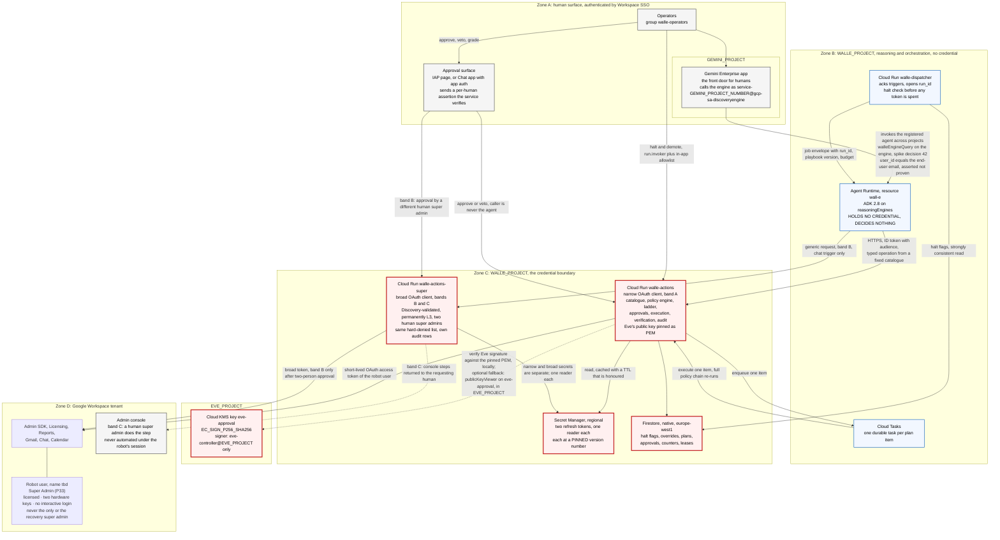
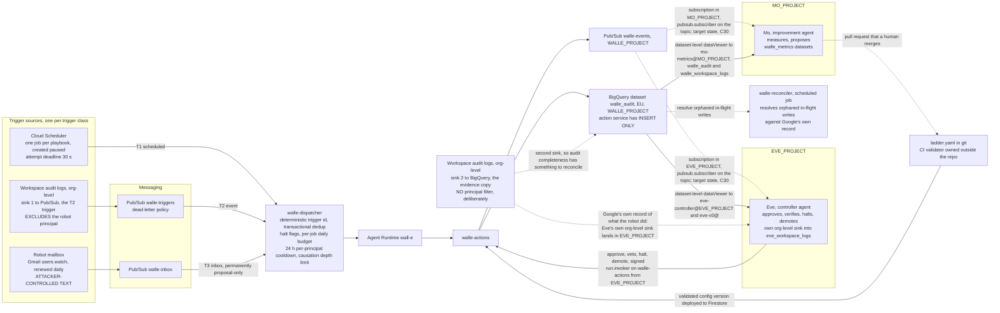
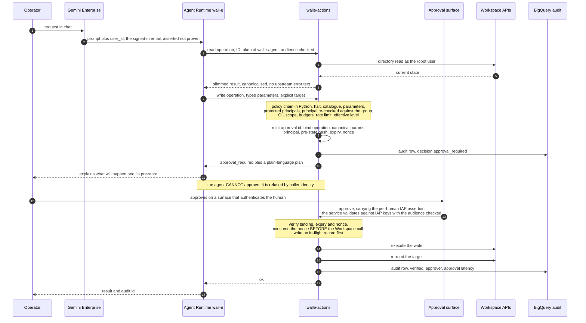
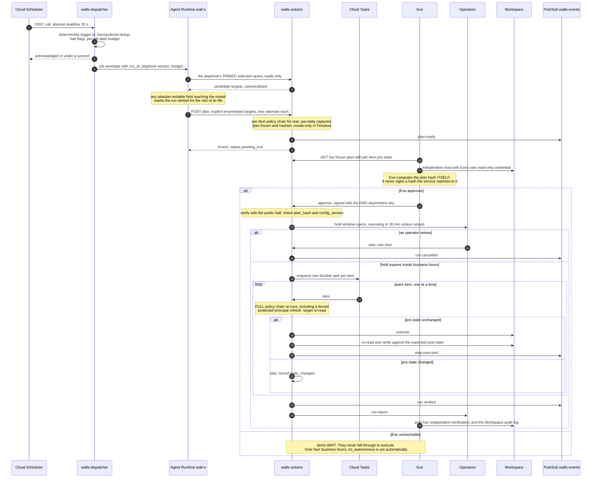

# Wall-E: service architecture

## Status
- Owner: the platform owner
- Last reviewed: 2026-09-14
- Maturity: **design. Nothing is built and nothing is enabled.**
- Objective of 2026-09-13: Wall-E holds **Super Admin** on a dedicated, licensed user account (P33); this page is one tenant's architecture under the platform HLD ([../agentic-platform/01-hld.md](../agentic-platform/01-hld.md), Tier P-SA, §11.3 and §13.1), and where the two disagree the platform HLD wins.
- Placement: four GCP projects under one folder (`GEMINI_PROJECT`, `WALLE_PROJECT`, `EVE_PROJECT`, `MO_PROJECT`); every cross-project grant is a binding on one resource, listed in [../project-topology.md](../project-topology.md), the authority for placement.
- Standalone: this document is self-contained. You do not need to read anything else first.

**Where the detail lives.** This is the consolidated view. The design set argues each part
properly: [01-hld.md](01-hld.md) for the component rationale,
[02-identity-and-auth.md](02-identity-and-auth.md) for identity and credentials,
[03-lld.md](03-lld.md) for the policy engine and data model,
[05-autonomy-ladder.md](05-autonomy-ladder.md) for the enablement plan,
[06-security-guardrails.md](06-security-guardrails.md) for the threat model,
[08-team-eve-mo.md](08-team-eve-mo.md) for the Eve and Mo contract, and
[10-adversarial-review.md](10-adversarial-review.md) for what two review passes corrected,
[11-prompt-security.md](11-prompt-security.md) for prompt security and monitoring,
[12-agent-identity.md](12-agent-identity.md) for agent, operator and workforce identity, and
[13-agent-interconnection.md](13-agent-interconnection.md) for connecting Wall-E to other agents.
To build it, follow [SETUP.md](SETUP.md).

**Audience:** an IT security reviewer, an architect, or an engineer who will build Eve or
Mo. It assumes no prior reading of the design set. Every product fact below was verified
on 2026-09-07 or 2026-09-08, or carries its source or the platform HLD section that verified it
on 2026-09-13.

Anything about your own tenant that has not been confirmed is prefixed `Assumption:` or
left as `tbd`. No credential value appears here. Where a credential exists, only its
location is recorded.

---

## 0. What is being approved now

This document describes an end state reached over roughly nine months of stages. The risk of the end state is not the risk of the thing being switched on next month. This section is the scope of the approval being asked for. Everything after it describes where the design is going.

Eve and Mo were designed on 2026-09-12 ([../eve/README.md](../eve/README.md), [../mo/README.md](../mo/README.md)) and the objective of 2026-09-13 names all three agents, but **neither is built**, so every level that depends on Eve's gate is unreachable today and the maximum autonomy this pilot can deliver is **L3, human approval per action**: section 5.2, the whole Eve-gated flow, and L4 and L5 describe a target state, and until Eve exists the metrics in section 8 are BigQuery scheduled queries read by a human.

| Item | What is in scope |
|---|---|
| **Stage** | **S0 "Eyes" only.** Reads run for real. Every write family sits at L1 shadow, which forces a dry run and never executes, even when handed a valid approval |
| **What actually touches Workspace** | Reads, plus `notify.operators`, a templated message to a config-fixed operator address, which is how a run reports at all. No directory write, no group change, no licence change, no suspension |
| **Pilot population** | `tbd`. `Assumption:` synthetic accounts in the sandbox, which is a separate Workspace tenant and never an organisational unit (decision 29, P40), plus one small real pilot organisational unit. The account count in each is `tbd` and must be an absolute number in the decision record that opens S0 |
| **Read scope** | The whole tenant, rate-limited at 120 reads per minute. This is not a pilot-sized read, and that matters for section 11 |
| **Employee attributes the reads touch** | Name, primary address and aliases, organisational unit, manager and relations, group memberships, admin-role holding, licence assignment by SKU, last sign-in time, and admin, login, group, token and SAML audit events |
| **Duration** | Floor of 3 to 4 weeks. Time alone promotes nothing. The exit criteria do |
| **Operator rota** | `Assumption:` the ladder owner alone at S0. A second named Workspace admin is required before S1, and a second approver from IT security before any high-risk promotion |
| **Autonomy ceiling for the pilot** | L3, and only from S1 onward. At S0 nothing executes |
| **The Super Admin grant** | **Not part of this approval.** It is a gate with its own checklist, opened on the day every row of the P line of the platform tier gate is green — Eve's observe-and-report layer live and drilled, the witness organisation, a SIEM with 24x7 acknowledgement, two human super admins with the robot never the recovery one, the penetration test, the DPIA started, works-council information given, the signed deviation (P33), the two lists signed (P29), P3's engine-reach spike passed ([platform HLD §0.4](../agentic-platform/01-hld.md), §13.1). **The grant precedes Stage 0**: before it the robot holds no admin role and reads nothing, and S0 runs on the narrow client after the grant ([02](02-identity-and-auth.md) "When Super Admin is granted", [05](05-autonomy-ladder.md) §7) |
| **Explicitly not in scope** | Autonomous writes of any kind. Eve. Mo. The event trigger class. The inbox trigger class. Any write outside the pilot organisational unit allowlist. Any operation not in the catalogue. Band B (`/v1/execute-generic`) and band C (`/v1/handoff`) on `walle-actions-super`, which exist only after the grant |

**What must be live before the pilot starts** is the checklist of [SETUP.md §6.1](SETUP.md#61-the-checklist) and the "Controls that must be live first" row of [05 S0](05-autonomy-ladder.md#s0--eyes). At S0 the guarantee that no write executes is the ladder's L1 in the action service and the narrow client's frozen scope set, never a Workspace refusal: the custom read-only role the pilot once rested on was withdrawn on 2026-09-13, because nothing in Workspace narrows a super-admin robot (P33, section 4.5).

**Exit criteria that would open S1, and the abort criteria**, are [05 S0](05-autonomy-ladder.md#s0--eyes). Aborting means pulling K2 and K4 in section 4.6, not changing a level.

---

## 1. What this is, and the one constraint that shapes it

Wall-E is an agent that administers a Google Workspace tenant: it reads the directory, reports on licences and stale accounts, and performs a small catalogue of reversible admin writes such as group membership changes, profile updates within a safe field list, licence assignment changes and user suspension. That catalogue is **band A**, the declared intended purpose and the only work that can climb the ladder. **Band B** is a generic Admin SDK request validated against the pinned Discovery document, permanently L3 with two human super admins. **Band C** is console-only work returned to a human as steps and watched for in the audit log. A hard-denied list is refused in every lane ([03 "The three bands"](03-lld.md#the-three-bands); [platform HLD §13.1](../agentic-platform/01-hld.md)). Wall-E is invoked either by a named human in Gemini Enterprise or by an unattended trigger, and it is intended to become progressively more autonomous.

The single constraint that drives the entire shape of the system: **autonomy is never a property of the agent, it is a number attached to a pair of (operation family, trigger class), stored as versioned configuration and enforced by a deterministic Python service that alone holds the Workspace credential**, raised by humans one notch at a time against evidence and lowered instantly by any operator, Eve or a breaker ([05 §1](05-autonomy-ladder.md#1-the-eight-rules)). The system is therefore not one process with a policy module inside it but a set of services split along the lines that constraint requires: the thing that reasons cannot hold the credential, the thing that holds the credential cannot reason, and the thing that approves cannot be either of them.

The second-order consequence, which explains most of the diagram that follows, is that **no domain-wide delegation is used anywhere** ([platform 04 §1](../agentic-platform/04-identity-and-privileged-access.md#1-principles-inherited-stated-once)). Wall-E acts as exactly one Workspace identity, a dedicated, licensed robot user holding **Super Admin** (P33; a narrow custom admin role until 2026-09-13), and it can never act as anyone else. Where a Google API requires domain-wide delegation, that API is out of scope rather than an exception; granting DWD is on the hard-denied list, because a super admin can grant it in the console.

The third-order consequence: **Workspace no longer refuses anything for this account.** A service account can hold any Workspace admin role except Super Admin ([Google: assign specific admin roles](https://knowledge.workspace.google.com/admin/users/assign-specific-admin-roles), read 2026-09-13), so the account is a user account; and Super Admin "can manage every aspect of your organization's account" with no organisational-unit limit ([Google: prebuilt administrator roles](https://knowledge.workspace.google.com/admin/users/prebuilt-administrator-roles), read 2026-09-13). The action services are the only enforcement point, the consented OAuth scope set is the only Google-enforced ceiling left, and detection is the primary control for this agent ([platform HLD](../agentic-platform/01-hld.md#what-this-reverses-and-what-it-costs) "What this reverses and what it costs", §7).

---

## 2. Service diagrams

Three diagrams. The first is the control and request plane. The second is the trigger and evidence plane. The third, in section 4, is the identity and credential model.

### 2.1 Control plane, with the credential boundary

Only the action services hold the Workspace credential. The red box holds the credential and the state that authorises its use. The dispatcher reaches one document in that state, the halt flags, read-only, and nothing else.

The credential boundary holds **two** services on one robot account ([platform HLD §13.1](../agentic-platform/01-hld.md) items 3 and 7): `walle-actions` reads the narrow OAuth client (band A, the catalogue), `walle-actions-super` reads the broad client (band B `/v1/execute-generic`, band C `/v1/handoff`), each with its own service account, regional secret and single reader; `cloud-platform` is in neither client, checked in CI. The dispatcher has no route to `walle-actions-super`, so only a human in chat can originate a band-B request; `eve-controller@EVE_PROJECT` holds `run.invoker` on it for the halt path only.



Read the diagram for what is missing as much as for what is there. There is no arrow from the agent to Secret Manager. There is no arrow from the agent to Workspace. There is no arrow from the agent to the approval surface or to any control endpoint. There is no solid arrow from `WALLE_PROJECT` into `EVE_PROJECT` at all: Eve's key is verified from a file in Wall-E's repository, so no principal of Wall-E's holds anything on the key by default. Those absences are the security model.

### 2.2 Trigger plane and evidence plane



One detail in that diagram is load-bearing and easy to lose: **the trigger copy and the evidence copy of the same admin-activity filter are filtered differently.** The trigger sink excludes the robot's own principal, or every write Wall-E makes starts another run, and the evidence copy does not, because it exists to reconcile what the robot actually did against what Wall-E says it did; the build tests that the BigQuery copy contains the robot's own writes. Since 2026-09-13 (P104, gate before Wall-E's Stage 1) neither sink stays Wall-E's — the trigger feed becomes `to-triggers-walle` in `LOGGING_PROJECT` and the evidence copy the view `platform_logs_views.walle_workspace_logs`, while Eve's independent sink is unaffected — and the sink definitions, filters and writer grants are [08 §3.2](../agentic-platform/08-data-logging-retention-sovereignty.md#32-the-sinks).

The actor exclusion still leaves a second hop: Wall-E moves a user, Google's own licensing engine reacts, and that event is attributed to the system rather than to the robot. The dispatcher therefore also enforces a 24-hour per-principal cooldown and a causation depth limit.

---

## 3. Service inventory

| Service | What it is | Why it exists | What breaks if merged into its neighbour | Runs as |
|---|---|---|---|---|
| **Gemini Enterprise app** | The human front door. A registered custom agent, shared on its User permissions tab with the operators group only. | Gives every human request an authenticated Workspace identity and a conversation surface your organisation already runs. | Exposing the agent directly loses per-agent sharing and the end-user identity, so trust boundary 1 disappears and any staff member with project access reaches Wall-E. | End user via Workspace SSO. The app lives in `GEMINI_PROJECT`, and the call to the agent arrives as that project's Discovery Engine service agent, `service-<GEMINI_PROJECT_NUMBER>@gcp-sa-discoveryengine.iam.gserviceaccount.com`, bound on the engine in `WALLE_PROJECT` through the custom role `walleEngineQuery` (decision 42, a spike) — never a project-level role in `WALLE_PROJECT` unless the spike fails, in which case the documented `roles/discoveryengine.serviceAgent` is a recorded exception. |
| **Approval surface** | An approval page behind Identity-Aware Proxy, bound to the plan hash. A Google Chat app with app authentication is the alternative, and it is a second identity with its own IAM and its own compromise story. | Human consent must arrive on a surface that authenticates the human itself **and passes a per-human assertion the action service verifies for itself**. Note that the robot's own user token can send **text only**, so one-click cards and buttons require a Chat app with app authentication. | Merging it into the agent means the model asserts that a human approved. That is exactly what a prompt injection produces, and it was the single worst defect found in review. | An IAP-authenticated human, whose assertion travels with the call. Never the agent's service account. |
| **Cloud Scheduler** | One HTTP job per playbook, all created paused, enabled per ladder stage. | The T1 scheduled trigger class. | Scheduler *can* call a Google API target directly with an OAuth token, so this is not about capability. Its attempt deadline defaults to three minutes while an agent turn takes longer, so a direct synchronous call is recorded as failed and retried, and the same run happens twice. | OIDC token as the dispatcher service account. |
| **Workspace audit log sinks, two of them** | Two Cloud Logging sinks on the same admin-activity filter. The trigger sink **excludes** the robot's principal, or every write Wall-E makes starts another run. The evidence copy does **not** exclude it, because reconciling audit completeness needs Google's own record of what the robot itself did. | The trigger sink is the T2 event trigger class, with no credential at all, replacing the Alert Center API which requires domain-wide delegation. The evidence copy is what Eve reconciles against. | Without the actor exclusion on the trigger sink the system feeds itself. With the actor exclusion applied to the evidence copy, the audit-completeness metric and Eve's independent record contain nothing about the robot, and the control is decoration. | Sink writer identities, one with publish rights on the topic and one with write rights on the dataset. Re-homed 2026-09-13 to `LOGGING_PROJECT` as a project sink and a log view (P104); definitions in [08 §3.2](../agentic-platform/08-data-logging-retention-sovereignty.md#32-the-sinks). |
| **Pub/Sub `walle-triggers` / `walle-inbox`** | Trigger transport with dead-letter policies. | Durable buffering and retry between an event source and a service that may be cold. | Pushing the sink straight at the agent loses dedup, dead-lettering and the ack-deadline safety margin. | Google-managed. Push subscription authenticates to the dispatcher. |
| **`walle-dispatcher`** (Cloud Run) | Acknowledges a trigger in under a second, dedups on a deterministic trigger id, checks halt flags and the job's daily budget, opens the `run_id`, then calls the agent. | Three reasons. The kill switch must work **before** the model runs, or a halt still costs a full agent turn. Run identity is a fact about the run and must not be invented by the model. A trigger must be acked in seconds while an agent turn takes minutes. | Merged into the agent: halting becomes expensive and late, `run_id` and budget become model output, and every long run is retried into a duplicate. | `walle-dispatcher@`, which holds `aiplatform.reasoningEngines.query` on Wall-E's engine only and reads halt flags. |
| **Agent Runtime `wall-e`** | The reasoning layer. ADK 2.8 on a `reasoningEngines` resource, deployed with `vertexai.Client(project, location).agent_engines.create(...)`. Tools are generated from the action service's catalogue endpoint rather than hand-written. Sessions managed, Memory Bank off. | Turns intent into a named operation from a fixed catalogue plus typed parameters, and narrates results. | Merged into the action service, the refresh token sits in the same process as the LLM loop and any tool that can read the environment becomes an exfiltration path. This is the merge that must never happen. | Agent Identity, decided in [12-agent-identity.md](12-agent-identity.md): adopted at creation, with a spike-gated fallback to `walle-agent@` |
| **`walle-actions`** (Cloud Run) | The credential holder for band A. Operation catalogue, Pydantic parameter models, the policy chain, the autonomy ladder, approval minting and verification, execution, verification by re-read, and the audit write. Deployed with an explicit 60 s timeout. | Between generated text and an Admin SDK call that suspends a user there must be a gate the model cannot talk its way past. Audit, budgets, idempotency, dry-run, pre-state capture and the ladder belong in one place or each is one refactor from being bypassed. | It has no safe neighbour to merge into. Splitting it **further**, so the control endpoints live on a second service with their own IAM, is a recognised improvement and is an open decision, targeted before the Eve-gated stage. Decision 18 lands now as the scope split ([platform HLD §13.1](../agentic-platform/01-hld.md) item 3): the broad credential lives in `walle-actions-super` (next row), and `walle-actions` keeps only the narrow client ([02 "OAuth client configuration"](02-identity-and-auth.md#oauth-client-configuration)). | `walle-actions@`, the only reader of the narrow credential secrets. |
| **`walle-actions-super`** (Cloud Run) | The second credential holder, on the same robot account and the broad OAuth client: band B `/v1/execute-generic` (a generic Admin SDK request validated against the pinned Discovery document, permanently L3, `chat` trigger only), band C `/v1/handoff` (the hard-denied check, then console steps returned to the requesting human super admin and a watch for the matching audit event), the two-person approval for tier `SUPER`, and its own audit rows carrying the canonical request, the Discovery revision and both humans ([03 "The three bands"](03-lld.md#the-three-bands)). | "Any super-admin-level action on a human's prompt" needs scopes the catalogue does not; putting them in `walle-actions` would make the narrow client's Google-enforced ceiling decorative for everything unattended. The hard-denied list is the same library in both services. | Merged into `walle-actions`, one token carries both reaches and the dispatcher's route to the action service becomes a route to the broad client. Merged into the agent, see the Agent Runtime row. | `walle-actions-super@`, the only reader of the broad client's secrets. Invoked by the agent (band B and C endpoints only), the approval surface, and `eve-controller@EVE_PROJECT` and `eve-verifier@EVE_PROJECT` for the halt path only ([../project-topology.md](../project-topology.md#3-cross-project-grants) row 27); never by `walle-dispatcher@` ([platform HLD §18](../agentic-platform/01-hld.md) item 25). |
| **Cloud Tasks** | One durable task per plan item, executed one at a time back into the action service. | Approving a plan must return immediately. Running a 25-item loop inside the approve request exceeds Cloud Run's timeout and leaves a half-applied plan, a consumed nonce and no terminal state. | Merged back into the request handler, that failure mode returns and there is no per-item halt check. | OIDC as a dedicated service account, **`walle-tasks@`**, which holds `run.invoker` and nothing else and appears on the in-app allowlist for the worker endpoint and no other endpoint. |
| **Firestore** (native, europe-west1) | The live control plane: halt flags, overrides, frozen plans, approvals and nonces, durable counters, leases, cooldowns, dedup, drill records, canary state, proposal and grade queues. | Every budget and rate limit must be global and honest across instances. An in-memory counter under two workers and autoscaling means the documented cap is a fiction. | Merged into process memory, budgets and rate limits stop being real and the andon cord has nowhere durable to live. | Accessed by `walle-actions@`, and by `walle-dispatcher@` for halt flags and trigger dedup. Halt and override reads are strongly consistent and never cached. |
| **Secret Manager** (regional) | The OAuth clients, the robot's refresh tokens and the service's own confirmation HMAC key: two client-and-token pairs on one robot account, each version pinned ([02 "OAuth client configuration"](02-identity-and-auth.md#oauth-client-configuration)). Regional secrets, not global secrets with user-managed replication. | Regional secrets keep the data in the location at rest, in use and in transit. The version number is pinned in config, because `latest` resolves to the newest **enabled** version and disabling the newest silently falls back to the previous, still-valid token. Disabling a version is still not a kill switch: the credential kill switch is the action service revoking its own refresh token at Google, with revoking the grant as the robot user as the backstop (section 4.6). | Baking the token into an image or an environment variable removes rotation, secret-access auditing and the pinned-version property in one step. | The narrow pair and the HMAC key read by `walle-actions@` only; the broad pair by `walle-actions-super@` only. |
| **Cloud KMS** (in `EVE_PROJECT`) | Eve's approval signing key `eve-approval`, `EC_SIGN_P256_SHA256`, created and held in Eve's project. | A shared symmetric secret cannot express "Eve approved this": either the action service cannot verify Eve's signature, or it can also mint one. Asymmetric signing is the only shape that works. | Merging the key into a shared HMAC makes every Eve-gated level meaningless, and the obvious build-time fix quietly destroys the property the controller role rests on. | `eve-controller@EVE_PROJECT` holds `cloudkms.signer` there. `walle-actions@` verifies locally against Eve's public key pinned as PEM in Wall-E's repository, per key version, and needs no KMS grant; `roles/cloudkms.publicKeyViewer` on that one key, granted in `EVE_PROJECT`, is the optional fallback ([../project-topology.md](../project-topology.md) §3 row 14). |
| **BigQuery `walle_audit`** (EU) | The evidence tables (`actions`, `runs`, `plans`, `approvals`, `verifications`, `config_versions` and the rest of the platform `audit.schema`), partitioned by timestamp, clustered by operation, beside Google's own Workspace audit log copy. Section 7.2. | The answer to "what has the robot done", and the evidence every autonomy promotion is argued from. Writes are refused when this sink is unavailable. | Merged into Cloud Logging or Firestore, the insert-only property is lost and the service can delete its own evidence. | `walle-actions@` holds **insert-only** rights on the dataset, deliberately. Cross-project readers hold dataset-level `roles/bigquery.dataViewer` with jobs run in their own project, and no authorised view outside `WALLE_PROJECT` is ever authorised on it ([../project-topology.md](../project-topology.md#3-cross-project-grants) rows 4, 6, 9, 21, 34). |
| **Pub/Sub `walle-events`** | The event stream: `run.started`, `plan.ready`, `step.pending`, `step.executed`, `run.verified`, `override.applied`, `halt.set`, `content.flagged`. | Eve and Mo observe Wall-E without asking Wall-E. A safety interlock that runs through an LLM is not an interlock. | Merged into an agent-to-agent conversation, Eve cannot stop Wall-E when the model layer is wedged, hallucinating or looping. | Published by `walle-actions@`. Subscribed by Eve and Mo from `EVE_PROJECT` and `MO_PROJECT` — a subscription in the reader's project with `roles/pubsub.subscriber` bound on the topic — as target state ([14](14-hld-challenge.md) C30; decision 45); no subscription exists at Stage 0. |
| **In-flight reconciler** | A scheduled job that reads `in_flight/{run_id}#{item}` in Firestore and resolves any unresolved record against the Workspace audit log copy in BigQuery. | The nonce is consumed **before** the Workspace call, because no transaction spans Firestore and an Admin SDK call. A crash in between leaves an operation whose outcome is unknown, and Google's own audit record is the only independent answer. | Without it, every crashed write is a permanent unknown in the evidence trail, and the audit-completeness metric cannot reach 100 per cent. Any orphan older than one hour alerts. | Its own service account with Firestore access and BigQuery read. No Workspace credential, no write path. |
| **Group-classification job** | Recomputes every group's class from the transitive closure of its ancestors and the admin roles attached to them. | Nesting is invisible in the console. A small distribution list inside `walle-operators@` looks like an ordinary group, and one membership write into it grants approval authority. | Without it the class is a hand-maintained file, which is a guess. CI fails when the human file diverges from the computed closure. | `walle-actions@`, with `admin.directory.rolemanagement.readonly`. Under Super Admin the reads are tenant-wide by construction; there is no separate read role. |
| **Protected-principal refresher** | A background job that fills the protected-principal cache: super admins, delegated admins, the robot, its OU and the transitive members of `walle-protected@`. | Two uncached Admin SDK calls per directory operation is not viable, and a stale set is a hole. | Without it the check is either slow or wrong. If the cache cannot be filled, the service **fails closed** and directory writes are denied. | `walle-actions@`, customer-scoped, never OU-scoped. The robot is itself returned by `directory.admins.list` and stays on the committed floor list; the set also carries `eve@`, Eve's role, the control groups and every other super admin (the protected-self rule, [platform HLD §13.1](../agentic-platform/01-hld.md) item 2). |
| **Gmail watch renewal job** | Renews `users.watch` on the robot mailbox daily. | A Gmail watch expires after seven days with no notice, and a dead trigger looks exactly like a quiet week. | Without it the T3 inbox trigger silently stops. A missed renewal pages. | `walle-actions@`, with the `gmail.readonly` scope already held. |
| **Google Workspace** | The tenant: one dedicated, licensed robot user holding **Super Admin** (P33; a narrow custom admin role until 2026-09-13). | The actual effect — and **no refusal**: Google enforces the consented scopes and nothing else. | It is the system of record and cannot be merged into anything. | The robot user in `/Automation/Service Identities`, hardened by the account hygiene set of [02](02-identity-and-auth.md#the-account-hygiene-set) (hardware-key-only 2SV with two witnessed keys, no recovery channels, super-admin self-recovery off, never the only or the recovery super admin), on which an interactive login after bootstrap is by definition a severity-1 incident, the one control that survives Super Admin. |

### The approval surface, specified

This is the control that makes every L3 statement in section 8 meaningful: the approve request carries a **per-human assertion the action service verifies itself** — the `x-goog-iap-jwt-assertion` header with its audience checked for the IAP page, or the Chat-verified sender for a Chat app — checked against the committed operator list in the deployed configuration (section 7.5), bound into the approval record with the surface that asserted it. A surface that can assert consent without such an assertion is the original defect one hop out, and a trusted caller identity alone does not satisfy the requirement. The acceptable surfaces, the claims checked and the relay design are [12-agent-identity.md §5.3](12-agent-identity.md#53-what-the-approval-surface-asserts-in-each-case).

---

## 4. Identity and credential model

**The agent's runtime identity is decided in [12-agent-identity.md](12-agent-identity.md): Agent Identity, set at engine creation, with `walle-agent@` as a spike-gated fallback.** Where a row below names `walle-agent@`, read "the agent principal, or `walle-agent@` on the fallback path". The two never coexist on one engine.

### 4.1 The problem in one paragraph

Workspace APIs authorise against a *user* and a GCP service account is not one; the normal bridge, domain-wide delegation, is excluded for every agent on the platform because a compromised delegate can act as anyone including a super admin ([platform 04 §1](../agentic-platform/04-identity-and-privileged-access.md#1-principles-inherited-stated-once) item 7), so Wall-E is exactly one Workspace identity and can never be another.

### 4.2 The principals

| Principal | Type | Holds | `run.invoker` | Must never |
|---|---|---|---|---|
| Robot user `walle@`, name tbd | Workspace user, licensed, **Super Admin** (P33) | Two OAuth refresh tokens, one per client, in Secret Manager; reach bounded on the Google side only by each client's consented scopes | Not applicable: a Workspace identity, never a GCP caller | Be signed into interactively after bootstrap (severity 1). Be the only or the recovery super admin. Be the target of any write through Wall-E's own lanes |
| `walle-actions@` | GCP service account, `WALLE_PROJECT` | Reads the narrow client's refresh token, the narrow OAuth client and the confirmation HMAC key | No: it runs the service | Read Eve's private key. Mint an Eve approval. Delete audit rows |
| `walle-actions-super@` | GCP service account, `WALLE_PROJECT` | Reads the broad client's refresh token and OAuth client, nothing of the narrow pair | No: it runs `walle-actions-super` | Read the narrow client. Execute at tier `SUPER` without a second human super admin. Serve any trigger but a human in chat |
| `walle-agent@` | GCP service account, `WALLE_PROJECT` | Nothing | **Yes**, on the execute and plan endpoints (and bands B and C on `walle-actions-super`) | Read any secret. Reach any control or approval endpoint. Hold a Workspace token |
| `walle-dispatcher@` | GCP service account, `WALLE_PROJECT` | Nothing; reads halt flags and holds `aiplatform.reasoningEngines.query` on Wall-E's engine only | **No** | Call an action service at all |

Every principal — `walle-tasks@`, `walle-operators-caller@`, `eve-controller@EVE_PROJECT`, the operators, the deployers — with what it may read, may do and must never do, is [02 "Principals, and what each may do"](02-identity-and-auth.md#principals-and-what-each-may-do). Two properties are re-verified after every IAM change: `walle-agent@` can read no secret, and `eve-controller@` and `walle-actions@` never share a key, or "Eve approved this" would mean nothing.

**The deploy grant is the largest control in the system, and it is held by a human.** A deploy to either action service changes the credential holder and the policy engine in one act, defeating the policy engine, the catalogue, the ladder, the in-app allowlist, the approval endpoints and the insert-only audit rights at once; so deploys come only from a CI pipeline whose identity no operator holds, with a second reviewer on the ceiling module, the policy chain and the catalogue, no human holds `run.developer` in steady state, and break-glass is the Privileged Access Manager entitlement `ent-deploy-credential-holder` (1 h, approved by the second reviewer, never the agent's owner), a precondition of the Super Admin grant ([02](02-identity-and-auth.md#principals-and-what-each-may-do); [platform HLD §4.4](../agentic-platform/01-hld.md)). Weakness 12 in section 11 records what remains.

Eve's and Mo's identities that touch Wall-E's resources, the resource-level grant each holds, and the grants that must not exist (among them any Eve binding on the engine, removed by [14](14-hld-challenge.md) C10) are [../project-topology.md §3](../project-topology.md#3-cross-project-grants).

```mermaid
flowchart TB
    subgraph WAL["WALLE_PROJECT"]
        subgraph NOCRED["Principals holding no credential and reading no secret"]
            AGT["walle-agent<br/>runs the ADK agent"]
            DSP["walle-dispatcher<br/>invokes the agent, reads halt flags"]
            APS["walle-approvals-super IAP surface<br/>service account name tbd"]
        end

        subgraph KEYED["Principals holding a key"]
            ACT["walle-actions@<br/>reader of the NARROW credential only<br/>holds Eve's public key as a pinned PEM"]
            ACTSA["walle-actions-super@<br/>reader of the BROAD credential only"]
        end

        subgraph VAULT["Secret Manager, regional, europe-west1, WALLE_PROJECT"]
            SEC["walle-refresh-token (narrow)<br/>PINNED VERSION NUMBER, never latest"]
            CLI["walle-oauth-client (narrow client 1)"]
            HM["confirmation HMAC key"]
            SSEC["walle-super-refresh-token (broad)<br/>PINNED VERSION NUMBER, never latest"]
            SCLI["walle-super-oauth-client (broad client 2)"]
        end

        CRS["walle-actions service (band A), WALLE_PROJECT"]
        CRSS["walle-actions-super service (bands B and C)"]
    end

    subgraph EVP["EVE_PROJECT"]
        EVC["eve-controller@EVE_PROJECT<br/>signs approvals with its own key"]
        EVV["eve-verifier@EVE_PROJECT<br/>reconciler limb, never signs"]
        EK["Cloud KMS key eve-approval<br/>EC_SIGN_P256_SHA256, HSM"]
    end

    subgraph MOP["MO_PROJECT"]
        MOA["mo-metrics@, mo-analyst@, mo-narrator@<br/>no credential; dataset reads and the two read endpoints"]
    end

    subgraph HUMANP["Human principals"]
        OPG["walle-operators<br/>run.invoker plus the approval surface"]
    end

    ROBOT["Workspace robot user<br/>Super Admin (P33)<br/>two OAuth clients, narrow and broad"]

    ACT -->|"read"| SEC
    ACT -->|"read"| CLI
    ACT -->|"read"| HM
    ACTSA -->|"read"| SSEC
    ACTSA -->|"read"| SCLI
    ACT -.->|"pinned PEM, verified locally;<br/>optional fallback publicKeyViewer on this key only"| EK
    EVC -->|"signer, sign only"| EK
    ACT -->|"narrow refresh token becomes a 1 h access token<br/>acts as this identity and no other"| ROBOT
    ACTSA -->|"broad refresh token, after two-person approval at tier SUPER"| ROBOT
    AGT -->|"execute and plan endpoints only"| CRS
    AGT -->|"band B execute-generic and band C handoff, chat trigger only"| CRSS
    APS -->|"approve and veto, forwards the IAP-asserted human"| CRSS
    DSP -->|"reasoningEngines.query on one engine"| AGT
    OPG -->|"approve, veto, halt, demote"| CRS
    EVC -->|"approve, veto, halt, demote<br/>cross-project run.invoker on the service"| CRS
    EVC -->|"halt only, cross-project run.invoker"| CRSS
    EVV -->|"halt only, cross-project run.invoker"| CRSS
    MOA -->|"GET plans and runs only, mo-analyst@<br/>cross-project run.invoker on the service"| CRS

    classDef keyed fill:#fff0f0,stroke:#c62828,stroke-width:3px,color:#000
    classDef plain fill:#f2f7ff,stroke:#1565c0,stroke-width:1.5px,color:#000
    class ACT,ACTSA,EVC,SEC,CLI,HM,SSEC,SCLI,EK,ROBOT,CRS,CRSS keyed
    class AGT,DSP,APS,EVV,MOA,OPG plain
```



The diagram leaves `eve-verifier@`'s halt and demote edge to `walle-actions` to [../project-topology.md](../project-topology.md#3-cross-project-grants) row 3.

### 4.3 The one-time consent flow

Exactly one interactive sign-in is unavoidable: the robot consents once to each of the **two** OAuth clients, narrow (read by `walle-actions`) and broad (read by `walle-actions-super`), in one witnessed sitting, repeated only on rotation or a scope change. **Scopes freeze permanently at consent time**, so each consented set is the true maximum reach of that token if it leaks and, under Super Admin, the only Google-enforced ceiling; `cloud-platform` is in neither, checked in CI against the consent screen ([platform HLD §13.1](../agentic-platform/01-hld.md) item 3). The consent sequence, both scope lists with the catalogue operation each scope serves, and the scopes deliberately left out are [02 "How the robot account gets a credential"](02-identity-and-auth.md#how-the-robot-account-gets-a-credential) and [02 "Scopes"](02-identity-and-auth.md#scopes).

### 4.4 What makes the credential stop working

Each cause of a refresh token dying — an External consent screen in Testing (seven days), more than 100 live tokens per client, six months unused, a password change while Gmail scopes are granted, a requested service set to Restricted in API controls, and user revocation (K5 in section 4.6) — is an operational rule, and each applies to the narrow and the broad token independently. `invalid_grant` is a paging incident, never a retryable error: on the narrow token band A is down, on the broad token bands B and C are, until a human re-bootstraps. The rules are [02 "What makes the refresh token stop working"](02-identity-and-auth.md#what-makes-the-refresh-token-stop-working).

### 4.5 Admin rights: Super Admin, and what replaces role scoping

**Reversed 2026-09-13 (P33, `decisions/2026-09-13-wall-e-holds-super-admin.md`).** Until then the robot held a custom role and never Super Admin; it now holds Super Admin on a dedicated, licensed user account, and the old reason for refusing it — a super admin can alter security policy, grant domain-wide delegation and escalate — is now the reason for everything below. Workspace refuses nothing for this account: there is no role assignment ladder, no OU-scoped write role and no second enforcement point outside our own code, the consented scopes are the only Google-side ceiling, detection is the primary control, and least privilege becomes a signed deviation ([platform HLD "What this reverses and what it costs"](../agentic-platform/01-hld.md#what-this-reverses-and-what-it-costs)).

What replaces the role, each a precondition of the grant; the full table is [02 "Admin rights: Super Admin, and what that removes"](02-identity-and-auth.md#admin-rights-super-admin-and-what-that-removes):

| Was enforced by the role | Now enforced by | Grade |
|---|---|---|
| Security posture, admin roles and deletion out of reach | The **hard-denied list**, refused in every lane | enforcement (code); for the settings Workspace multi-party approval covers, also Google (P66) |
| Uncatalogued super-admin-class work out of reach | Band B at tier `SUPER`: two human super admins, a change ticket, a hold window, permanently L3 | enforcement (code) |
| Detection confirmed what the role refused | **Detection is the primary control**: Eve's minute-latency reconciliation of every robot-attributed event, the daily super-admin roster check, the evidence heartbeat, the SIEM-hosted severity-1 set outside `WALLE_PROJECT` | detection, minute latency, with absence alarms |
| The credential-leak bound | Custody and the account hygiene set, the scope split across two clients, K6 | enforcement (Google, by scope) plus detection |
| Writes outside the pilot OU refused by Google | The OU allow-list in the policy chain as a hard invariant, tested by the denial suite | enforcement (code) |

The **hard-denied list** (the robot itself, Eve, the control groups and clients, security posture, escalation to Super Admin, other admins' security settings, irreversible deletions and spend) is refused in every lane, band C included, with one of the five `p:` denial reasons, a breaker trip and a severity-1 page ([03 "The hard-denied list"](03-lld.md#the-hard-denied-list)). The **tier-`SUPER` list** is reachable only through band B under two human super admins, never autonomously ([03 "The tier-`SUPER` two-person list"](03-lld.md#the-tier-super-two-person-list)). The Workspace privilege facts verified for the old custom role on 2026-09-07/08 (suspension within Users → Update, License Management indivisible, Groups and Reports privileges not OU-scopable) are moot for Wall-E, still relevant to any delegated admin role including Eve's, and kept with their 2026-09-13 status in [02 "Workspace privilege facts"](02-identity-and-auth.md#workspace-privilege-facts).

### 4.6 Kill switches

Eight switches, ordered from surgical to total. A reviewer's third question is "how is it stopped", so the answer is in one table rather than scattered. K6 exists because a super-admin account needs a switch that survives a token already minted, and K7 is the fleet kill that lives outside every agent project ([platform HLD §11.4](../agentic-platform/01-hld.md), §13.1 item 7; [../agentic-platform/04-identity-and-privileged-access.md](../agentic-platform/04-identity-and-privileged-access.md#9-the-fleet-kill-switch-k7) §9). K0 to K4 also apply to `walle-actions-super`, which has its own halt endpoint and its own token.

| Switch | Mechanism | Who may pull it | Target time | What it does **not** stop | Last measured |
|---|---|---|---|---|---|
| **K0** halt writes | `POST /v1/control/halt` with mode `no_writes`, `no_autonomous` or `halt_all` | Any operator, Eve, or a breaker. No approval, no incident opened by default | Under 5 s at the endpoint; containment target under 60 s from the decision ([../agentic-platform/07-monitoring-detection-incident-response.md](../agentic-platform/07-monitoring-detection-incident-response.md) §9.2) | Reads keep working. An item already inside a Workspace API call completes | `tbd`, nothing is built |
| **K1** demote one cell | `POST /v1/control/demote` for one (family, trigger) pair | Any operator, Eve, or a breaker | Under 5 s | Every other family and trigger keeps its level | `tbd` |
| **K2** stop new runs | Pause the Scheduler jobs (in `WALLE_PROJECT`), detach the push subscriptions. Eve's and Mo's subscriptions, when they exist, live in `EVE_PROJECT` and `MO_PROJECT` and are theirs to detach | An operator with the GCP rights | Seconds | Runs already open. Chat requests already in flight | `tbd` |
| **K3** cut the agent off | Remove `run.invoker` from `walle-agent@` | A project IAM admin | About a minute | Anything `walle-actions` is already executing. Operator control endpoints keep working, deliberately | `tbd` |
| **K4** kill the credential | The action service **revokes its own refresh token at Google**. It holds the token, so it can revoke it. Pulled on **both** action services: `walle-actions` revokes the narrow token, `walle-actions-super` the broad one. [SETUP.md](SETUP.md) §5 names the call `POST /v1/control/revoke-credential`; the endpoint is not yet in [03-lld.md](03-lld.md)'s endpoint table (*tbd*) | Any operator, with one call to each service, from the approval page or the CLI through the operators' caller identity `walle-operators-caller@`; the service performs the revocation. Needs no console and no second person | Seconds | An access token already issued stays valid for **up to 60 minutes**. Recovery is a full re-bootstrap ([SETUP.md](SETUP.md) Phase 9), the same as K5 | `tbd` |
| **K5** revoke the grant | Revoke the OAuth grants of **both** clients (`tokens.delete` for both client ids on `walle@`, or as the robot user on the account's app-permissions page), or suspend the robot account (`users.update` with `suspended: true` on `walle@`). The backstop for when the action service itself is unresponsive | A **human** Workspace super admin other than the robot, on the two-person rota (the on-duty human super admin and the second human outside the Wall-E line), paged from the witness; suspending a super admin needs another super admin | Seconds to pull; target within 30 min of a severity-1 acknowledgement (`Assumption:`); then Wall-E is down until a human re-bootstraps | The same 60-minute access-token residual | `tbd` |
| **K6** remove Super Admin | A human super admin sets `users.makeAdmin` with `status: false` on the robot, or removes the role in the Admin console ([Google: users.makeAdmin](https://developers.google.com/workspace/admin/directory/reference/rest/v1/users/makeAdmin), read 2026-09-13; the method takes a boolean `status`). The switch that survives a token already minted, because the token outlives the privilege | Human only, on the same two-person rota as K5; never the agent owner when the actor is the owner; no machine holder of a privilege over `walle@` is built (P16) | Seconds to pull; target within 60 min | Anything already executed. Non-admin calls the scopes still allow (the robot's own mail and calendar). GCP-side reach already obtained, if any, is K7's and the incident's. Issued tokens stay valid; `Assumption:` each Admin SDK call is authorised against the account's current privileges, so the super-admin reach ends with the role — verified in the first K6 drill. K4 and K5 still stop the credential. Restoring needs the Admin-rights grant again ([SETUP.md](SETUP.md) Phase 2), with multi-party approval | `tbd`; drilled quarterly with K5, in the sandbox tenant on the robot's twin, never in production |
| **K7** fleet kill | Four pre-written levers applied at the tier folders from `CORE_PROJECT`, in the order KF-1 (service denial), KF-3 (Scheduler pause), KF-4 (empty principal access boundary), KF-2 (deny policy) ([04 §9.3](../agentic-platform/04-identity-and-privileged-access.md#93-the-four-levers-verified)) | `platform-approvers@` or a severity-1 SIEM rule, executing the Cloud Run job `k7-executor`; a human through the PAM entitlement `ent-k7-human` only when the job itself is suspect; never a model ([04 §9.4](../agentic-platform/04-identity-and-privileged-access.md#94-the-executor-job)) | KF-1 under 60 s, under 5 min end to end | `fld-controllers`: Eve keeps watching and paging. Under KF-1 the K0 and K4 endpoints are refused too, so **K4 is pulled before K7** in the P-SA runbook. Lifting K7 is a two-human pull request | `tbd`; drilled monthly in nonprod |

**The residual, stated plainly.** K4 and K5 stop future token refreshes. They do not invalidate an access token already in hand, which lives up to an hour. So **K0 is what stops work now, and K4 is what stops the credential.**

**Why K4 revokes at Google rather than disabling the secret.** Disabling the credential secret is not a kill switch, for three reasons. A container that caches built API clients for its whole life never re-reads the secret, so the service honours the cache TTL and rebuilds its clients. The secret read from `versions/latest` resolves to the newest **enabled** version, so disabling the newest silently falls back to the previous, still-valid token; the version number is therefore pinned in config. And even with a pinned version and no cache, disabling a secret only stops future token refreshes, while an access token already in hand stays valid for up to an hour. Only revocation at Google stops a running instance now, which is why a K4 drill attempts a Workspace read from a warm instance immediately afterwards: a success means a cached access token was measured, not a kill switch ([SETUP.md](SETUP.md) §5).

**Operator credentials are a principal.** An operator with no `run.invoker` path (no human holds it directly; operators reach the control endpoints through `walle-operators-caller@` or the approval page) reaches none of K0 to K3, which is why [02-identity-and-auth.md](02-identity-and-auth.md) treats operator credentials as a principal in their own right. Which kind of operator can pull which switch is [12-agent-identity.md](12-agent-identity.md) §5.5.

K0 and K1 are the andon cord. Anyone may pull them, no approval is needed, and no incident is opened by default. K3 and above open an incident. For the P-SA crisis scenario the order is K0 `halt_all` → K4 on both services → K7 on the P-SA folder → K5 → K6 if the account itself is suspect → evidence preservation → the incident commander ([04 §9.7](../agentic-platform/04-identity-and-privileged-access.md#97-how-k7-sits-with-each-agents-k0k6)). Drill results and measured times are written to `drills/{date}` in Firestore, and CI refuses any promotion citing a drill older than 30 days. Drill cadence: K0 to K3 every 30 days; K4 at commissioning and after any real credential incident, not monthly, because it consumes the credential and costs a full re-bootstrap; K5 and K6 quarterly in the sandbox tenant ([platform HLD §11.2](../agentic-platform/01-hld.md)); K7 monthly in nonprod ([../agentic-platform/04-identity-and-privileged-access.md](../agentic-platform/04-identity-and-privileged-access.md#96-drills) §9.6). K4 and K5 fire the robot-login alert by design, so a drill is announced to the operators first and the alert recorded against the drill id. Nothing has been drilled yet, because nothing is built.

If Firestore is unreachable the service self-halts writes rather than assuming it is running. The andon cord cannot un-pull itself during an outage.

---

## 5. Request paths

### 5.1 A human request, high risk, human approval

Trigger class T0. A `WRITE_HIGH` operation at level L3. The point of the diagram is where the agent is **not**.

The directory read returns the target's display name, so this run is **tainted** from that moment. Under section 8.4 a tainted chat run has a ceiling of L3, which is exactly where this operation already sits. The flow therefore proceeds, behind human approval, and can never climb higher no matter what the ladder says.



Failure branches that matter. If the approve call arrives without a valid per-human assertion, it is refused: a trusted caller identity alone is not consent, and the service verifies the assertion itself rather than believing a service account that says a human clicked. If the model calls the approval endpoint, it is denied with `approver_is_agent`, which is a hard invariant that trips the breaker for that family. If a human suspends the target between plan and approval, the pre-state differs at execution and the item is skipped as `state_changed` rather than executed on a stale premise. If two operators both confirm, the nonce is consumed transactionally and the second gets `approval_already_used`. If BigQuery is unavailable, the write is refused before execution: no evidence, no action.

### 5.2 An autonomous run, Eve approval, hold window, verification

Trigger class T1. Level L4. This is the shape that exists from the Eve-gated stage onward.



**Why this L4 path is reachable at all.** Taint is not a property of the playbook's subject, it is a property of the fields it lets into the model's context, so each playbook has to be checked against section 8.4 explicitly. A machine run that taints takes the inbox ceiling, where every write family is at L2 or L0, and the flow above would collapse to proposals.

| Playbook | Pinned selection and reads | Attacker-writable fields returned | Effective ceiling on T1 scheduled |
|---|---|---|---|
| `licence-reclaim-suspended` | `directory.user.list` pinned and projected to `primaryEmail`, `suspended`, `orgUnitPath`, `lastLoginTime`; `licensing.assignments.list` | None. The projection excludes `name.*`, `organizations`, `locations` and `relations` | Untainted. F7 keeps its configured level, up to L4. This is the flow drawn above |
| `leaver-checklist` | `directory.user.get`, `directory.group.members.list`, projected to addresses, ids and group keys | None. Group `name` and `description` are attacker-writable and are not requested | Untainted. F3 up to L4 |
| `stale-account-report` | The same reads, plus `name.*` so the report is readable by a human | User `name.*` | Declares `taints: true`. The inbox ceiling applies: reads stay L5, every write family drops to L2. Correct, because the playbook only ever produces a report |

The rule is mechanical, and the catalogue's field projection enforces it rather than the prompt. A playbook reaches L4 only if it never lets an attacker-writable field into the model's context. Showing a display name is a legitimate thing to want, and it costs autonomy. That trade is exactly what the taint bit exists to make explicit.

Three properties of this path are worth a reviewer's attention. **The whole policy chain re-runs per item**, rather than comparing a stored pre-state hash, because a human restoring a suspended user between plan and execution leaves the membership pre-state untouched, so group removals would execute on an active account and verify perfectly clean: the write correct, the premise stale. **A plan that cannot complete inside today's business window is refused at plan time**, never deferred, because an attacker who chooses when the triggering event fires would otherwise aim every batch at 08:00 the next morning with nobody watching. And **Eve's absence never increases what happens.**

---

## 6. Trust boundaries

Five boundaries. The first four answer "may this action happen at all". The fifth answers "may it happen without a human watching, right now, at this level of proven reliability". Those are separate questions and the design keeps them separate. What each boundary stops and how each can still fail are [01-hld.md "The five trust boundaries"](01-hld.md#the-five-trust-boundaries).

| # | Boundary | Enforced by |
|---|---|---|
| **1** | Human to Gemini Enterprise | Workspace SSO; the agent is shared only with the operators group. The end user's email is asserted, not proven, so the service re-checks group membership on every write |
| **2** | Agent to action service | Cloud Run `run.invoker`, ID-token verification **with audience**, and the in-app per-endpoint caller allowlist of section 7.5, because `run.invoker` is granted per service, not per path |
| **3** | LLM to credential | Architecture: the refresh tokens exist only inside the two action services, never in the model's process or context; the narrow client's scopes are the Google-enforced ceiling on anything unattended |
| **4** | Requested action to executed action | The deterministic policy engine alone — catalogue allowlist, typed parameters, protected principals, OU and group-class scope, budgets, the hard-denied list — with no Workspace refusal behind it (P33) |
| **5** | Permitted action to autonomously executed action | The autonomy ladder: a level per (family, trigger), approvals only a human or Eve releases, hold windows, breakers and ceilings in code; the taint bit depends on a complete field inventory |

Several mechanisms are often mistaken for boundaries. They are not, and calling them boundaries would overstate the design.

| Mechanism | What it actually is |
|---|---|
| The system instruction telling the agent that content is data, never instruction | A courtesy. It will sometimes fail, and every ceiling in section 8 exists to compensate for a prompt that has already failed. |
| The ADK policy plugin mirroring the catalogue and level | Defence in depth inside the process it protects. A code change bypasses it. |
| Cloud Run ingress settings | **Not usable here.** Agent Runtime egresses from a Google-managed tenant project, which Cloud Run treats as external, so internal-only ingress blocks the agent entirely. IAM is the enforced boundary. See section 9 for what that leaves exposed. |
| Model Armor on Agent Gateway, plus project-level floor settings | Content screening Wall-E's own code cannot switch off, which makes it better than an in-process plugin. Its two paths fail differently — the gateway path fails closed, so Model Armor availability is part of Wall-E's availability, and the floor-settings path fails open — and the console's Gemini Enterprise Model Armor setting does not cover custom ADK agents ([06 §2.5](../agentic-platform/06-gateways-model-armor-perimeter.md#25-the-gateway-plus-model-armor-as-an-availability-domain), [06 §3.1](../agentic-platform/06-gateways-model-armor-perimeter.md#31-the-layers-and-their-grades-made-platform-wide); [11-prompt-security.md](11-prompt-security.md)). |

### 6.1 The two escalation controls

**Protected principals** — super admins, delegated admins, the robot and its OU, and the transitive members of `walle-protected@` — are refused as write targets; the set is enumerated customer-wide and must be a superset of a committed floor list, which carries the robot, or every directory write is denied `protection_incomplete`, and writes targeting the robot, `eve@`, Eve's role or the control groups are hard-denied in every lane ([03 "Protected principals"](03-lld.md#protected-principals)). **Group classification** computes every group's class (`low`, `access`, `security`) from the transitive closure of its ancestors and attached admin roles, never by hand, because a distribution list nested inside `walle-operators@` looks ordinary and one membership write into it grants approval authority; unclassified reads as `security`, which is never written ([03 "Group classification"](03-lld.md#group-classification)). Both fail closed, and both depend on `admin.directory.rolemanagement.readonly` being in the narrow client's frozen scope list (section 4.3).

---

## 7. Data model, and the contract Eve and Mo are built against

The place the three agents meet is one shared set of facts with three different readings. Neither Eve nor Mo reads Wall-E's memory, and neither asks Wall-E questions about itself.

### 7.1 Firestore: live control-plane state

| Collection | Holds | Read by | Written by |
|---|---|---|---|
| `control/mode`, `control/freeze` | Halt state with a monotone `halt_epoch` | Dispatcher and action services, strongly consistent, never cached | Operators, Eve, breakers |
| `overrides/{family}/{trigger}` | Live demotions with `override_epoch`. **An absent read means L0, never L5** | Action service | Operators, Eve, breakers |
| `plans/{id}` | Frozen plan and its lifecycle, **create-only for the action service**, so a signed plan cannot be rewritten between signature and execution | Action service; Eve and Mo only through `GET /v1/plans/{id}` and `walle_audit.plans`, never Firestore directly | Action service |
| `approvals/{id}`, `in_flight/{run_id}#{item}` | Nonce, binding and consumer; the record written before a Workspace call and resolved after, the reconciler's input | Action service, reconciler | Action service |
| `counters/{scope}/{window}` | Durable transactional budgets, rate limits and novelty caps over rolling 7-day and 30-day windows | Action service | Action service |

Every collection, with its readers and writers, is [03 "Firestore"](03-lld.md#firestore). **Any** Firestore read or write error anywhere in the chain denies with `control_plane_unavailable`, a hard invariant, and more than 30 seconds unreachable self-halts writes ([03 "The control plane fails closed"](03-lld.md#the-control-plane-fails-closed-including-the-parts-that-used-to-fail-open)).

### 7.2 BigQuery `walle_audit`: the evidence

`walle_audit` is in `WALLE_PROJECT` (EU), on the platform `audit.schema`, partitioned by timestamp and clustered by operation; the action services hold **insert-only** rights, writes are write-ahead and fail-closed, payloads are never stored, and the Workspace audit log copy beside it, written by Google rather than by Wall-E, is what makes Eve independent ([03 "Storage"](03-lld.md#storage)). Eve and Mo read from their own projects through dataset-level `roles/bigquery.dataViewer`, with jobs run and billed in the reader's project, and no project-level role, `jobUser` or authorised view on a Wall-E dataset is ever granted ([../project-topology.md](../project-topology.md#3-cross-project-grants) §3 rows 4, 6, 9). `denial_reason` is the closed vocabulary of [03 "Denial reasons"](03-lld.md#denial-reasons): only its hard invariants trip a breaker and count in Eve's hard-invariant metric.

### 7.3 Pub/Sub `walle-events`: the stream

Published events: `run.started`, `plan.ready`, `step.pending`, `step.executed`, `run.verified`, `override.applied`, `halt.set`, `content.flagged`. Eve and Mo both subscribe, from `EVE_PROJECT` and `MO_PROJECT`: the subscription lives in the reader's project and `roles/pubsub.subscriber` is bound on the topic, never project-wide — target state per [14](14-hld-challenge.md) C30, with no subscription at Stage 0. The join key is `run_id` throughout, plus the ADK `invocation_id` linking Agent Runtime traces to audit rows.

### 7.4 The interfaces Eve consumes, and why they are plain REST

These are built in the action service from the first commit, exercised by a stub caller until Eve exists. They are plain authenticated REST rather than agent-to-agent messages, because Eve must be able to stop Wall-E when the model layer is wedged, hallucinating or looping. Agent-to-agent protocol is fine for delegating conversational work. It is not fine for halt and approve.

| Interface | Caller | Contract |
|---|---|---|
| `GET /v1/plans/{id}`, `GET /v1/runs/{id}` | Eve, Mo | Frozen plan, `plan_hash`, per-item pre-state, expectations, rollback plan, per-item verdict, effective level, config version |
| `POST /v1/plans/{id}/approve` | Eve, or the out-of-band human surface. **Never the agent** | Signed with Eve's Cloud KMS asymmetric key, verified with the public half. Carries `plan_hash` and `config_version`, rejected if either differs. Eve signs a hash it computed itself |
| `POST /v1/plans/{id}/veto` | Operator, Eve | During a hold window |
| `POST /v1/control/halt`, `POST /v1/control/demote` | Operator, Eve | Halt modes run, `no_autonomous`, `no_writes`, `halt_all`; demote lowers a level and **refuses any raise — there is no raise endpoint at all** |
| `GET /v1/ladder`, `GET /healthz` | Operators and Eve. **Never the agent** on the ladder | Effective matrix, ceilings, overrides, halt state, config version and last drill date; liveness plus **last successful audit write**, so Eve can halt when evidence stops flowing |

Every endpoint of both action services, with its caller and purpose, is [03 "Action service — interface"](03-lld.md#action-service--interface).

### 7.5 The endpoint-to-caller allowlist

`run.invoker` is granted per service, not per path, so IAM cannot express any of this. The allowlist is application code doing platform work, keyed on the verified identity claim of the caller's ID token, with foreign emails compared byte for byte and a negative test per row; it is the **only** place a foreign identity's reach is narrowed below `run.invoker`.

| Endpoint group on `walle-actions` | Allowed callers, and nobody else |
|---|---|
| `POST /v1/execute`, `POST /v1/plans`, `GET /v1/operations` | `walle-agent@` (or the agent principal) |
| `POST /v1/tasks/item`, the Cloud Tasks worker endpoint | `walle-tasks@` — the most execution-capable path in the system |
| `POST /v1/plans/{id}/approve` | The approval surface's verified human assertion and `eve-controller@EVE_PROJECT`; the agent gets `approver_is_agent`, a hard invariant |
| Veto, halt, demote, `GET /v1/ladder`, `GET /healthz` | Members of `walle-operators@` and Eve's identities; **never the agent** |
| `GET /v1/plans/{id}`, `GET /v1/runs/{id}` | Eve, `mo-analyst@MO_PROJECT`, members of `walle-operators@`; `mo-analyst@` gets 403 on every other endpoint |

The full per-endpoint allowlist of `walle-actions`, the separate allowlist of `walle-actions-super` (bands B and C for the agent with a human `chat` principal, approve for the approval surface, halt for operators, `eve-controller@` and `eve-verifier@`, nothing for `walle-dispatcher@`, `walle-tasks@` or any Mo identity) and the negative tests are [03 "GCP resource inventory"](03-lld.md#gcp-resource-inventory).

**Operator authorisation is not circular, deliberately.** The control and approval endpoints authorise against a committed operator list in the deployed configuration, never a live Directory read, so K0 halt and K1 demote work when the Workspace credential is revoked, expired or rate-limited; the live Directory re-check applies to the write path only, and the list and the group are reconciled daily ([03](03-lld.md#gcp-resource-inventory)). Mo has **no write path of any kind** and no call path to the action service beyond the two read endpoints: its output is a pull request that a human merges.

---

## 8. The autonomy model, in brief

Enough that a reviewer understands the control without reading the full ladder document, [05-autonomy-ladder.md](05-autonomy-ladder.md).

Any caller that reaches Wall-E over an agent protocol, Eve's reasoning layer included, is principal type `agent`, with its own ceiling column — L5 for READ, L0 for every write tier, stamped into `ceilings_sha` — so a peer can obtain reads and narration through Wall-E and never a proposal ([platform 05 §9.7](../agentic-platform/05-registry-and-autonomy-contract.md#97-the-fleet-wide-peer-rule-p78); [13-agent-interconnection.md](13-agent-interconnection.md)).

### 8.1 Six levels

Six levels — L0 off, L1 shadow (a forced dry run that never executes), L2 propose (no execution path), L3 a named operator approves out of band, L4 Eve approves behind a hold window any operator can veto, L5 executes and Eve verifies independently within 60 minutes — and deliberately none above execute-and-report, because "execute and tell nobody" is a defect, not a level ([05 §2](05-autonomy-ladder.md#2-the-six-levels)).

### 8.2 Four trigger classes

Four trigger classes, each climbing independently — T0 chat (an authenticated operator, high trust), T1 scheduled (Wall-E's own reads, medium), T2 event (Google's payload whose cause may be an attacker's action, medium-low) and T3 inbox (attacker-controlled text, low, whose writes are proposals only, permanently) ([05 §3](05-autonomy-ladder.md#3-trigger-classes)).

### 8.3 Ceilings that are code, not configuration

Configuration may set any level at or below a ceiling per risk tier and trigger that lives in code — raising one is a reviewed code change with a security sign-off that costs a deploy, and the running service publishes `ceilings_sha` on its ladder endpoint and stamps it on every audit row — and behind the table stand four permanent statements: `WRITE_HIGH` never reaches L5, no super-admin-class operation is ever autonomous (`SUPER` and `WRITE-generic` stay at L3 on chat and L0 elsewhere), T3 never produces a write, and free-text outbound is never autonomous ([05 §4](05-autonomy-ladder.md#4-ceilings-that-are-code-not-config)).

### 8.4 The taint bit

Injection arrives with what a run reads, not with how it started, so every catalogue operation declares its attacker-writable returned fields, and a run in which any such non-empty field reaches the model is tainted for the rest of its life; a playbook that must show names to a human declares that it taints ([03 "The taint bit"](03-lld.md#the-taint-bit-and-why-trigger-class-is-not-enough)). **Taint maps to the inbox ceiling only for machine principals.** For T0 chat the tainted ceiling is **L3**, so an operation a named operator asked for still runs, behind human approval on a surface the agent cannot reach. Without this exception section 5.1 cannot execute, because `directory.user.get` returns `name.*` and every chat run that shows a user's name would be capped at L0 for `WRITE_HIGH`. The exception is narrow and it is the whole of it: a tainted chat run never reaches L4 or L5, and a tainted machine run still takes the inbox column with no exception at all. The effective level for one item is:

```
trigger_for_ceiling = trigger
if run.tainted:
    trigger_for_ceiling = "chat_tainted" if trigger == "chat" else "inbox"

effective = min( ceiling[risk_tier][trigger_for_ceiling],   # code, never raised by config
                 config.families[f].levels[trigger],        # the ladder
                 playbook.level,                            # a playbook may cap itself
                 override[f][trigger] )                     # live, demote-only
```

where the `chat_tainted` column is L5 for READ and **L3 for everything else**. It is a column in the ceiling module, reviewed like any other ceiling, and it is stamped into `ceilings_sha` on every audit row. The effective level is evaluated after the policy chain ([03 "The autonomy config"](03-lld.md#the-autonomy-config)).

The canonical home of this rule is [03 "The autonomy config"](03-lld.md#the-autonomy-config) and [03 "The taint bit"](03-lld.md#the-taint-bit-and-why-trigger-class-is-not-enough), which do not yet carry it. 03's formula (`"inbox" if (run.tainted and principal.type != "human") else trigger`) would give a tainted human chat run the plain chat column, up to L5 for a reversible `WRITE_LOW`, and its taint paragraph gives every tainted run the inbox ceiling; its own comment and [11-prompt-security.md](11-prompt-security.md) say a tainted human chat request keeps L3. Until 03 and [05 §4](05-autonomy-ladder.md#4-ceilings-that-are-code-not-config) carry the `chat_tainted` column, this section is the definition that holds.

### 8.5 Blast radius in numbers

Level tells a reviewer who approves. It does not tell them how much one approved batch, or one L5 cell, can move. This table answers the question directly: if this goes wrong on a Tuesday morning and nobody notices for four hours, how many accounts change.

Every number below is a default that the decision record opening each stage may tighten and may not loosen without a fresh decision. Budgets rise monotonically across stages, deliberately, so that no cap tightens while autonomy widens.

| Stage | Max objects per plan | Per-family daily write budget | Tenant-wide daily write cap | `WRITE_HIGH` per minute | OU allowlist | Worst case in 24 hours if every gate below the level passes |
|---|---|---|---|---|---|---|
| **S0 Eyes** | 10 shadow items | **0**, and shadow items evaluate the cap without consuming it | **0** | 5 | Pilot OU, `tbd` accounts | **Zero accounts changed.** Nothing executes at L1 |
| **S1 Hands held** | 10 per request | 10 | 10 | 5 | Pilot OU | **10 accounts**, each approved individually by a named operator in chat |
| **S2 Proposals** | 20 per run | 10, templated notification only | 10 | 5 | Pilot OU | **0 accounts changed.** 10 templated messages to config-fixed recipients. Write families are at L2, which has no execution path |
| **S3 Batch approval** | 10 per run, 25 after 20 clean runs | 25 | 25 | 5 | Pilot OU | **25 accounts**, all inside batches a human approved, each item re-read immediately before it executes |
| **S4 Eve gates** | 25 | 50 | 50 | 5 | Pilot OU plus `tbd` | **50 accounts**, Eve-approved, each batch behind a 30-minute window in which one operator click cancels it |
| **S5 Steady state** | 25, reviewed quarterly | Reviewed quarterly | Reviewed quarterly | 5 | Reviewed quarterly | As S4 until a decision record changes it. `WRITE_HIGH` never reaches L5, so no high-risk write is ever unattended |

Read the S0 row as the answer to the approval being asked for now: **the worst 24 hours costs zero changed accounts**, because nothing executes. The first stage that can change an account is S1, and its worst day is ten accounts, each one individually approved by a named human.

Every number in this table is enforced by the action service and nothing else; with a super-admin robot, Workspace no longer bounds any of them. The table covers band A. Band B has no budget ladder: each request is one fully specified operation approved individually (by a second human super admin at tier `SUPER`), never in a playbook, never on a machine trigger, so its worst day is the number of two-person approvals given that day; band C executes nothing ([platform HLD §13.1](../agentic-platform/01-hld.md)).

**Which numbers are actually enforced, and by what.** The per-run object cap, the per-family daily budget, the tenant-wide daily cap, the per-tier rate limits and the novelty caps over rolling 7-day and 30-day windows are **transactional Firestore counters**, so they are global across instances and honest under autoscaling. An in-memory counter under two workers and autoscaling makes every documented cap a fiction, which is what an earlier scaffold shipped.

**The OU allowlist is enforced once**, by our own scope check in the policy chain, as a hard invariant tested by the denial suite. Until 2026-09-13 it was also enforced by the OU-scoped write role assignment, so Workspace itself refused an operation outside the pilot unit; a super admin cannot be scoped to an organisational unit (P33), so that second enforcement point is gone for every privilege. Group membership writes, and every other write, rest on our own code, the group classification in section 6.1, and Eve's minute-latency reconciliation, which is the check that sees a write outside the allowlist after the fact ([platform HLD §13.1](../agentic-platform/01-hld.md) items 5 and 10).

### 8.6 The asymmetry

The ladder owner raises one notch at a time with a dated decision record and a config version (a second named human above L3); any operator, Eve or a breaker lowers instantly and alone; Mo only proposes a pull request with evidence, Eve and Wall-E never raise, and nobody changes a ceiling through the ladder ([05 §6](05-autonomy-ladder.md#6-who-may-raise-who-may-lower)). The ratchet after an automatic demotion, the CI refusals of a promotion and the validator owned outside the repository it validates are [05 §6](05-autonomy-ladder.md#6-who-may-raise-who-may-lower) and [05 §10](05-autonomy-ladder.md#10-recording-a-promotion).

---

## 9. Deployment and residency

Since 2026-09-13 the projects below sit in the tier folders under `fld-agentic-platform` (`FOLDER_ID`) drawn in [02 §2.1](../agentic-platform/02-landing-zone-and-tiers.md#21-the-tree), `WALLE_PROJECT` in the super-admin singleton folder `fld-agents-p-sa`. Residency rules below are unchanged except where a row says so; the compliance frame is no longer data protection alone but the **EU AI Act and TISAX** as well (section 11). Retention per store is the platform schedule, [08 §5.2](../agentic-platform/08-data-logging-retention-sovereignty.md#52-the-schedule); this table keeps location and residency.

| Component | Location | Residency |
|---|---|---|
| `GEMINI_PROJECT` | The Gemini Enterprise app, its Discovery Engine service agent, the registration of Wall-E and the share to `walle-operators@`. Nothing of Wall-E's. `Assumption:` it already exists, owned by the Gemini Enterprise administrators. Decided 2026-09-13 (decision 52): the app project is a platform project, **imported in place** under `fld-gemini-enterprise` with the administrators' agreement, or kept outside as the one recorded exception with the floor, deny policy, Data Access config and sink re-applied at project level ([platform HLD §2.1](../agentic-platform/01-hld.md)) | Per the app's location |
| `WALLE_PROJECT` | Everything of Wall-E's: the one engine, the three Cloud Run services (`walle-actions`, `walle-actions-super`, `walle-dispatcher`), Firestore, the five secrets (two client-and-token pairs plus the HMAC key, [02](02-identity-and-auth.md#oauth-client-configuration)), `walle_audit`, the topics, the queue, the gateways, the Model Armor templates, whose P-SA response template carries the hard-denied vocabulary detectors ([11-prompt-security.md](11-prompt-security.md) §4). The registry entry is in the shared Agent Registry in `CORE_PROJECT` (P71) and `walle_workspace_logs` is a view in `LOGGING_PROJECT` (P104, P107). Dedicated, never shared with another workload; holds nothing of Eve's, Mo's or the app's. Id `tbd`, `walle-` prefix proposed; `PROJECT` in Wall-E's own runbook and script | `europe-west1`, BigQuery `EU`, in `fld-agents-p-sa` |
| `EVE_PROJECT` | Eve's identities, the KMS key `eve-approval`, the secrets `eve-refresh-token` and `eve-oauth-client`, the `eve` dataset with the `walle_audit` mirror, `eve_workspace_logs`, Eve's jobs and console. Created by Eve's runbook | `europe-west1`, BigQuery `EU`, under `FOLDER_ID` |
| `MO_PROJECT` | `mo-metrics@`, `mo-analyst@`, `mo-narrator@`; `walle_metrics`, `walle_metrics_archive`, `walle_metrics_private`, `walle_metrics_views`; the scheduled queries; the drop-box bucket; Mo's jobs. Created by Mo's runbook | `europe-west1`, BigQuery `EU`, under `FOLDER_ID` |
| Agent Runtime `wall-e` | `europe-west1` | **EU at rest.** GA in this region, with Sessions and Memory Bank. Memory Bank is switched off by choice and holds nothing |
| Agent Runtime traces | `europe-west1`, tracing on | EU. Traces carry prompt and tool-call content, so their retention is a data-protection input, not an operations detail |
| Cloud Run `walle-actions`, `walle-actions-super`, `walle-dispatcher` | `europe-west1` | EU |
| **Cloud Logging, project logs** | `europe-west1` log bucket, regionalised explicitly at build | EU. **This is where the full upstream error detail goes**, the detail the service deliberately never returns to the model. Google's error bodies echo the request, so these logs carry employee names, addresses and submitted field values. Treat this bucket as personal data, not as diagnostics. Retention: `_Default` is scheduled under [08 §5.2](../agentic-platform/08-data-logging-retention-sovereignty.md#52-the-schedule) row R9 at 30 days (`Assumption:` pending your retention policy), but R9 rates its stores personal data "low with span content off"; for this credential holder's `_Default` bucket that rating does not hold, so the bucket needs its own personal-data line in R9 and the DPIA |
| **Workspace audit sink, organisation level** | Cloud Logging at organisation level. **Region not selectable**; since 2026-09-13 routed by the platform's aggregated sink into the locked `europe-west1` bucket in `LOGGING_PROJECT`, and Wall-E holds a view, not a sink ([platform HLD §7.1](../agentic-platform/01-hld.md), §7.5) | **Exception, see below** |
| Firestore, native mode | `europe-west1` | EU |
| Secret Manager | **Regional secrets** at `projects/*/locations/europe-west1/secrets/*`, via the regional endpoint. Versions are kept until rotation, then disabled and destroyed on the rotation runbook | EU at rest, in use and in transit. Global secrets with user-managed replication pin only the payload at rest, and automatic replication stores payloads worldwide |
| Cloud KMS key ring (Eve's, ring `eve`) | In `EVE_PROJECT`, created in `europe-west1`; Wall-E holds only the pinned public PEM | EU |
| BigQuery `walle_audit` | Dataset location `EU` | EU |
| Pub/Sub topics | EU. Confirm the message storage policy at build | EU, subject to that build check |
| Cloud Scheduler, Cloud Tasks, Artifact Registry | `europe-west1` | EU |
| Gemini Enterprise app | Hosted in `GEMINI_PROJECT` (number `GEMINI_PROJECT_NUMBER`, from which the service agent is built). Location `Assumption:` `tbd`, `eu` or `global`: an `eu` app can front a `europe-west1` agent, a `global` app can front any region. Confirm in console. The app holds every operator conversation about named employees | tbd |
| Model | Pinned by id, recorded in `config_versions`. **Not every current model has EU residency**, so check the per-model table before pinning. No training on the data, no prompt retention beyond abuse monitoring; confirm per model at build | must be EU |
| Workspace tenant data regions | Out of scope of this document. `Assumption:` governed by your organisation's existing policy | tbd |

Every figure marked `Assumption:` or `tbd` above, and every retention figure in the schedule, is pending your organisation's policy and must carry a number before the data-protection assessment closes.

### The known residency exception

1. **Workspace audit logs land in Cloud Logging at organisation level, and their storage region is not selectable.** This is accepted knowingly rather than worked around, because that sink is the only credential-free event source available once the Alert Center API is excluded, and because it is what makes Eve's verification independent of Wall-E. It is documented for the data-protection assessment. Since 2026-09-13 it is also one of the platform's dated sovereignty exception rows ([platform HLD §8.2](../agentic-platform/01-hld.md)), and the routed copy lands in a locked EU bucket.

**Agent Runtime Code Execution is not a residency exception.** Google's agent-locations page lists it in `europe-west1` and the `eu` endpoint ([platform HLD §11.4](../agentic-platform/01-hld.md); [../agentic-platform/09-supply-chain-secrets-recovery.md](../agentic-platform/09-supply-chain-secrets-recovery.md) §4.1). It stays off fleet-wide because its launch stage is unverified, its isolation technology unnamed and its egress path undocumented, and Wall-E must not run arbitrary code in any case. No organisation-policy constraint exists for it; "off" is enforced by the absence of any sandbox-create permission on agent identities, a CI ban and a severity-1 log alert.

One related configuration constraint, not an exception: **CMEK is unavailable** when the runtime uses a multi-regional endpoint or sessions use the global one, so neither is used.

### Network exposure of the credential holder

Until P3's engine-reach spike passes, **`walle-actions` and `walle-actions-super` run with ingress `all` and authentication required**, so the holders of the Workspace admin credential are reachable from the public internet with IAM as the only gate: internal-only ingress blocks the agent, because Agent Runtime egresses from a Google-managed tenant project that Cloud Run treats as external. Reversed 2026-09-13 (P3, which absorbs decision 21 and E-19, [platform HLD §8.1](../agentic-platform/01-hld.md)): the pilot deferral is withdrawn, the spike — an engine reaching an `internal-and-cloud-load-balancing` service through an internal load balancer and a Private Service Connect endpoint, with a direct `run.app` call refused — is a precondition of the Super Admin grant, after which the folder policy `run.allowedIngress` makes neither service internet-reachable, and a VPC Service Controls perimeter per tier folder, which must also admit Eve's and Mo's identities reading `walle_audit` and calling `walle-actions` and `GEMINI_PROJECT`'s service agent querying the engine, is the backstop after the second spike. Until then the compensating controls are the per-endpoint caller allowlist (section 7.5), the alert on secret access by a non-service identity, the deploy separation (section 4.2) and a drift check on the ingress value, recorded as weakness 13 in section 11; the rule and both spikes are [06 §4.3](../agentic-platform/06-gateways-model-armor-perimeter.md#43-credential-holders-are-never-internet-reachable-as-a-folder-rule).

### Deployment mechanics worth stating

The agent is deployed with `vertexai.Client(project, location).agent_engines.create(...)`. The older module-level API is deprecated. Cloud Run services are deployed with authentication required and an explicit 60 second timeout, so that a long item loop inside a request becomes structurally impossible rather than merely unlikely. Scheduler jobs are created **paused** and enabled one at a time per ladder stage, with a 30 second attempt deadline covering acknowledgement only. Organisation-level log sinks need organisation-level log configuration rights, a separate approval from anything in the project; since the sinks moved to `LOGGING_PROJECT` (section 2.2) Wall-E's runbooks no longer need them. The interactive-login alert on the robot account is a **reporting rule under Admin console Rules**, not an Alert Center alert, and its availability depends on the Workspace edition, which is `tbd`.

**Cloud Trace holds employee data unless you stop it.** Agent Observability exports ADK spans, and `ADK_CAPTURE_MESSAGE_CONTENT_IN_SPANS` defaults to on, so tool-call arguments and tool responses, which carry names, addresses and group memberships, land in Cloud Trace with a 30-day retention that is not under your control. Set it off for Wall-E, or treat Cloud Trace as a personal-data store in the assessment. Details and the export path in [11-prompt-security.md](11-prompt-security.md).

---

## 10. What is deliberately not in the architecture

Each of these cost the design something. They are exclusions, not gaps. With a super-admin robot none of them is enforced by a Workspace role any more: each is absent from the catalogue (band A), reachable only through band B under two human super admins, or refused in every lane by the hard-denied list, and every one is watched by Eve's reconciliation and the SIEM's super-admin set. The full exclusion table and the lane of every category are [06 "Never in the catalogue"](06-security-guardrails.md#never-in-the-catalogue).

| Excluded | Why, and what holds it now |
|---|---|
| **Domain-wide delegation and user impersonation, in any form** | A tenant-wide impersonation capability scoped only by OAuth scopes; the cost is that the Alert Center API is out of scope, replaced by Workspace audit-log sharing into Cloud Logging. Wall-E acts as exactly one identity and never receives a user token carrying Workspace write scopes. A DWD change is hard-denied in every lane and a severity-1 detection |
| **Any credential inside the model's process, and any approval the model can produce** | The agent holds nothing, at the cost of one network hop of roughly 50 to 150 ms per operation, and is refused on every approval endpoint with `approver_is_agent`, a hard invariant; if it could reach an approval endpoint, every other control here would be decoration |
| **Irreversible operations and security-posture changes in the catalogue** | No user create, delete or undelete, no group or OU delete, no mailbox purge or Vault, no password, app-password or other users' token operations, no 2SV, SSO, session, API-control, data-region or admin-role setting. Outside the catalogue each is hard-denied (deletion of any admin or the tenant, other admins' security settings, Super Admin assignment), band B at tier `SUPER` (user delete of non-admins, group delete, OU changes, admin-role create or assign below Super Admin), or band C for a human super admin in the console. Moving a user between OUs changes posture without touching a setting, so OU move has its own destination allowlist |
| **Self-administration, and Wall-E administering the platform it runs on** | The robot, its OU, the control groups, the ladder, the catalogue, the overrides and the halt flags are hard-denied targets in every lane. GCP IAM and Gemini Enterprise configuration are outside the reach of the agent and every Wall-E service account by construction, and outside the robot credential's only by the hard-denied list, `cloud-platform` never being consented, no interactive login and the severity-1 alert on any `SetIamPolicy` by `walle@`, because a super admin can grant itself Organization Administrator |
| **Query-shaped writes, and a single merged service for reasoning and action** | Writes take explicit, enumerated targets and the playbook's selection query is pinned and hashed into the playbook version; merging reasoning and action is the merge that would destroy the design (section 3) |

---

## 11. Known structural weaknesses

Stated plainly, because a design that quietly corrects itself teaches nothing. This design has been through an adversarial pass of seventeen attacks and a consistency and fact pass, both on 2026-09-08. The following survive.

Every weakness below was first stated for a narrow, OU-scoped role. Under Super Admin the ones that describe the action service as the gate get **more severe**, because it is now the only gate in front of a tenant-wide credential; the line under each says how, and weakness 14 records the residual the owner signed ([platform HLD](../agentic-platform/01-hld.md#what-this-reverses-and-what-it-costs) "What this reverses and what it costs", P33).

**1. Every control still runs in one process.** The credential, the policy chain, approval minting *and* approval verification, plan hashing, execution, verification and the audit write all live in `walle-actions`. The three agents cannot collapse into one, but the service beneath them was never decomposed, and there is no genuine control for a compromised or badly bugged action service. What makes it survivable rather than fatal: Eve's key is asymmetric, so the service cannot mint an Eve approval; frozen plans are create-only, so a signed plan cannot be rewritten; and the Workspace audit log is written by Google, not by us. Splitting the control endpoints onto a second Cloud Run service with their own IAM is the recognised fix. Under Super Admin the severity rises — the process now holds a super-admin credential and Workspace refuses nothing behind it — and decision 18 lands now in the form the platform HLD requires: two services on two credentials (`walle-actions` narrow, `walle-actions-super` broad), one hard-denied library, so a compromise of the unattended lane does not carry the broad scopes ([platform HLD §13.1](../agentic-platform/01-hld.md) item 3). Everything in one service still runs in one process; that part of the weakness stands.

**2. Cloud Run IAM is per service, not per path.** `run.invoker` on `walle-actions` is granted to the agent, `eve-controller@EVE_PROJECT`, `mo-analyst@MO_PROJECT`, `walle-tasks@`, `walle-approvals@` and `walle-operators-caller@` (no human holds it directly), as [02](02-identity-and-auth.md#principals-and-what-each-may-do) and [12](12-agent-identity.md) section 8.1 step 12 state — two of them foreign identities, bound on the service from other projects — and it gives every one of them the right to call *every* endpoint. The dispatcher does **not** hold it and never calls the action service. The exclusion of the agent from the control and approval endpoints is therefore an **in-app allowlist keyed on the verified email claim of the caller's ID token**, which is application code rather than platform enforcement. Every row of the allowlist carries its own negative test, not just the demote endpoint.

**3. The end user's identity is asserted, never proven.** Gemini Enterprise passes the signed-in user's email as `user_id`, asserted by the Discovery Engine service agent. Its trustworthiness rests entirely on `aiplatform.reasoningEngines.query` being locked to named principals (two since [14](14-hld-challenge.md) C10) and on the action service re-checking group membership on every write, failing closed. That live re-check is confined to the write path on purpose: applying it to the control endpoints would make halt and demote depend on the very credential that may be the problem, which is why section 7.5 authorises those endpoints against a committed operator list instead. Binding an approval to a verified token is available as hardening for the highest-risk cases, and is not yet the default.

**4. Eve's independence has a limit at the pre-approval step.** Eve reads the frozen plan from the very service it is checking. Computing the plan hash itself and re-reading Workspace with its own credential narrows that, and it does not close it. Post-hoc verification at L5 is genuinely independent because it reads Workspace and Google's audit log directly. Pre-approval at L4 is not, fully. Under Super Admin a second limit sits above this one. A super-admin credential can suspend `eve@`, revoke Eve's token, remove Eve's role and switch off audit-log sharing, and a super admin who reaches Organization Administrator can redeploy Eve's gate. Inside the organisation Eve's independence is **detective, not structural**; what is structural is what leaves it — the daily evidence export, the incident record and the pager in the witness organisation `EVE_WITNESS_PROJECT`, with an absence alarm on Eve's heartbeat and on Google's feed, a precondition of the grant ([platform HLD §13.2](../agentic-platform/01-hld.md)).

**5. An injection can still reach the operator queue.** Anything derived from tenant content can produce a **proposal**. Removing that would mean never reading tenant data, which is most of Wall-E's value. It is bounded by being visible, attributed, unable to execute, and measured as a precision metric. Accepted, not solved.

**6. The taint bit depends on a complete field inventory.** It is enforced by each catalogue operation declaring which of its returned fields are attacker-writable. A field that nobody thought to declare is a silent hole, and the failure mode is quiet: a run that should have been capped at proposals runs at its configured level instead. This needs a review discipline, not just code.

**7. No Workspace privilege slices the risk model.** For the old custom role, granting profile editing was recorded as unavoidably granting suspension; Google's privilege definitions, re-read on 2026-09-13, now list *Suspend users* among the Update sub-permissions that can be individually delegated, and under Super Admin **no** privilege is sliced at all ([02 "Workspace privilege facts"](02-identity-and-auth.md#workspace-privilege-facts)). So the separation between "edit a profile" and "suspend a user" exists only in the safe-field allowlist and the ladder levels. Those two are load-bearing rather than defence in depth, and they are our own code rather than Google's enforcement; the fact stays relevant to any delegated admin role on the platform.

**8. The recovery path is deliberately slower than the failure path.** Suspension can reach Eve-gated autonomy, while restoring access is capped at human approval permanently. That asymmetry is correct, because re-granting access is a security decision, but it means an incident takes longer to undo than to cause. A batch rollback primitive, released by one fresh human approval against fresh pre-state, is what keeps that from being unacceptable.

**9. Several triggers fail silently by nature.** A Gmail watch expires after seven days without notice, so a daily renewal job is mandatory and a missed renewal must alert. A dead scheduled trigger looks exactly like a quiet week. Both are covered by a "missing two consecutive windows" alert, which is a detection rather than a prevention.

**10. A one-person operator rota is the binding constraint on the whole plan.** `Assumption:` today that is the ladder owner alone. Approval latency then gates every stage exit, high-risk promotions cannot get their second named approver, and every kill switch has exactly one pair of hands. This is an organisational weakness, not a technical one, and it is the one most likely to actually stop the programme. The platform turns it into a gate rather than a weakness: the Super Admin grant does not happen until a second human super admin exists with the robot never the recovery one, a second human outside the Wall-E administration line owns Eve, a band-B approver is a different human super admin from the requester, and "the four owner groups are one person" expires on the grant date ([platform HLD §0.3, §0.4](../agentic-platform/01-hld.md); TISAX 1.2.2).

**11. The data-protection question starts now, not at Stage 3.** The read-only stage already processes personal data on every employee, including last sign-in, licence, group membership and admin activity, aggregated per organisational unit. That is a processing activity in its own right and needs its own assessment before the first report is produced, not before Stage 3. Autonomous action is then a second, different processing activity, assessed again before writes stop having a human in the path. Both questions are asked in week one because they have the longest lead time in the plan. `Assumption:` employee representative bodies with a say here, where your jurisdiction has them. In jurisdictions with strong rules on monitoring employees, the European Union for example, the systematic-monitoring question is engaged by the reads alone. The organisation-level log sinks are a second external dependency, needing organisation-level log configuration rights, until they move to `LOGGING_PROJECT` (section 2.2). Since 2026-09-13 the compliance frame is also the EU AI Act — the catalogue is Wall-E's declared intended purpose, with an Art. 6(3) derogation claimed and Super Admin the fact most likely to be held against it ([10 §3.1](../agentic-platform/10-eu-ai-act.md#31-wall-e-wall-e)) — and TISAX, where Super Admin is a signed deviation against ISA 4.2.1 ([11 §6.1](../agentic-platform/11-tisax.md#61-what-the-deviation-is-in-isa-terms)); the DPIA and the works-council information are preconditions of the grant as well as of Stage 1.

**12. One deploy grant defeats every control in this document.** Anyone holding `run.developer` on `walle-actions` plus `iam.serviceAccountUser` on `walle-actions@` can ship a revision that keeps the service account, reads the pinned secret version and does anything at all with it. That bypasses the policy engine, the catalogue, the ladder, the in-app allowlist, the approval endpoints and the insert-only audit rights in one act, and weakness 1 understates the problem by describing the process without describing who can rewrite it. Section 4.2 states the mitigation: CI-only deploys from an identity no operator holds, a second reviewer on the ceiling module, the policy chain and the catalogue, no human holding `run.developer` in steady state, and a time-boxed, alerted break-glass grant. The residual is real. A compromised CI pipeline is a compromised action service, and the only evidence of it is the Workspace audit log, which Google writes rather than we do. Under Super Admin the severity rises, because the credential a rogue revision reads is now a super-admin credential, on `walle-actions-super` as well as `walle-actions`. The standing half of the weakness is closed before the role exists: the deploy grant is never standing, only the Privileged Access Manager entitlement `ent-deploy-credential-holder` for 1 h approved by a second reviewer who is not the agent's owner; the deployer is `walle-deployer@` in `WALLE_PROJECT` (the platform's `<agent>-deployer@` form), impersonated by the release pipeline (P142); Binary Authorization admits only attested images; Access Approval on `WALLE_PROJECT`. The residual — a compromised pipeline — stays, and it is now a tenant compromise ([platform HLD §4.3, §4.4, §9](../agentic-platform/01-hld.md), §13.1 item 8).

**13. The credential holder is internet-reachable until P3's first spike passes.** `walle-actions` runs with ingress `all` because internal-only ingress blocks Agent Runtime, so IAM is the only gate on the process that holds the Workspace admin credential. Reversed 2026-09-13 (P3): this is no longer deferred for the pilot — the engine-reach spike and the internal-ingress folder policy are a precondition of the Super Admin grant, so by the grant date neither action service is internet-reachable, and VPC Service Controls follows as the backstop (section 9, [platform HLD §8.1](../agentic-platform/01-hld.md)).

**14. A leaked token or an interactive login is a tenant compromise, and a path into the GCP organisation** (the residual of decision P33). Nothing in Workspace or GCP narrows a super-admin account. A leaked refresh token from either client reaches everything its scopes allow across the whole tenant; an interactive login reaches everything, including the power to grant Organization Administrator and so reach `EVE_PROJECT`, `MO_PROJECT` and the core projects. The perimeter is custody (two hardware keys, witnessed, no recovery channels, self-recovery off), the scope split, Workspace multi-party approval on the settings it covers, detection latency (Eve's minute-latency reconciliation, the SIEM's severity-1 set, a bought 24x7 desk) and K6. Accepted in the accepted-risks table with the owner's signature, as a TISAX deviation signed by the security reviewer and as row one of the risk register; response includes Google support escalation ([platform HLD §13.1](../agentic-platform/01-hld.md) item 12).

---

## 12. Pointers for whoever builds Eve or Mo

Eve and Mo are designed (2026-09-12) and not built, and the platform HLD owns the interfaces every agent attaches to — `agent-manifest.yaml`, `audit.schema`, `ladder.schema`, the factory's grant rows ([platform HLD §12](../agentic-platform/01-hld.md), §3.2); Mo's remit includes Eve (HLD §13.3). Read this section as pointers for Eve, Mo and whoever builds the next agent against Wall-E.

Build against sections 7.2, 7.3, 7.4 and 7.5, and build in your own project — `EVE_PROJECT` or `MO_PROJECT`, under `FOLDER_ID`. Nothing in section 0's pilot depends on you, and the interfaces are built in the action service from the first commit and exercised by a stub caller until you exist. Request from Wall-E's owner only resource-level grants on Wall-E's resources — `run.invoker` on `walle-actions` (on `walle-actions-super` only for Eve's halt path), dataset-level `dataViewer` on `walle_audit`, and `pubsub.subscriber` on `walle-events` when a duty needs the topic — and never a project-level role, a `jobUser` or an authorised view on a Wall-E dataset; the complete grant list, including `eve-export@`'s dataset-level `READER` on `walle_audit` for the daily evidence export, is [../project-topology.md §3](../project-topology.md#3-cross-project-grants).

The rules that keep three agents from collapsing back into one — no agent both decides and acts, no agent grades its own work, only humans loosen anything — are [08-team-eve-mo.md "The separation that makes a team worth having"](08-team-eve-mo.md#the-separation-that-makes-a-team-worth-having). If a single design change would let one agent do two of decide, act and grade, that change is wrong regardless of how convenient it is.
