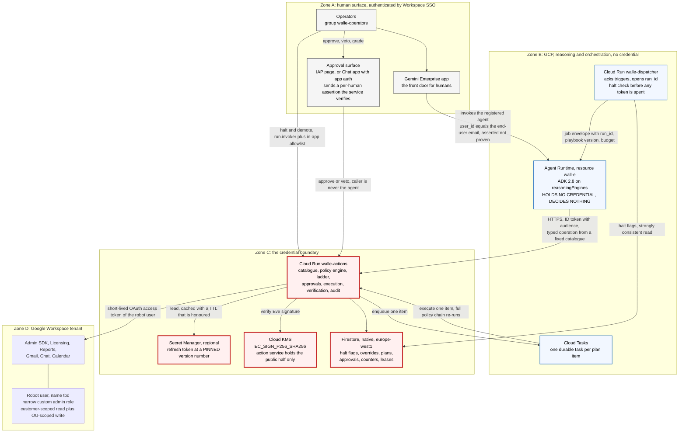
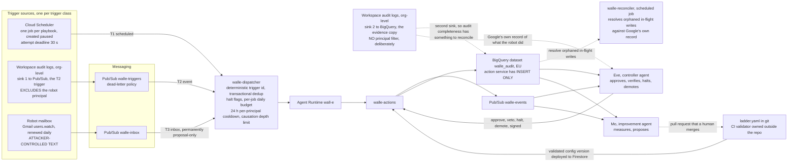
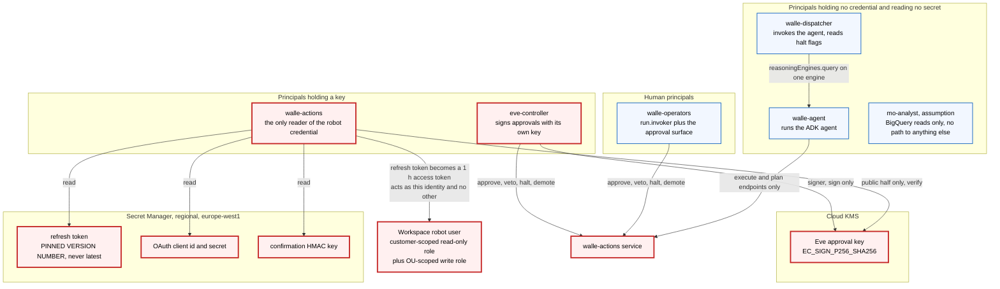
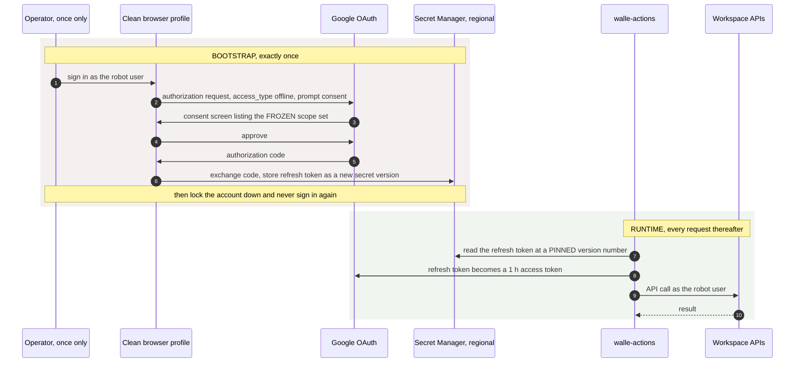
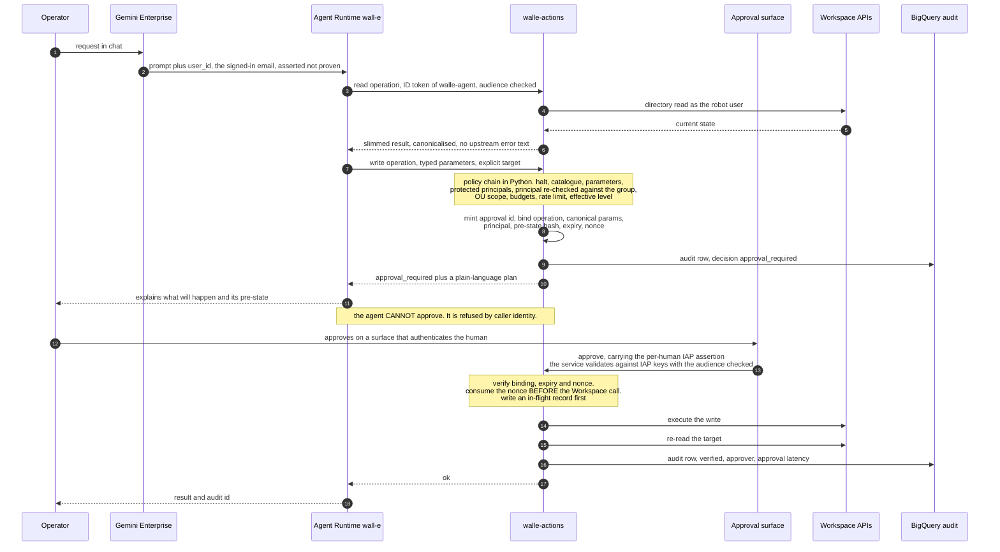
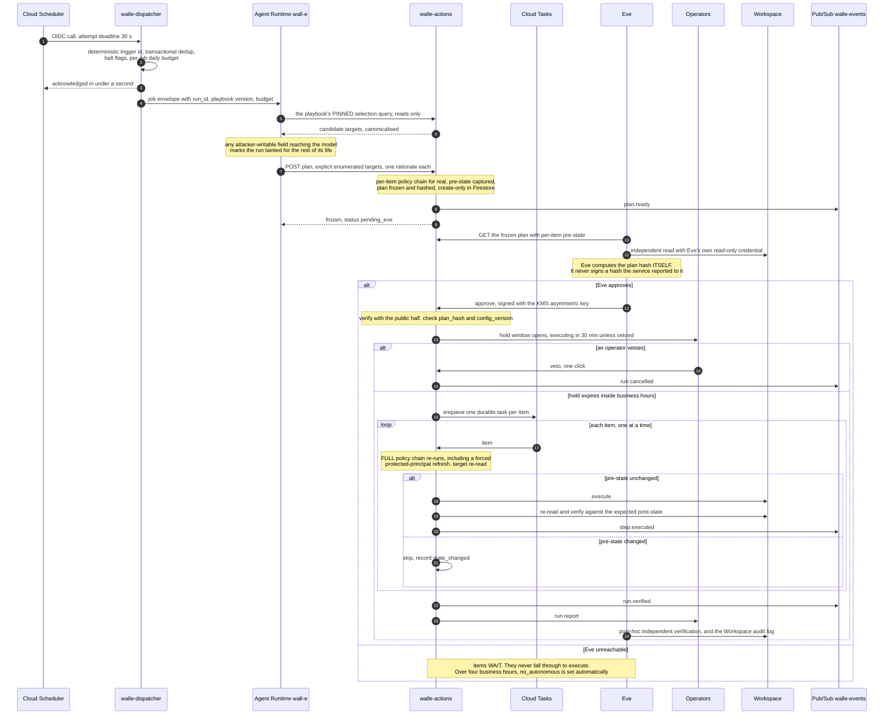

# Wall-E: service architecture

## Status
- Owner: the platform owner
- Last reviewed: 2026-09-09
- Maturity: **design. Nothing is built and nothing is enabled.**
- Standalone: this document is self-contained. You do not need to read anything else first.

**Where the detail lives.** This is the consolidated view. The design set argues each part
properly: [01-hld.md](01-hld.md) for the component rationale,
[02-identity-and-auth.md](02-identity-and-auth.md) for identity and credentials,
[03-lld.md](03-lld.md) for the policy engine and data model,
[05-autonomy-ladder.md](05-autonomy-ladder.md) for the enablement plan,
[06-security-guardrails.md](06-security-guardrails.md) for the threat model,
[08-team-eve-mo.md](08-team-eve-mo.md) for the Eve and Mo contract, and
[10-adversarial-review.md](10-adversarial-review.md) for what two review passes corrected,
[11-prompt-security.md](11-prompt-security.md) for prompt security and monitoring,
[12-agent-identity.md](12-agent-identity.md) for agent, operator and workforce identity, and
[13-agent-interconnection.md](13-agent-interconnection.md) for connecting Wall-E to other agents.
To build it, follow [SETUP.md](SETUP.md).

**Audience:** an IT security reviewer, an architect, or an engineer who will build Eve or
Mo. It assumes no prior reading of the design set. Every product fact below was verified
on 2026-09-07 or 2026-09-08.

Anything about your own tenant that has not been confirmed is prefixed `Assumption:` or
left as `tbd`. No credential value appears here. Where a credential exists, only its
location is recorded.

---

## 0. What is being approved now

This document describes an end state reached over roughly nine months of stages. The risk of the end state is not the risk of the thing being switched on next month. This section is the scope of the approval being asked for. Everything after it describes where the design is going.

**Eve and Mo do not exist. They have no design and no date.** Every level that depends on Eve is therefore unreachable today. L4 and L5 cannot be delivered in this pilot, and the maximum autonomy deliverable is **L3, human approval per action**. Section 5.2, the whole Eve-gated flow, and the L4 and L5 rows of section 8.1 describe a target state. Until Eve exists, the metrics in section 8 are BigQuery scheduled queries read by a human.

| Item | What is in scope |
|---|---|
| **Stage** | **S0 "Eyes" only.** Reads run for real. Every write family sits at L1 shadow, which forces a dry run and never executes, even when handed a valid approval |
| **What actually touches Workspace** | Reads, plus `notify.operators`, a templated message to a config-fixed operator address, which is how a run reports at all. No directory write, no group change, no licence change, no suspension |
| **Pilot population** | `tbd`. `Assumption:` a sandbox organisational unit of synthetic accounts, plus one small real pilot organisational unit. The account count in each is `tbd` and must be an absolute number in the decision record that opens S0 |
| **Read scope** | The whole tenant, rate-limited at 120 reads per minute. This is not a pilot-sized read, and that matters for section 11 |
| **Employee attributes the reads touch** | Name, primary address and aliases, organisational unit, manager and relations, group memberships, admin-role holding, licence assignment by SKU, last sign-in time, and admin, login, group, token and SAML audit events |
| **Duration** | Floor of 3 to 4 weeks. Time alone promotes nothing. The exit criteria do |
| **Operator rota** | `Assumption:` the ladder owner alone at S0. A second named Workspace admin is required before S1, and a second approver from IT security before any high-risk promotion |
| **Autonomy ceiling for the pilot** | L3, and only from S1 onward. At S0 nothing executes |
| **Explicitly not in scope** | Autonomous writes of any kind. Eve. Mo. The event trigger class. The inbox trigger class. Any write outside the pilot organisational unit allowlist. Any operation not in the catalogue |

**What must be live before the pilot starts.** The custom read-only role and its two role assignments. The robot account hardened as listed in section 3. The action service with its catalogue, policy chain, durable counters and write-ahead audit. Ladder config v1 with every write family at L1. The halt flags and the K0 to K5 chain in section 4.6, drilled once with times recorded. The dispatcher with per-job enable and budget. The approval surface specified in section 3, because it must exist before the first real write rather than before the first execution. The data-protection question in section 11 formally asked.

**Exit criteria that would open S1.** At least 20 shadow runs covering every write family, every item graded by an operator, at least 95 per cent graded correct. Zero hard-invariant denials arising from autonomous runs. Zero requests without an audit row, proved by reconciling Cloud Logging against BigQuery. The injection regression suite passes. K0 measured under 60 seconds and K5 measured at all. The data-protection position answered, and the position of employee representative bodies where your jurisdiction has them. A signed decision record for S1.

**Abort criteria.** Any of these stops the pilot rather than demoting one family. Any execution against Workspace during S0, because nothing at L1 may execute. Any severity-1 event: an effect on a protected principal, an operation executed that was not in the frozen plan, a forged or agent-posted approval, or any interactive login to the robot account. Audit completeness below 100 per cent that cannot be reconciled. An `invalid_grant` from Google not explained within one working day. K0 missing its 60-second target in a drill. A data-protection objection to the reads, or an objection from employee representative bodies where your jurisdiction has them. Aborting means pulling K2 and K4 in section 4.6, not changing a level.

---

## 1. What this is, and the one constraint that shapes it

Wall-E is an agent that administers a Google Workspace tenant: it reads the directory, reports on licences and stale accounts, and performs a small catalogue of reversible admin writes such as group membership changes, profile updates within a safe field list, licence assignment changes and user suspension. It is invoked either by a named human in Gemini Enterprise or by an unattended trigger, and it is intended to become progressively more autonomous. The single constraint that drives the entire shape of the system is this: **autonomy is never a property of the agent, it is a number attached to a pair of (operation family, trigger class), stored as versioned configuration and enforced by a deterministic Python service that is the only holder of the Workspace credential.** Humans raise that number one notch at a time against measured evidence. Any operator, the controller agent Eve, or an automatic breaker lowers it instantly and alone. Because of that constraint the system is not one process with a policy module inside it. It is a set of services split along the lines that the constraint requires: the thing that reasons cannot hold the credential, the thing that holds the credential cannot reason, and the thing that approves cannot be either of them.

The second-order consequence, which explains most of the diagram that follows, is that **no domain-wide delegation is used anywhere**. Wall-E acts as exactly one Workspace identity, a robot user holding a narrow custom admin role, and it can never act as anyone else. Where a Google API requires domain-wide delegation, that API is out of scope rather than an exception.

---

## 2. Service diagrams

Three diagrams. The first is the control and request plane. The second is the trigger and evidence plane. The third, in section 4, is the identity and credential model.

### 2.1 Control plane, with the credential boundary

Only `walle-actions` holds the Workspace credential. The red box holds the credential and the state that authorises its use. The dispatcher reaches one document in that state, the halt flags, read-only, and nothing else.



Read the diagram for what is missing as much as for what is there. There is no arrow from the agent to Secret Manager. There is no arrow from the agent to Workspace. There is no arrow from the agent to the approval surface or to any control endpoint. Those absences are the security model.

### 2.2 Trigger plane and evidence plane



One detail in that diagram is load-bearing and easy to lose, and it has been got wrong before. There are **two organisation-level sinks on the same admin-activity filter, and they are filtered differently.**

Sink one goes to Pub/Sub and is the T2 trigger. It **excludes the robot's own principal**, otherwise every write Wall-E makes produces an event that starts another run that writes again. Sink two goes to BigQuery and is the evidence copy. It does **not** exclude the robot, because the only thing it exists for is reconciling what the robot itself actually did against what Wall-E says it did. Applying the actor exclusion to both sinks leaves the audit-completeness metric and Eve's independent record with zero rows about the robot, which is precisely the control being claimed. Build them as two sinks with two filters, and test that the BigQuery copy contains the robot's own writes.

The actor exclusion still leaves a second hop: Wall-E moves a user, Google's own licensing engine reacts, and that event is attributed to the system rather than to the robot. The dispatcher therefore also enforces a 24-hour per-principal cooldown and a causation depth limit.

---

## 3. Service inventory

| Service | What it is | Why it exists | What breaks if merged into its neighbour | Runs as |
|---|---|---|---|---|
| **Gemini Enterprise app** | The human front door. A registered custom agent, shared on its User permissions tab with the operators group only. | Gives every human request an authenticated Workspace identity and a conversation surface your organisation already runs. | Exposing the agent directly loses per-agent sharing and the end-user identity, so trust boundary 1 disappears and any staff member with project access reaches Wall-E. | End user via Workspace SSO. The call to the agent arrives as the Discovery Engine service agent. |
| **Approval surface** | An approval page behind Identity-Aware Proxy, bound to the plan hash. A Google Chat app with app authentication is the alternative, and it is a second identity with its own IAM and its own compromise story. | Human consent must arrive on a surface that authenticates the human itself **and passes a per-human assertion the action service verifies for itself**. Note that the robot's own user token can send **text only**, so one-click cards and buttons require a Chat app with app authentication. | Merging it into the agent means the model asserts that a human approved. That is exactly what a prompt injection produces, and it was the single worst defect found in review. | An IAP-authenticated human, whose assertion travels with the call. Never the agent's service account. |
| **Cloud Scheduler** | One HTTP job per playbook, all created paused, enabled per ladder stage. | The T1 scheduled trigger class. | Scheduler *can* call a Google API target directly with an OAuth token, so this is not about capability. Its attempt deadline defaults to three minutes while an agent turn takes longer, so a direct synchronous call is recorded as failed and retried, and the same run happens twice. | OIDC token as the dispatcher service account. |
| **Workspace audit log sinks, two of them** | Two organisation-level Cloud Logging sinks on the same admin-activity filter. The Pub/Sub sink **excludes** the robot's principal, or every write Wall-E makes starts another run. The BigQuery sink does **not** exclude it, because reconciling audit completeness needs Google's own record of what the robot itself did. | Sink one is the T2 event trigger class, with no credential at all, replacing the Alert Center API which requires domain-wide delegation. Sink two is the evidence copy Eve reconciles against. | Without the actor exclusion on sink one the system feeds itself. With the actor exclusion applied to sink two, the audit-completeness metric and Eve's independent record contain nothing about the robot, and the control is decoration. | Sink writer identities, one with publish rights on the topic and one with write rights on the dataset. Creating both needs organisation-level log configuration rights. |
| **Pub/Sub `walle-triggers` / `walle-inbox`** | Trigger transport with dead-letter policies. | Durable buffering and retry between an event source and a service that may be cold. | Pushing the sink straight at the agent loses dedup, dead-lettering and the ack-deadline safety margin. | Google-managed. Push subscription authenticates to the dispatcher. |
| **`walle-dispatcher`** (Cloud Run) | Acknowledges a trigger in under a second, dedups on a deterministic trigger id, checks halt flags and the job's daily budget, opens the `run_id`, then calls the agent. | Three reasons. The kill switch must work **before** the model runs, or a halt still costs a full agent turn. Run identity is a fact about the run and must not be invented by the model. A trigger must be acked in seconds while an agent turn takes minutes. | Merged into the agent: halting becomes expensive and late, `run_id` and budget become model output, and every long run is retried into a duplicate. | `walle-dispatcher@`, which holds `aiplatform.reasoningEngines.query` on Wall-E's engine only and reads halt flags. |
| **Agent Runtime `wall-e`** | The reasoning layer. ADK 2.8 on a `reasoningEngines` resource, deployed with `vertexai.Client(project, location).agent_engines.create(...)`. Tools are generated from the action service's catalogue endpoint rather than hand-written. Sessions managed, Memory Bank off. | Turns intent into a named operation from a fixed catalogue plus typed parameters, and narrates results. | Merged into the action service, the refresh token sits in the same process as the LLM loop and any tool that can read the environment becomes an exfiltration path. This is the merge that must never happen. | Agent Identity, decided in [12-agent-identity.md](12-agent-identity.md): adopted at creation, with a spike-gated fallback to `walle-agent@` |
| **`walle-actions`** (Cloud Run) | The only credential holder. Operation catalogue, Pydantic parameter models, the policy chain, the autonomy ladder, approval minting and verification, execution, verification by re-read, and the audit write. Deployed with an explicit 60 s timeout. | Between generated text and an Admin SDK call that suspends a user there must be a gate the model cannot talk its way past. Audit, budgets, idempotency, dry-run, pre-state capture and the ladder belong in one place or each is one refactor from being bypassed. | It has no safe neighbour to merge into. Splitting it **further**, so the control endpoints live on a second service with their own IAM, is a recognised improvement and is an open decision, targeted before the Eve-gated stage. | `walle-actions@`, the only reader of the credential secrets. |
| **Cloud Tasks** | One durable task per plan item, executed one at a time back into the action service. | Approving a plan must return immediately. Running a 25-item loop inside the approve request exceeds Cloud Run's timeout and leaves a half-applied plan, a consumed nonce and no terminal state. | Merged back into the request handler, that failure mode returns and there is no per-item halt check. | OIDC as a dedicated service account, **`walle-tasks@`**, which holds `run.invoker` and nothing else and appears on the in-app allowlist for the worker endpoint and no other endpoint. |
| **Firestore** (native, europe-west1) | The live control plane: halt flags, overrides, frozen plans, approvals and nonces, durable counters, leases, cooldowns, dedup, drill records, canary state, proposal and grade queues. | Every budget and rate limit must be global and honest across instances. An in-memory counter under two workers and autoscaling means the documented cap is a fiction. | Merged into process memory, budgets and rate limits stop being real and the andon cord has nowhere durable to live. | Accessed by `walle-actions@`, and by `walle-dispatcher@` for halt flags and trigger dedup. Halt and override reads are strongly consistent and never cached. |
| **Secret Manager** (regional) | The OAuth client, the robot's refresh token, and the service's own confirmation HMAC key. Regional secrets, not global secrets with user-managed replication. | Regional secrets keep the data in the location at rest, in use and in transit. The version number is pinned in config: `latest` resolves to the newest **enabled** version, so disabling the newest silently falls back to the previous, still-valid token. Pinning closes that fallback, but disabling a version still only stops future refreshes, and an access token already in hand stays valid for up to an hour. The credential kill switch is therefore the action service **revoking its own refresh token at Google**: it holds the token, so it can revoke it, instantly and without a second person. Revoking the grant as the robot user is the backstop for when the service itself is unresponsive. See section 4.6. | Baking the token into an image or an environment variable removes rotation, secret-access auditing and the pinned-version property in one step. | Read by `walle-actions@` only. |
| **Cloud KMS** | Eve's approval signing key, `EC_SIGN_P256_SHA256`. | A shared symmetric secret cannot express "Eve approved this": either the action service cannot verify Eve's signature, or it can also mint one. Asymmetric signing is the only shape that works. | Merging the key into a shared HMAC makes every Eve-gated level meaningless, and the obvious build-time fix quietly destroys the property the controller role rests on. | `eve-controller@` holds `cloudkms.signer`. `walle-actions@` holds `publicKeyViewer` and verifies locally. |
| **BigQuery `walle_audit`** (EU) | Six tables: `actions`, `runs`, `plans`, `approvals`, `verifications`, `config_versions`. Partitioned by timestamp, clustered by operation. Plus the **second** Workspace audit log sink, the one with no principal filter. | The answer to "what has the robot done", and the evidence every autonomy promotion is argued from. Writes are refused when this sink is unavailable. | Merged into Cloud Logging or Firestore, the insert-only property is lost and the service can delete its own evidence. | `walle-actions@` holds **insert-only** rights on the dataset, deliberately. |
| **Pub/Sub `walle-events`** | The event stream: `run.started`, `plan.ready`, `step.pending`, `step.executed`, `run.verified`, `override.applied`, `halt.set`, `content.flagged`. | Eve and Mo observe Wall-E without asking Wall-E. A safety interlock that runs through an LLM is not an interlock. | Merged into an agent-to-agent conversation, Eve cannot stop Wall-E when the model layer is wedged, hallucinating or looping. | Published by `walle-actions@`. Subscribed by Eve and Mo. |
| **In-flight reconciler** | A scheduled job that reads `in_flight/{run_id}#{item}` in Firestore and resolves any unresolved record against the Workspace audit log copy in BigQuery. | The nonce is consumed **before** the Workspace call, because no transaction spans Firestore and an Admin SDK call. A crash in between leaves an operation whose outcome is unknown, and Google's own audit record is the only independent answer. | Without it, every crashed write is a permanent unknown in the evidence trail, and the audit-completeness metric cannot reach 100 per cent. Any orphan older than one hour alerts. | Its own service account with Firestore access and BigQuery read. No Workspace credential, no write path. |
| **Group-classification job** | Recomputes every group's class from the transitive closure of its ancestors and the admin roles attached to them. | Nesting is invisible in the console. A small distribution list inside `walle-operators@` looks like an ordinary group, and one membership write into it grants approval authority. | Without it the class is a hand-maintained file, which is a guess. CI fails when the human file diverges from the computed closure. | `walle-actions@`, using the customer-scoped read role and `admin.directory.rolemanagement.readonly`. |
| **Protected-principal refresher** | A background job that fills the protected-principal cache: super admins, delegated admins, the robot, its OU and the transitive members of `walle-protected@`. | Two uncached Admin SDK calls per directory operation is not viable, and a stale set is a hole. | Without it the check is either slow or wrong. If the cache cannot be filled, the service **fails closed** and directory writes are denied. | `walle-actions@`, customer-scoped, never OU-scoped. |
| **Gmail watch renewal job** | Renews `users.watch` on the robot mailbox daily. | A Gmail watch expires after seven days with no notice, and a dead trigger looks exactly like a quiet week. | Without it the T3 inbox trigger silently stops. A missed renewal pages. | `walle-actions@`, with the `gmail.readonly` scope already held. |
| **Google Workspace** | The tenant. One robot user with a narrow custom admin role, held as two role assignments. | The actual effect. | It is the system of record and cannot be merged into anything. | The robot user, `Assumption:` in its own OU for service identities. Hardened means, specifically: own OU for service identities; 2-step verification enforced, hardware key only, key in a safe; no recovery email and no recovery phone; long random password held in the corporate vault and never in the wiki; short session length with no remembered device; less secure app access off. After bootstrap an interactive login is by definition an incident, and the reporting rule that detects it depends on the Workspace edition, which is `tbd`. |

### The approval surface, specified

This is the control that makes every L3 statement in section 8 meaningful, so it is specified here rather than left as a choice.

The approve request carries a **per-human assertion the action service verifies itself**. For the IAP page that is the `x-goog-iap-jwt-assertion` header, validated against IAP's public keys, with the audience checked. For the Chat app it is the interaction event's Chat-verified sender, validated against Google's keys. The service then re-checks the asserted identity against the **committed operator list in the deployed configuration**, not against a live Directory read, for the reason in section 7.5. It binds the verified identity into the approval record and stores which surface asserted it.

A surface that can assert consent without a per-human assertion the service can verify is the original defect one hop out: the model no longer claims a human approved, a service account does, and nothing verifiable travels with the claim. That is not acceptable, and a trusted caller identity alone does not satisfy this requirement.

---

## 4. Identity and credential model

**The agent's runtime identity is decided in [12-agent-identity.md](12-agent-identity.md): Agent Identity, set at engine creation, with `walle-agent@` as a spike-gated fallback.** Where a row below names `walle-agent@`, read "the agent principal, or `walle-agent@` on the fallback path". The two never coexist on one engine.

### 4.1 The problem in one paragraph

Workspace APIs authorise against a *user*. A GCP service account is not a Workspace user. The normal bridge is domain-wide delegation, in which the tenant grants a service account the right to impersonate users. That is excluded, because domain-wide delegation is a tenant-wide capability scoped only by OAuth scopes, so a compromised service account can act as anyone including a super admin. Without it a service account cannot become a Workspace user, so the design does not try. Wall-E is exactly one Workspace identity and can never be another.

### 4.2 The principals

| Principal | Type | Holds | May read | May do | `run.invoker` on `walle-actions` | Must never |
|---|---|---|---|---|---|---|
| Robot user, `walle@` domain, name tbd | Workspace user | The OAuth refresh token, stored in Secret Manager | Everything its custom admin role allows | The only identity that ever touches Workspace | Not applicable. It is a Workspace identity, never a GCP caller | Be signed into interactively after bootstrap. That is by definition an incident. |
| `walle-actions@` | GCP service account | Reads the refresh token, the OAuth client and the confirmation HMAC key | Those secrets, Firestore, BigQuery insert, KMS public key | Run the action service, decide authorisation, execute, audit | No. It runs the service, it does not call it | Read Eve's private key. Mint an Eve approval. Delete audit rows. |
| `walle-agent@` | GCP service account | Nothing | No secret at all | Run the agent. Call the execute and plan endpoints of the action service | **Yes** | Read any secret. Reach any control or approval endpoint. Hold a Workspace token. |
| `walle-dispatcher@` | GCP service account | Nothing | Halt flags | Invoke the agent. Holds `aiplatform.reasoningEngines.query` on Wall-E's engine only | **No.** It calls the agent and reads Firestore, never the action service | Call the action service at all. |
| `walle-tasks@` | GCP service account | Nothing | Nothing | Deliver one queued plan item back into the worker endpoint | **Yes**, and it is on the in-app allowlist for the worker endpoint only | Call any endpoint but the worker endpoint. |
| `eve-controller@` | GCP service account | `cloudkms.signer` on Eve's own asymmetric key | Audit dataset, plans, runs, and, per an open decision, its **own** read-only Workspace credential | Approve, veto, halt, demote. Read everything Wall-E has produced | **Yes** | Execute any Workspace operation. Raise any level. Read any secret or signing key of Wall-E's. |
| Human operators, `walle-operators@` | Workspace group, presenting an identity token | Nothing | The control and read endpoints | Approve, veto, halt, demote, grade | **Yes**, or none of the kill switches has a handle | Also hold `run.developer` on the action service. |
| **Deployers** | Human plus CI | `run.developer` on `walle-actions`, `iam.serviceAccountUser` on `walle-actions@` | The service's image and configuration | Ship a revision of the credential holder | Not the point. A revision defines what every allowlist means | Be an operator or an approver at the same time. |

**The deploy grant is the largest control in the system, and it is held by a human.** A deploy to `walle-actions` changes the credential holder and the policy engine in one act: the new revision keeps the service account, reads the pinned secret version, and can do anything at all with it. That single grant defeats the policy engine, the catalogue, the ladder, the in-app allowlist, the approval endpoints and the insert-only audit rights simultaneously. So: deploys come only from a CI pipeline whose identity no operator holds, from a branch requiring a second reviewer on the ceiling module, the policy chain and the catalogue. **No human holds `run.developer` on this service in steady state**, and a break-glass grant is time-boxed and alerted. Weakness 12 in section 11 records what remains.

**Why Eve may invoke the agent.** `eve-controller@` holds `aiplatform.reasoningEngines.query` so it can run its own read-only verification playbooks through the agent rather than through the service it is checking. It cannot reach the execute path, which requires a principal on the in-app allowlist for that endpoint, and the agent it invokes holds no credential either way.

Three further principals exist around the edges. `Assumption:` **Mo** gets a read-only principal, `mo-analyst@`, with BigQuery access and no path to anything else. Two more Workspace groups carry policy rather than access: **`walle-readers@`**, whose members may invoke READ operations only and who see nothing until the agent is also shared with them in Gemini Enterprise, and **`walle-protected@`**, whose transitive members can never be the target of a write.

Two properties to re-verify after every IAM change:

1. `walle-agent@` can read no secret.
2. `eve-controller@` and `walle-actions@` never share a key. If they did, "Eve approved this" would mean nothing.



### 4.3 The one-time consent flow

Exactly one interactive sign-in is unavoidable. There is no way to obtain user credentials for an account without that account consenting, and every alternative is the thing being avoided. It happens once, takes about fifteen minutes, and is repeated only on rotation.



**Scopes freeze permanently at consent time.** Adding one later means redoing the bootstrap and the trusted-client step, so the whole list must be decided before the first consent. This is the one irreversible step in the pilot, and the frozen set is **the true maximum reach of the credential if the token ever leaks, independent of the custom admin role**. The role can be narrowed later. The scope list cannot.

The complete frozen list, one row per scope, with the catalogue operation that needs it. Any scope with no catalogue operation against it is removed before consent.

| Scope | Catalogue operations that require it |
|---|---|
| `admin.directory.user` | `directory.user.get`, `directory.user.list`, `directory.user.update`, `directory.user.suspend`, `directory.user.move_ou` |
| `admin.directory.group` | `directory.group.list`, `directory.group.members.list`, `directory.group.member.add`, `directory.group.member.remove` |
| `admin.directory.orgunit.readonly` | `directory.orgunit.list`, and the organisational-unit scope check |
| `admin.directory.rolemanagement.readonly` | `directory.admins.list`, the protected-principal set, and the group-classification job. **Required, not optional**: without it the control that stops privilege escalation through a group has nothing to read |
| `admin.reports.audit.readonly` | `reports.activities.list` for admin, login, group, token and SAML events |
| `admin.reports.usage.readonly` | `reports.usage.users`, which is `accounts:last_login_time` and therefore every inactivity report |
| `apps.licensing` | `licensing.assignments.list`, `licensing.assignment.delete`, `.insert`, `.patch` |
| `gmail.readonly` | `gmail.list`, `gmail.get` on the robot's own mailbox, which is the T3 inbox trigger |
| `gmail.labels` | `gmail.label` on the robot's own mailbox, family F9 |
| `gmail.send` | `gmail.send`, family F2b, and `notify.operators` when the notification is mail |
| `chat.messages` | `chat.message.send`, family F2b, and `notify.operators` when the notification is Chat |
| `calendar.events` | `calendar.event.create`, `calendar.events.list` on the robot's own calendar |
| `userinfo.email` | None. Bootstrap only: the script verifies that the consenting account really is the robot |
| `openid` | None. Bootstrap only, for the same check |

Two live questions must be closed before consent, not after. First, whether `admin.directory.user.security` is included: it enables sign-out and token revocation for leaver hygiene, and it also enables session-hijack cleanup, so it is currently **excluded** and must be decided explicitly rather than inherited. Second, confirmation that `drive` is **not** requested: without domain-wide delegation the robot sees only its own Drive, so the scope buys nothing and widens the blast radius of a leak.

`cloud-platform` is never requested, because it would bind the Workspace credential to your organisation's GCP session-control policy. The Gmail scopes are "restricted" in Google's classification; for an **Internal** app that needs no Google verification, but your tenant's own API controls block them until the client is marked trusted.

### 4.4 What makes the credential stop working

Each row is an operational rule, not a curiosity.

| Cause | Rule it imposes |
|---|---|
| External-type consent screens in Testing expire refresh tokens after seven days | Set the consent screen to **Internal** and to **In production**. |
| More than 100 live tokens for one client silently invalidates the oldest | One client, one token. Never reuse this OAuth client. |
| Six months unused | The action service refreshes at least monthly even when idle, and alerts on failure. |
| Robot password change, with Gmail scopes granted | Password rotation invalidates the token. Re-bootstrap is part of the rotation runbook. |
| A requested service set to Restricted in API controls | Mark the client **Trusted** in Admin console API controls, in the same sitting as the consent. |
| User revocation | This is K5 in section 4.6. Total, and it costs a re-bootstrap. |

`invalid_grant` is treated as a paging incident, never a retryable error. It means the credential is gone and Wall-E is down until a human re-bootstraps.

### 4.5 Admin rights: never super admin, and two role assignments

The robot holds a custom role, never Super Admin. A super admin can alter security policy, grant domain-wide delegation and escalate. The role grows with the autonomy ladder: read-only at the first stage, gaining a write privilege only when the stage that needs it is entered.

Three Workspace facts constrain how the role can be sliced, and each one broke an earlier draft:

- **There is no standalone suspend privilege.** Suspension is a sub-action of Users → Update, alongside rename, move, password reset and aliases. Granting profile editing unavoidably grants suspension at the Workspace layer. Separation between them exists only in the safe-field allowlist and the ladder levels, which makes those two load-bearing rather than defence in depth.
- **License Management is a single indivisible privilege with no read-only half.** It cannot be granted during a read-only stage.
- **Groups and Reports privileges cannot be organisational-unit scoped**, and the read-only stage's whole value is tenant-wide reads such as inactivity by OU, licences by SKU and admin-role holders against a signed list.

Therefore the design uses **two role assignments**: a customer-scoped read-only role granted first, and a separate OU-scoped write role granted later. The OU-scoped assignment means Workspace itself refuses an operation outside the pilot scope, which is a second enforcement point outside our own code and worth having.

Permanently excluded from the role: user create and delete, security and domain settings, admin role assignment, and Vault or eDiscovery.

### 4.6 Kill switches

Six switches, ordered from surgical to total. A reviewer's third question is "how is it stopped", so the answer is in one table rather than scattered.

| Switch | Mechanism | Who may pull it | Target time | What it does **not** stop | Last measured |
|---|---|---|---|---|---|
| **K0** halt writes | `POST /v1/control/halt` with mode `no_writes`, `no_autonomous` or `halt_all` | Any operator, Eve, or a breaker. No approval, no incident opened by default | Under 5 s | Reads keep working. An item already inside a Workspace API call completes | `tbd`, nothing is built |
| **K1** demote one cell | `POST /v1/control/demote` for one (family, trigger) pair | Any operator, Eve, or a breaker | Under 5 s | Every other family and trigger keeps its level | `tbd` |
| **K2** stop new runs | Pause the Scheduler jobs, detach the push subscriptions | An operator with the GCP rights | Seconds | Runs already open. Chat requests already in flight | `tbd` |
| **K3** cut the agent off | Remove `run.invoker` from `walle-agent@` | A project IAM admin | About a minute | Anything `walle-actions` is already executing. Operator control endpoints keep working, deliberately | `tbd` |
| **K4** kill the credential | The action service **revokes its own refresh token at Google**. It holds the token, so it can revoke it | The service itself, on one operator call. Needs no console and no second person | Seconds | An access token already issued stays valid for **up to 60 minutes** | `tbd` |
| **K5** revoke the grant | Revoke the OAuth grant as the robot user, or suspend the robot account | A Workspace super admin | Seconds to pull, then Wall-E is down until a human re-bootstraps | The same 60-minute access-token residual | `tbd` |

**The residual, stated plainly.** K4 and K5 stop future token refreshes. They do not invalidate an access token already in hand, which lives up to an hour. So **K0 is what stops work now, and K4 is what stops the credential.** Disabling a secret version is not a kill switch at all: it stops future refreshes only, and before the version was pinned it did not even do that, because `latest` fell back to the previous still-valid version.

K0 and K1 are the andon cord. Anyone may pull them, no approval is needed, and no incident is opened by default. K3 and above open an incident. Drill results and measured times are written to `drills/{date}` in Firestore, and CI refuses any promotion citing a drill older than 30 days. Nothing has been drilled yet, because nothing is built.

If Firestore is unreachable the service self-halts writes rather than assuming it is running. The andon cord cannot un-pull itself during an outage.

---

## 5. Request paths

### 5.1 A human request, high risk, human approval

Trigger class T0. A `WRITE_HIGH` operation at level L3. The point of the diagram is where the agent is **not**.

The directory read returns the target's display name, so this run is **tainted** from that moment. Under section 8.4 a tainted chat run has a ceiling of L3, which is exactly where this operation already sits. The flow therefore proceeds, behind human approval, and can never climb higher no matter what the ladder says.



Failure branches that matter. If the approve call arrives without a valid per-human assertion, it is refused: a trusted caller identity alone is not consent, and the service verifies the assertion itself rather than believing a service account that says a human clicked. If the model calls the approval endpoint, it is denied with `approver_is_agent`, which is a hard invariant that trips the breaker for that family. If a human suspends the target between plan and approval, the pre-state differs at execution and the item is skipped as `state_changed` rather than executed on a stale premise. If two operators both confirm, the nonce is consumed transactionally and the second gets `approval_already_used`. If BigQuery is unavailable, the write is refused before execution: no evidence, no action.

### 5.2 An autonomous run, Eve approval, hold window, verification

Trigger class T1. Level L4. This is the shape that exists from the Eve-gated stage onward.



**Why this L4 path is reachable at all.** Taint is not a property of the playbook's subject, it is a property of the fields it lets into the model's context, so each playbook has to be checked against section 8.4 explicitly. A machine run that taints takes the inbox ceiling, where every write family is at L2 or L0, and the flow above would collapse to proposals.

| Playbook | Pinned selection and reads | Attacker-writable fields returned | Effective ceiling on T1 scheduled |
|---|---|---|---|
| `licence-reclaim-suspended` | `directory.user.list` pinned and projected to `primaryEmail`, `suspended`, `orgUnitPath`, `lastLoginTime`; `licensing.assignments.list` | None. The projection excludes `name.*`, `organizations`, `locations` and `relations` | Untainted. F7 keeps its configured level, up to L4. This is the flow drawn above |
| `leaver-checklist` | `directory.user.get`, `directory.group.members.list`, projected to addresses, ids and group keys | None. Group `name` and `description` are attacker-writable and are not requested | Untainted. F3 up to L4 |
| `stale-account-report` | The same reads, plus `name.*` so the report is readable by a human | User `name.*` | Declares `taints: true`. The inbox ceiling applies: reads stay L5, every write family drops to L2. Correct, because the playbook only ever produces a report |

The rule is mechanical, and the catalogue's field projection enforces it rather than the prompt. A playbook reaches L4 only if it never lets an attacker-writable field into the model's context. Showing a display name is a legitimate thing to want, and it costs autonomy. That trade is exactly what the taint bit exists to make explicit.

Three properties of this path are worth a reviewer's attention. **The whole policy chain re-runs per item**, rather than comparing a stored pre-state hash, because a human restoring a suspended user between plan and execution leaves the membership pre-state untouched, so group removals would execute on an active account and verify perfectly clean: the write correct, the premise stale. **A plan that cannot complete inside today's business window is refused at plan time**, never deferred, because an attacker who chooses when the triggering event fires would otherwise aim every batch at 08:00 the next morning with nobody watching. And **Eve's absence never increases what happens.**

---

## 6. Trust boundaries

Five boundaries. The first four answer "may this action happen at all". The fifth answers "may it happen without a human watching, right now, at this level of proven reliability". Those are separate questions and the design keeps them separate.

| # | Boundary | Enforced by | What it stops | How it can still fail |
|---|---|---|---|---|
| **1** | Human to Gemini Enterprise | Workspace SSO. The agent is shared only with the operators group on its User permissions tab. | Non-allowlisted staff reaching Wall-E at all. | The end user's email is **asserted** by the caller, not cryptographically bound to the user, which is why boundary 2 must be tight and the service re-checks group membership. |
| **2** | Agent to action service | Cloud Run IAM `run.invoker`, ID-token verification **with audience**, plus an **in-app per-endpoint caller allowlist** keyed on the verified email claim. `aiplatform.reasoningEngines.query` granted to exactly three principals: the Gemini Enterprise service agent, the dispatcher and Eve. Section 4.2 says why Eve is one of them. | Anything but Wall-E's own identity calling the action service, and the agent reaching the control or approval endpoints. | `run.invoker` is granted **per service, not per path**, so IAM alone cannot express this. The in-app allowlist is doing real work, and splitting the control plane onto a second service is the stronger version of the same idea. |
| **3** | LLM to credential | Architecture. The refresh token exists only inside the action service, never in the model's process or context. No catalogue operation returns it. | Prompt injection exfiltrating an admin credential. | Nothing in the model's process is authoritative, so an ADK plugin mirroring the policy is defence in depth and never the boundary. |
| **4** | Requested action to executed action | The deterministic policy engine: catalogue allowlist, Pydantic parameter models with `extra="forbid"`, protected principals, OU and group-class scope, durable budgets, rate limits, business hours, idempotency. | The model inventing a destructive call and it simply running. | Every control runs in one process. See section 11. |
| **5** | Permitted action to autonomously executed action | The autonomy ladder: a level per (operation family, trigger class), approval ids the service mints and only a human or Eve releases, hold windows, breakers, and ceilings that live in code. | An operation that is legitimate on request being taken unattended before it has earned the right. | The taint bit depends on the catalogue correctly declaring which returned fields are attacker-writable. A missed field is a silent hole. |

Three mechanisms are often mistaken for boundaries. They are not, and calling them boundaries would overstate the design.

| Mechanism | What it actually is |
|---|---|
| The system instruction telling the agent that content is data, never instruction | A courtesy. It will sometimes fail, and every ceiling in section 8 exists to compensate for a prompt that has already failed. |
| The ADK policy plugin mirroring the catalogue and level | Defence in depth inside the process it protects. A code change bypasses it. |
| Cloud Run ingress settings | **Not usable here.** Agent Runtime egresses from a Google-managed tenant project, which Cloud Run treats as external, so internal-only ingress blocks the agent entirely. IAM is the enforced boundary. See section 9 for what that leaves exposed. |
| Model Armor on Agent Gateway, plus project-level floor settings | Content screening Wall-E's own code cannot switch off, which makes it better than an in-process plugin.Two failure modes, and they differ. On the **Agent Gateway** path Model Armor is attached through a Service Extensions authorization extension whose `failOpen` is false in Google's own sample and defaults to false, so a Model Armor timeout or error **stops the request**: fail-closed, which makes Model Armor availability part of Wall-E's availability. On the **floor-settings** path, which screens the agent's own `generateContent` calls, an error **skips sanitisation and continues**: fail-open. See [11-prompt-security.md](11-prompt-security.md). The console's Gemini Enterprise Model Armor setting does not cover custom ADK agents. |

### 6.1 The two escalation controls

Boundary 4 rests on two mechanisms that a reviewer will ask about by name, because "can it add someone to a group that grants admin rights" is a top-three question. Both are specified here rather than named in passing.

**Protected principals.** The set is: super admins, delegated admins, the robot itself, the robot's own organisational unit, and the members of `walle-protected@`. Membership is expanded **transitively**, because nesting `super-admins@` inside the protected group otherwise protects that group's address and not one actual admin. The enumeration runs under the **customer-scoped** read role, never the OU-scoped one: an OU-scoped read returns only admins inside the pilot unit, often none, and an empty result reads as clean. A committed **floor list** of known admin addresses lives in git, and the computed set must be a superset of it or every directory write is denied with `protection_incomplete`, as a hard invariant. That is what turns a silent truncation into a loud refusal. The check applies to writes only, so asking "who is a super admin" is answerable. A daily job reconciles the computed set against the floor list and alerts on divergence.

**Group classification.** Every group is `low`, `access` or `security`. The class is **computed from the transitive closure** of ancestors and attached admin roles, never declared by hand, because nesting is invisible in the console: a small distribution list that happens to sit inside `walle-operators@` looks like an ordinary group, and one membership write into it would grant an attacker approval authority. Unclassified reads as `security`. A lookup failure denies. Membership writes are allowed on `low` at higher levels, `access` only at lower ones, and `security` never. CI fails when the human-readable file contradicts the computed closure.

Both controls fail closed, and both depend on `admin.directory.rolemanagement.readonly` being in the frozen scope list in section 4.3.

---

## 7. Data model, and the contract Eve and Mo are built against

The place the three agents meet is one shared set of facts with three different readings. Neither Eve nor Mo reads Wall-E's memory, and neither asks Wall-E questions about itself.

### 7.1 Firestore: live control-plane state

| Collection | Holds | Read by | Written by |
|---|---|---|---|
| `control/mode`, `control/freeze` | Halt state with a monotone `halt_epoch` | Dispatcher and action service, strongly consistent, never cached | Operators, Eve, breakers |
| `overrides/{family}/{trigger}` | Live demotions with `override_epoch`. **An absent read means L0, never L5** | Action service | Operators, Eve, breakers |
| `ladder/current` | Deployed config version and `ceilings_sha` | Action service, and the ladder endpoint | The config deploy tool, after CI validation |
| `plans/{id}` | Frozen plan and its lifecycle: pending, held, released, vetoed, expired, done. **Create-only for the action service**, so a signed plan cannot be rewritten between signature and execution | Action service, Eve, Mo | Action service |
| `approvals/{id}` | Nonce, binding, consumer, timestamps | Action service | Action service |
| `in_flight/{run_id}#{item}` | Written before a Workspace call, resolved after. The reconciler's input | Reconciler | Action service |
| `proposals/{id}`, `grades/{run_id}#{item}` | Proposal queue with verdict and reason code; operator gradings of shadow items | Operators, Eve, Mo | Action service creates the proposal; operators write the verdict and the grade |
| `leases/{principal}`, `cooldown/{principal}` | One active run per target; no autonomous write to a principal written to in the last 24 hours | Action service | Action service |
| `counters/{scope}/{window}` | Durable transactional budgets, rate limits and novelty caps over rolling 7-day and 30-day windows | Action service | Action service |
| `idempotency/{key}`, `dedup/{trigger_id}` | Replay suppression | Action service, dispatcher | Both |
| `drills/{date}`, `canary/{family}/{trigger}` | Kill-switch drill results and measured times; canary sampling state | CI, action service | Operators, action service |

**Any** Firestore read or write error anywhere in the chain denies with `control_plane_unavailable`, and that is a hard invariant. If Firestore has been unreachable for more than 30 seconds the process self-halts writes without waiting to be told. The andon cord cannot un-pull itself during an outage.

### 7.2 BigQuery `walle_audit`: the evidence

Partitioned by timestamp, clustered by operation. The action service holds **insert-only** rights, deliberately.

| Table | Purpose | Consumed by Eve | Consumed by Mo |
|---|---|---|---|
| `actions` | One row per request. Principal type and id, `on_behalf_of`, `run_id`, `plan_id`, `trigger_id`, family, risk tier, level, `config_version`, `catalogue_version`, `playbook_version`, `model_id`, decision, denial reason, `dry_run`, pre and post state hashes, verification, approval id and approver, approval latency, redacted parameters, result summary, latency, error class, `tainted`, `halt_epoch`, `override_epoch`, `ceilings_sha` | Yes: reconciliation, drift, invariant denials | Yes: precision, cost, regression attribution |
| `runs` | One row per run: terminal state, counts, budget consumed, tokens, cost | Yes | Yes |
| `plans` | Frozen plans with per-item pre-state, `plan_hash`, `rollback_hash` | Yes: pre-approval | Yes |
| `approvals` | Every approval and refusal, who, when, how long, verdict, reason | Yes | Yes |
| `verifications` | `verified`, `drift` or `unverifiable` per executed write | Yes | Yes |
| `config_versions` | Every ladder change: version, sha, decision file, deployer, origin human or Eve or breaker | Yes: config drift | Yes |
| Workspace audit logs, second sink | What the robot actually did, **written by Google rather than by Wall-E** | Yes, and this is what makes Eve independent | Yes |

`denial_reason` is a closed vocabulary, defined once and nowhere else. The **hard invariants**, which deny, write an audit row **and** trip the family breaker, are `operation_not_allowed`, `protected_principal` (autonomous runs only), `protection_incomplete`, `bad_approval`, `approval_already_used`, `approver_is_agent`, `level_bypass`, `control_plane_unavailable`, `selection_not_declared` and `ou_destination_not_allowed`. Ordinary refusals are `level_off`, `level_no_execute`, `invalid_parameters`, `playbook_violation`, `actor_not_authorised`, `foreign_actor`, `halted`, `budget_exceeded`, `rate_limited`, `outside_window`, `state_changed`, `lease_held` and `audit_unavailable`. Eve's hard-invariant metric counts the first list and nothing else. A `protected_principal` denial arising from a human chat request is an ordinary, correct refusal: an operator asking about someone who turns out to be a delegated admin must not halt the programme.

Three rules on the audit trail. Writes are **write-ahead and fail-closed**: if the audit sink is down, writes are refused. **Payloads are never stored**, only ids and counts, because a naive result summary puts email body excerpts into BigQuery. And the service cannot delete its own evidence.

### 7.3 Pub/Sub `walle-events`: the stream

Published events: `run.started`, `plan.ready`, `step.pending`, `step.executed`, `run.verified`, `override.applied`, `halt.set`, `content.flagged`. Eve and Mo both subscribe. The join key is `run_id` throughout, plus the ADK `invocation_id` linking Agent Runtime traces to audit rows.

### 7.4 The interfaces Eve consumes, and why they are plain REST

These are built in the action service from the first commit, exercised by a stub caller until Eve exists.

| Interface | Caller | Contract |
|---|---|---|
| `GET /v1/plans/{id}`, `GET /v1/runs/{id}` | Eve, Mo | Frozen plan, `plan_hash`, per-item pre-state, expectations, rollback plan, per-item verdict, effective level, config version |
| `POST /v1/plans/{id}/approve` | Eve, or the out-of-band human surface. **Never the agent** | Signed with Eve's Cloud KMS asymmetric key, verified with the public half. Carries `plan_hash` and `config_version`, rejected if either differs. Eve signs a hash it computed itself |
| `POST /v1/plans/{id}/veto` | Operator, Eve | During a hold window |
| `POST /v1/control/halt` | Operator, Eve | Modes: run, no_autonomous, no_writes, halt_all |
| `POST /v1/control/demote` | Operator, Eve | Lowers a level. **Refuses any raise. There is no raise endpoint at all** |
| `GET /v1/ladder` | Operators and Eve. **Not the agent** | Effective matrix, ceilings, overrides, halt state, config version, last drill date |
| `GET /healthz` | Eve and operators | Liveness plus **last successful audit write**, so Eve can halt when evidence stops flowing |

They are plain authenticated REST rather than agent-to-agent messages, because Eve must be able to stop Wall-E when the model layer is wedged, hallucinating or looping. Agent-to-agent protocol is fine for delegating conversational work. It is not fine for halt and approve.

### 7.5 The endpoint-to-caller allowlist

`run.invoker` is granted per service, not per path, so IAM cannot express any of this. The allowlist below is application code doing platform work, keyed on the verified identity claim (`email` for a service account or a human; `sub` or the SPIFFE id for an agent identity, captured in the spike of [12-agent-identity.md](12-agent-identity.md)) of the caller's ID token, and it is therefore printed in full and tested per row rather than described.

| Endpoint | Allowed callers, and nobody else | Negative test that must pass |
|---|---|---|
| `POST /v1/execute` | `walle-agent@` | Eve and an operator both get 403 |
| `POST /v1/plans` | `walle-agent@` | Same |
| `POST /v1/tasks/item`, the Cloud Tasks worker endpoint | `walle-tasks@` | The agent gets 403. This is the most execution-capable path in the system |
| `POST /v1/plans/{id}/approve` | The approval surface's verified human assertion, and `eve-controller@` | The agent gets 403 with `approver_is_agent`, a hard invariant |
| `POST /v1/plans/{id}/veto` | Members of `walle-operators@`, `eve-controller@` | The agent gets 403 |
| `POST /v1/control/halt` | Members of `walle-operators@`, `eve-controller@` | The agent gets 403 |
| `POST /v1/control/demote` | Members of `walle-operators@`, `eve-controller@` | The agent gets 403 |
| `GET /v1/plans/{id}`, `GET /v1/runs/{id}` | `eve-controller@`, `mo-analyst@`, members of `walle-operators@` | The agent gets 403 |
| `GET /v1/operations` | `walle-agent@` | Catalogue introspection, from which the agent's tools are generated |
| `GET /v1/ladder` | Members of `walle-operators@`, `eve-controller@`. **Never the agent** | The agent gets 403. The effective matrix tells a steered model exactly which family and trigger pair executes unattended right now, which is reconnaissance rather than information |
| `GET /healthz` | `eve-controller@`, members of `walle-operators@`. The unauthenticated response carries liveness only, never the last-audit-write timestamp | An anonymous caller sees no timing signal |

**Operator authorisation is not circular, deliberately.** The control and approval endpoints authorise against a **committed operator list carried in the deployed configuration**, never against a live Directory read. K0 halt and K1 demote therefore work when the Workspace credential is revoked, expired or rate-limited, which is exactly when they are most needed. The live Directory re-check applies to the **write path only**, where failing closed denies an action rather than removing a brake. The committed list and the group are reconciled daily and any divergence alerts.

Mo has **no write path of any kind**, and no call path to the action service beyond the two read endpoints in the allowlist above. Everything else it needs it takes from BigQuery and from git, and its output is a pull request that a human merges. It holds no credential and cannot reach configuration, the control endpoints or Workspace.

---

## 8. The autonomy model, in brief

**Amendment of 2026-09-11 from [13-agent-interconnection.md](13-agent-interconnection.md).** The ceiling table gains an `agent` column for any caller that reaches Wall-E over an agent protocol, Eve's reasoning layer included: L5 for READ, L0 for every write tier, stamped into `ceilings_sha` like every other column. The effective-level line becomes `ceiling[risk]["agent" if principal.type == "agent" else trigger_for_ceiling]`. The `eve` principal type stays for REST-originated calls from the deterministic controller. A peer can obtain reads and narration through Wall-E and never a proposal.

Enough that a reviewer understands the control without reading the full ladder document.

### 8.1 Six levels

| Level | Name | What the action service does | Who is asked | Who is told |
|---|---|---|---|---|
| L0 | OFF | Runs the full policy chain, then denies with `level_off`. The operation stays in the catalogue so re-enabling is config, not a deploy | nobody | run report |
| L1 | SHADOW | Forces a dry run. Runs allowlist, parameters, protected principals, scope and budgets, so denials are observed for real. Shadow items **evaluate** budgets without consuming them, or a stage whose write budget is zero denies every shadow item before the level can force the dry run, and the evidence engine the whole ladder is argued from produces nothing. Captures pre-state and the would-be verdict. **Never executes**, even if handed a valid approval | nobody | run report, graded by an operator |
| L2 | PROPOSE | As L1, plus a proposal in the operator queue with pre-state and rationale. **There is no execution path at L2**: a well-formed approval is refused with `level_no_execute` | operator, for a verdict | operators |
| L3 | HUMAN | Waits for a named operator to approve out of band. Membership verified live, nonce consumed, then execute and verify. Approval expires after four business hours and is never executed late | operator, for execution | operators, Eve |
| L4 | EVE | Eve approves with its own signing key. A hold window opens during which any operator vetoes with one click. Then execute and verify | Eve, blocking. Humans may veto | operators |
| L5 | AUTO | Executes immediately within scope. The service verifies, and **Eve verifies independently within 60 minutes**. Humans read a digest | nobody | digest |

There is deliberately no level above execute-and-report. "Execute and tell nobody" is not a level, it is a defect.

### 8.2 Four trigger classes

| Class | Trigger | Principal recorded | Trust |
|---|---|---|---|
| T0 chat | Operator in Gemini Enterprise | The human's email | High. An authenticated operator asked |
| T1 scheduled | Cloud Scheduler to the dispatcher | `job:<playbook>` with the owning human | Medium. Input is Wall-E's own reads |
| T2 event | Workspace audit log to Cloud Logging to Pub/Sub | `event:<rule>` | Medium-low. The payload is Google's, but the *cause* may be an attacker's action |
| T3 inbox | The robot's own mailbox | `inbox` | **Low. Attacker-controlled text** |

Each class climbs independently. A family at L5 on scheduled is still at L1 on event until event has done its own progression.

### 8.3 Ceilings that are code, not configuration

Configuration may set any level at or below these. Raising a ceiling is a code change reviewed like a change to the protected-principal check, plus a security sign-off, and it costs a deploy. The running service publishes `ceilings_sha` on its ladder endpoint and stamps it on every audit row, and the deploy tool refuses a config whose declared hash does not match what is running.

| Risk tier | T0 chat | T1 scheduled | T2 event | T3 inbox |
|---|---|---|---|---|
| READ | L5 | L5 | L5 | L5 |
| WRITE_LOW, reversible | L5 | L5 | L4 | **L2** |
| WRITE_LOW, irreversible such as mail and Chat | L5 templated, L3 free text | **L4 templated only** | **L4 templated only** | **L2** |
| WRITE_HIGH, reversible | **L3** | **L4** | **L4** | **L0** |
| WRITE_HIGH, irreversible | **L3** | **L2** | **L2** | **L0** |
| External recipients, any operation | **L3** | **L2** | **L2** | **L0** |

A tainted run does not read these columns directly. Section 8.4 says which column it reads instead, and it is never a higher one.

Three permanent statements sit behind that table. **`WRITE_HIGH` never reaches L5 on any trigger, at any stage.** **T3 never produces a write**, so anything derived from mailbox content can only ever become a proposal that a human executes from chat as a separate act. **Free-text outbound is never autonomous**, which is why templated notification to config-fixed recipients and free-text mail are two different operation families with different ceilings.

### 8.4 The taint bit

Trust was originally attached to *how a run started*, but injection arrives with *what a run reads*. Those are independent axes. So every catalogue operation declares which of its returned fields are attacker-writable: user names, organizations, locations and relations; group names and descriptions; OU descriptions; calendar summaries, descriptions and locations; Chat text; mail headers and bodies; the parameter values of audit rows; and every upstream error string. When any such field is non-empty and reaches the model, the run is marked tainted for the rest of its life, whatever trigger started it. A playbook that must show names to a human declares that it taints, and is permanently capped at proposals by construction rather than by care.

**Taint maps to the inbox ceiling only for machine principals.** For T0 chat the tainted ceiling is **L3**, so an operation a named operator asked for still runs, behind human approval on a surface the agent cannot reach. Without this exception section 5.1 cannot execute, because `directory.user.get` returns `name.*` and every chat run that shows a user's name would be capped at L0 for `WRITE_HIGH`. The exception is narrow and it is the whole of it: a tainted chat run never reaches L4 or L5, and a tainted machine run still takes the inbox column with no exception at all. Section 5.2 shows, per playbook, which reads taint and what ceiling that leaves.

The effective level for one item is therefore:

```
trigger_for_ceiling = trigger
if run.tainted:
    trigger_for_ceiling = "chat_tainted" if trigger == "chat" else "inbox"

effective = min( ceiling[risk_tier][trigger_for_ceiling],   # code, never raised by config
                 config.families[f].levels[trigger],        # the ladder
                 playbook.level,                            # a playbook may cap itself
                 override[f][trigger] )                     # live, demote-only
```

where the `chat_tainted` column is L5 for READ and **L3 for everything else**. It is a column in the ceiling module, reviewed like any other ceiling, and it is stamped into `ceilings_sha` on every audit row.

### 8.5 Blast radius in numbers

Level tells a reviewer who approves. It does not tell them how much one approved batch, or one L5 cell, can move. This table answers the question directly: if this goes wrong on a Tuesday morning and nobody notices for four hours, how many accounts change.

Every number below is a default that the decision record opening each stage may tighten and may not loosen without a fresh decision. Budgets rise monotonically across stages, deliberately: an earlier draft ran 50, then 10, then 25, which tightened a cap while widening autonomy.

| Stage | Max objects per plan | Per-family daily write budget | Tenant-wide daily write cap | `WRITE_HIGH` per minute | OU allowlist | Worst case in 24 hours if every gate below the level passes |
|---|---|---|---|---|---|---|
| **S0 Eyes** | 10 shadow items | **0**, and shadow items evaluate the cap without consuming it | **0** | 5 | Pilot OU, `tbd` accounts | **Zero accounts changed.** Nothing executes at L1 |
| **S1 Hands held** | 10 per request | 10 | 10 | 5 | Pilot OU | **10 accounts**, each approved individually by a named operator in chat |
| **S2 Proposals** | 20 per run | 10, templated notification only | 10 | 5 | Pilot OU | **0 accounts changed.** 10 templated messages to config-fixed recipients. Write families are at L2, which has no execution path |
| **S3 Batch approval** | 10 per run, 25 after 20 clean runs | 25 | 25 | 5 | Pilot OU | **25 accounts**, all inside batches a human approved, each item re-read immediately before it executes |
| **S4 Eve gates** | 25 | 50 | 50 | 5 | Pilot OU plus `tbd` | **50 accounts**, Eve-approved, each batch behind a 30-minute window in which one operator click cancels it |
| **S5 Steady state** | 25, reviewed quarterly | Reviewed quarterly | Reviewed quarterly | 5 | Reviewed quarterly | As S4 until a decision record changes it. `WRITE_HIGH` never reaches L5, so no high-risk write is ever unattended |

Read the S0 row as the answer to the approval being asked for now: **the worst 24 hours costs zero changed accounts**, because nothing executes. The first stage that can change an account is S1, and its worst day is ten accounts, each one individually approved by a named human.

**Which numbers are actually enforced, and by what.** The per-run object cap, the per-family daily budget, the tenant-wide daily cap, the per-tier rate limits and the novelty caps over rolling 7-day and 30-day windows are **transactional Firestore counters**, so they are global across instances and honest under autoscaling. An in-memory counter under two workers and autoscaling makes every documented cap a fiction, which is what an earlier scaffold shipped.

The OU allowlist is enforced twice: by our own scope check, and by the OU-scoped write role assignment, so Workspace itself refuses an operation outside the pilot unit. **That second enforcement does not cover group or Reports privileges**, which cannot be organisational-unit scoped at all. Group membership writes therefore rest on our own code plus the group classification in section 6.1, and nothing outside it.

### 8.6 The asymmetry

| Actor | Raise | Lower | Change a ceiling |
|---|---|---|---|
| Ladder owner | One notch, with a dated decision record and a config version. A second named human is required above L3 | Yes | No |
| Any operator | No | **Yes, instantly, alone** | No |
| Eve | **Never.** It attests that criteria are met and cannot act on its own attestation | Yes, to any level, including halt | No |
| Breaker in the action service | No | Yes, to L0 for that family, synchronously | No |
| Mo | Proposes a pull request with evidence | No | No |
| Wall-E | **Never.** No catalogue operation touches config, overrides or halt flags | Only by refusing its own run | No |

After any automatic demotion: a minimum five business days at the lower level, a written root cause, and a fresh decision record before re-raising. CI refuses a promotion that skips a notch above L3, exceeds a ceiling, lacks a second approver for a high-risk cell, or cites a kill-switch drill older than 30 days. The validator is owned outside the repository it validates, so one pull request cannot move the ladder and its gate together.

---

## 9. Deployment and residency

| Component | Location | Residency | Retention |
|---|---|---|---|
| GCP project | Dedicated, never shared with another workload. Id `tbd`, `walle-` prefix proposed | — | — |
| Agent Runtime `wall-e` | `europe-west1` | **EU at rest.** GA in this region, with Sessions and Memory Bank. Memory Bank is switched off by choice | Sessions `tbd`, pending your retention policy. Memory Bank holds nothing, by choice |
| Agent Runtime traces | `europe-west1`, tracing on | EU | `Assumption:` the platform default of 30 days. Traces carry prompt and tool-call content, so this figure is a data-protection input, not an operations detail. Confirm at build |
| Cloud Run `walle-actions`, `walle-dispatcher` | `europe-west1` | EU | — |
| **Cloud Logging, project logs** | `europe-west1` log bucket, regionalised explicitly at build | EU | `Assumption:` 30 days, pending your retention policy. **This is where the full upstream error detail goes**, the detail the service deliberately never returns to the model. Google's error bodies echo the request, so these logs carry employee names, addresses and submitted field values. Treat this bucket as personal data, not as diagnostics |
| **Workspace audit sink, organisation level** | Cloud Logging at organisation level. **Region not selectable** | **Exception, see below** | Governed by the organisation's log retention, outside this project's control. `tbd` |
| Firestore, native mode | `europe-west1` | EU | Plans, approvals and grades kept for the audit window. Counters and dedup expire on their own windows |
| Secret Manager | **Regional secrets** at `projects/*/locations/europe-west1/secrets/*`, via the regional endpoint | EU at rest, in use and in transit. Global secrets with user-managed replication pin only the payload at rest, and automatic replication stores payloads worldwide | Versions kept until rotation, then disabled and destroyed on the rotation runbook |
| Cloud KMS key ring | Must be created in `europe-west1` | EU | — |
| BigQuery `walle_audit` | Dataset location `EU` | EU | **400 days**, set as a table expiry on every table, pending your retention policy |
| Pub/Sub topics | EU. Confirm the message storage policy at build | EU, subject to that build check | 7-day message retention, dead-letter topics included |
| Cloud Scheduler, Cloud Tasks, Artifact Registry | `europe-west1` | EU | — |
| Gemini Enterprise app | `Assumption:` `tbd`. An `eu` app can front a `europe-west1` agent, a `global` app can front any region. Confirm in console | tbd | **`tbd`, and it must be resolved before the pilot.** This is the front door, so it holds every operator conversation about named employees. An unresolved region and an unresolved retention on the conversation store is not a story that survives a data-protection review |
| Model | Pinned by id, recorded in `config_versions`. **Not every current model has EU residency**, so check the per-model table before pinning | must be EU | No training on the data, no prompt retention beyond abuse monitoring. Confirm per model at build |
| Workspace tenant data regions | Out of scope of this document. `Assumption:` governed by your organisation's existing policy | tbd | Your organisation's policy |

Every figure marked `Assumption:` or `tbd` above is pending your organisation's policy and must carry a number before the data-protection assessment closes.

### The two known residency exceptions

1. **Workspace audit logs land in Cloud Logging at organisation level, and their storage region is not selectable.** This is accepted knowingly rather than worked around, because that sink is the only credential-free event source available once the Alert Center API is excluded, and because it is what makes Eve's verification independent of Wall-E. It is documented for the data-protection assessment.
2. **Agent Runtime Code Execution has no EU at-rest residency.** It is therefore never enabled. Wall-E must not run arbitrary code in any case, so this costs the design nothing, but a future engineer switching it on would silently break residency.

One related configuration constraint, not an exception: **CMEK is unavailable** when the runtime uses a multi-regional endpoint or sessions use the global one, so neither is used.

### Network exposure of the credential holder

Said plainly, because the ingress note in section 6 stops one sentence short of the consequence. **`walle-actions` is deployed with ingress `all` and authentication required.** The only holder of a Workspace admin credential is therefore reachable from the public internet, with IAM as the sole gate. Internal-only ingress is not available: Agent Runtime egresses from a Google-managed tenant project, which Cloud Run treats as external, so internal-only blocks the agent entirely. An internal load balancer or a Private Service Connect endpoint would work but changes the agent's egress path, and a PSC interface alone does not, because `run.app` traffic keeps taking the Google network path without private DNS peering.

A **VPC Service Controls perimeter** covering Secret Manager, BigQuery, Firestore and the Agent Runtime tenant project would bound exfiltration regardless of the ingress problem, and it is the control a corporate security function asks about first. It is **deferred for the pilot stage**, because the pilot executes no writes, because the perimeter has to include a Google-managed tenant project whose interaction with the perimeter is untested here, and because getting it wrong blocks the agent in a way that looks like an application fault. It is an open decision that must be answered before S1, the first stage that writes.

While it is deferred the compensating controls are: the per-endpoint caller allowlist in section 7.5; an alert on any secret access by a non-service identity, read from Cloud Audit Logs; and the deploy separation in section 4.2. This is recorded as weakness 13 in section 11 rather than left as silence, because silence reads as "not considered" rather than "considered and deferred".

### Deployment mechanics worth stating

The agent is deployed with `vertexai.Client(project, location).agent_engines.create(...)`. The older module-level API is deprecated. Cloud Run services are deployed with authentication required and an explicit 60 second timeout, so that a long item loop inside a request becomes structurally impossible rather than merely unlikely. Scheduler jobs are created **paused** and enabled one at a time per ladder stage, with a 30 second attempt deadline covering acknowledgement only. The organisation-level log sinks need organisation-level log configuration rights, which is a separate approval from anything in the project. The interactive-login alert on the robot account is a **reporting rule under Admin console Rules**, not an Alert Center alert, and its availability depends on the Workspace edition.

---

**Cloud Trace holds employee data unless you stop it.** Agent Observability exports ADK spans, and `ADK_CAPTURE_MESSAGE_CONTENT_IN_SPANS` defaults to on, so tool-call arguments and tool responses, which carry names, addresses and group memberships, land in Cloud Trace with a 30-day retention that is not under your control. Set it off for Wall-E, or treat Cloud Trace as a personal-data store in the assessment. Details and the export path in [11-prompt-security.md](11-prompt-security.md).

## 10. What is deliberately not in the architecture

Each of these cost the design something. They are exclusions, not gaps.

| Excluded | Why, and what it costs |
|---|---|
| **Domain-wide delegation, in any form** | It is a tenant-wide impersonation capability scoped only by OAuth scopes, so a compromised service account can act as anyone including a super admin. Not for a service account, not through a private Marketplace app, which installs domain-wide and uses it underneath, and not as an exception for one API. The cost is real: the **Alert Center API requires it and is therefore out of scope**, replaced by Workspace audit-log sharing into Cloud Logging. |
| **User impersonation of any kind** | Wall-E acts as exactly one identity and can never act as anyone else. Gemini Enterprise Authorizations, which act as the *requesting* user, are rejected as the acting identity: every operator's own privileges would become the ceiling and every action would be attributed to them. They remain useful only for binding a verified email to a high-risk approval, and Wall-E must never receive a user token carrying Workspace write scopes. `drive` is not requested for the same family of reasons: without delegation the robot sees only its own Drive. |
| **Any credential inside the model's process or context** | The agent holds nothing. No tool returns a credential and no prompt reveals one. The cost is one network hop of roughly 50 to 150 ms on every operation, which is not a trade worth reconsidering for an identity that can administer the tenant. |
| **Any approval the model can produce** | The agent is refused on the approval endpoints by caller identity, with denial reason `approver_is_agent`, treated as a hard invariant. Human consent arrives on a surface that authenticates the human itself. Eve signs with an asymmetric key the action service cannot mint. If the agent could reach the approval endpoint at all, every other control here would be decoration. |
| **Irreversible operations in the catalogue** | No user create, delete or undelete. No group or OU delete. No mailbox purge, Vault matter, hold, export or retention change. No password or app-password operations. No token revocation for other users. Restore of a deleted user is possible for 20 days only and needs a spare licence, so deletion is not a risk to be managed, it is an operation that does not exist. Calendar invites are treated as irreversible, because an invite that was seen cannot be unseen. |
| **Any change to tenant security posture** | 2SV, SSO and SAML, password and session policy, login challenges, recovery settings, API controls and OAuth app trust, DLP, context-aware access, data regions, domain and DNS settings, admin role creation or assignment. A robot that can change the rules constraining it is not constrained. Enforced twice: absent from the catalogue, and absent from the custom admin role. Note that **moving a user between organisational units changes their security posture without touching a single security setting**, which is why OU move is its own operation with its own destination allowlist rather than a profile field. |
| **Self-administration** | Nothing in the catalogue targets the robot account, its OU, the control groups, the ladder config, the catalogue, the overrides or the halt flags. GCP IAM, project settings and Gemini Enterprise configuration are outside Wall-E's reach entirely. `walle-agent@` holds no IAM on any of them. |
| **Query-shaped writes** | Writes take explicit, enumerated targets. The playbook's *selection query* is pinned and hashed into the playbook version as well, because pinning only the selection operation left a free-form query string that a steered model could aim at an entire OU, and caps would then turn a mass action into a drip rather than a refusal. |
| **Wall-E administering the platform it runs on** | GCP IAM, the ladder, the catalogue and the Gemini Enterprise app are all outside its reach by construction. |
| **A single merged service for reasoning and action** | Discussed in the inventory table. It is the merge that would destroy the design. |

---

## 11. Known structural weaknesses

Stated plainly, because a design that quietly corrects itself teaches nothing. This design has been through an adversarial pass of seventeen attacks and a consistency and fact pass, both on 2026-09-08. The following survive.

**1. Every control still runs in one process.** The credential, the policy chain, approval minting *and* approval verification, plan hashing, execution, verification and the audit write all live in `walle-actions`. The three agents cannot collapse into one, but the service beneath them was never decomposed, and there is no genuine control for a compromised or badly bugged action service. What makes it survivable rather than fatal: Eve's key is asymmetric, so the service cannot mint an Eve approval; frozen plans are create-only, so a signed plan cannot be rewritten; and the Workspace audit log is written by Google, not by us. Splitting the control endpoints onto a second Cloud Run service with their own IAM is the recognised fix, and it should land before the Eve-gated stage.

**2. Cloud Run IAM is per service, not per path.** `run.invoker` on `walle-actions` is granted to the agent, Eve, the Cloud Tasks worker identity and the operator group, exactly as the column in section 4.2 states, and it gives all four the right to call *every* endpoint. The dispatcher does **not** hold it and never calls the action service. The exclusion of the agent from the control and approval endpoints is therefore an **in-app allowlist keyed on the verified email claim of the caller's ID token**, which is application code rather than platform enforcement. Every row of the table in section 7.5 carries its own negative test, not just the demote endpoint.

**3. The end user's identity is asserted, never proven.** Gemini Enterprise passes the signed-in user's email as `user_id`, asserted by the Discovery Engine service agent. Its trustworthiness rests entirely on `aiplatform.reasoningEngines.query` being locked to three principals and on the action service re-checking group membership on every write, failing closed. That live re-check is confined to the write path on purpose: applying it to the control endpoints would make halt and demote depend on the very credential that may be the problem, which is why section 7.5 authorises those endpoints against a committed operator list instead. Binding an approval to a verified token is available as hardening for the highest-risk cases, and is not yet the default.

**4. Eve's independence has a limit at the pre-approval step.** Eve reads the frozen plan from the very service it is checking. Computing the plan hash itself and re-reading Workspace with its own credential narrows that, and it does not close it. Post-hoc verification at L5 is genuinely independent because it reads Workspace and Google's audit log directly. Pre-approval at L4 is not, fully.

**5. An injection can still reach the operator queue.** Anything derived from tenant content can produce a **proposal**. Removing that would mean never reading tenant data, which is most of Wall-E's value. It is bounded by being visible, attributed, unable to execute, and measured as a precision metric. Accepted, not solved.

**6. The taint bit depends on a complete field inventory.** It is enforced by each catalogue operation declaring which of its returned fields are attacker-writable. A field that nobody thought to declare is a silent hole, and the failure mode is quiet: a run that should have been capped at proposals runs at its configured level instead. This needs a review discipline, not just code.

**7. Two Workspace privileges cannot be sliced the way the risk model wants.** Granting profile editing unavoidably grants suspension, because there is no standalone suspend privilege. So the separation between "edit a profile" and "suspend a user" exists only in the safe-field allowlist and the ladder levels. Those two are load-bearing rather than defence in depth, and they are our own code rather than Google's enforcement.

**8. The recovery path is deliberately slower than the failure path.** Suspension can reach Eve-gated autonomy, while restoring access is capped at human approval permanently. That asymmetry is correct, because re-granting access is a security decision, but it means an incident takes longer to undo than to cause. A batch rollback primitive, released by one fresh human approval against fresh pre-state, is what keeps that from being unacceptable.

**9. Several triggers fail silently by nature.** A Gmail watch expires after seven days without notice, so a daily renewal job is mandatory and a missed renewal must alert. A dead scheduled trigger looks exactly like a quiet week. Both are covered by a "missing two consecutive windows" alert, which is a detection rather than a prevention.

**10. A one-person operator rota is the binding constraint on the whole plan.** `Assumption:` today that is the ladder owner alone. Approval latency then gates every stage exit, high-risk promotions cannot get their second named approver, and every kill switch has exactly one pair of hands. This is an organisational weakness, not a technical one, and it is the one most likely to actually stop the programme.

**11. The data-protection question starts now, not at Stage 3.** The read-only stage already processes personal data on every employee, including last sign-in, licence, group membership and admin activity, aggregated per organisational unit. That is a processing activity in its own right and needs its own assessment before the first report is produced, not before Stage 3. Autonomous action is then a second, different processing activity, assessed again before writes stop having a human in the path. Both questions are asked in week one because they have the longest lead time in the plan. `Assumption:` employee representative bodies with a say here, where your jurisdiction has them. In jurisdictions with strong rules on monitoring employees, the European Union for example, the systematic-monitoring question is engaged by the reads alone. The organisation-level log sinks are a second external dependency: they need organisation-level log configuration rights, which is a separate approval from anything in the project.

**12. One deploy grant defeats every control in this document.** Anyone holding `run.developer` on `walle-actions` plus `iam.serviceAccountUser` on `walle-actions@` can ship a revision that keeps the service account, reads the pinned secret version and does anything at all with it. That bypasses the policy engine, the catalogue, the ladder, the in-app allowlist, the approval endpoints and the insert-only audit rights in one act, and weakness 1 understates the problem by describing the process without describing who can rewrite it. Section 4.2 states the mitigation: CI-only deploys from an identity no operator holds, a second reviewer on the ceiling module, the policy chain and the catalogue, no human holding `run.developer` in steady state, and a time-boxed, alerted break-glass grant. The residual is real. A compromised CI pipeline is a compromised action service, and the only evidence of it is the Workspace audit log, which Google writes rather than we do.

**13. The credential holder is internet-reachable and the perimeter is deferred.** `walle-actions` runs with ingress `all` because internal-only ingress blocks Agent Runtime, so IAM is the only gate on the process that holds the Workspace admin credential. A VPC Service Controls perimeter is the stronger answer and is deferred for the pilot, with the reasons and the compensating controls in section 9. It must be decided before S1.

---

## 12. Pointers for whoever builds Eve or Mo

Build against sections 7.2, 7.3, 7.4 and 7.5. Note first that neither of you exists yet, so nothing in section 0's pilot depends on you, and the interfaces below are built in the action service from the first commit and exercised by a stub caller until you do. Three rules from the team design are non-negotiable, because breaking any of them collapses three agents back into one.

1. **No agent both decides and acts.** Wall-E acts and never approves. Eve approves and never acts on Workspace. Mo proposes and does neither.
2. **No agent grades its own work.** Wall-E's re-read after a write is a sanity check, not evidence. Eve verifies independently, with its own read-only credential and against Google's audit log.
3. **Only humans loosen anything.** Eve and Mo can lower a level, halt and propose. The raise path goes through a pull request, CI validation and a dated decision record with a named human, two of them above L3.

If a single design change would let one agent do two of decide, act and grade, that change is wrong regardless of how convenient it is.